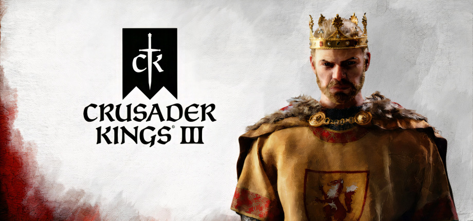

  

## 재미 요소

 Crusader Kings 시리즈는 중세 영주가 되어 가문을 영속해 나가는 것이 목표인 역사 시뮬레이션 게임 시리즈이다. 이 시리즈의 최신작인 Crusader Kings 3(2020년 9월 발매)에서 플레이어는 1066년 혹은 867년 실제 유럽과 중앙아시아, 서아프리카를 아우르는 지도 위에서 역사 속 영주(혹은 자료가 충분하지 않은 곳은 가상의 영주)가 되어 자신의 가문을 번성케 해야 한다.

### Role-Playing 게임

 Crusader Kings 시리즈는 Sid Meier’s Civilization 시리즈, Total War 시리즈나 같은 개발사의 Hearts Of Iron, Victoria, Europa Universalis 시리즈 등 다른 역사 전략 시뮬레이션 시리즈와는 다소 차이를 보인다. 일반적인 전략 시뮬레이션 장르 게임에서 플레이어는 한 문명이나 국가를 관장하는 신과 같은 존재가 된다. 이러한 게임에서 게임 내 시간이 얼마나 흐르던 간에 이 국가의 지도자는 국가 정신 그 자체인 플레이어이며, 플레이어는 국가를 성장시키기 위한 플레이를 하게 된다. 하지만 Crusader Kings 시리즈는 조금 특별하다. 플레이어는 중세의 한 인물이 되며, 이 인물이 죽게 되면 가문의 후계자로서 플레이하게 된다. 일반적인 전략 시뮬레이션 장르의 게임 오버는 해당 국가의 멸망임에 반해, Crusader Kings 시리즈의 게임 오버는 가문 후계자의 절멸이다.

 이러한 Role-Playing 요소는 중세 유럽의 봉건제 요소와 맞물려 Crusader Kings에 독특한 매력을 부여한다. 한 인물은 여러 개의 작위를 가질 수 있으며, 곧 이 작위의 영역이 그 인물의 영토이다. 곧 영토를 늘리기 위해서는 다른 인물의 작위를 빼앗아야 하는데, 대부분의 다른 게임이 영토 획득을 위해 전쟁을 해야 하는 반면 이 게임은 전쟁 이외에도 다양한 방법을 사용할 수 있다. 해당 작위에 대한 명분이 있다면 전쟁을 할 수도 있지만, 결혼을 통해 자식에게 상속시키거나, 상속 순위가 밀린다면 선순위자들을 암살하거나 하는 등 다양한 방법으로 작위를 획득할 수 있다.

 특히 최신 게임인 Crusader Kings 3에 와서는 Role-Playing 요소를 강화했다. 각 인물에게는 서너 가지의 성격이 있고, 이 성격에 따라 각종 이벤트에서 선택을 내릴 때 스트레스 수치가 증감한다. 가령 게으른 인물은 사냥을 나서면 스트레스가 쌓이고, 기만적인 인물은 거짓말을 할 때 스트레스가 감소하는 식이다. 스트레스가 일정 수치에 도달하면 정신 붕괴 이벤트가 발생하는데, 개종 혹은 긍정적, 부정적인 특성이 붙을 수 있고, 스트레스가 지나치게 많이 쌓이면 사망하는 등 플레이어로 하여금 좀 더 인물의 성격에 몰입해서 플레이할 수 있도록 하는 장치이다.

 그 외에도 각 인물들 간의 관계에 집중해 후견인, 친구, 사돈이라면 쉽게 동맹을 맺을 수 있고 활동을 같이 하면 스트레스가 내려가는 등 긍정적인 효과를 얻을 수 있으며, 가문 간 불화가 있는 인물이거나 종교가 다르거나, 어린 시절 괴롭히던 인물이거나 적이라면 각종 부정적인 이벤트가 발생하기도 한다.

 이러한 Role-Playing 요소들은 Crusader Kings 3에 다른 전략 게임과는 차별화된 재미를 부여한다.

### 역사적 사실에 기반한 샌드박스 게임

 Crusader Kings 시리즈는 역사적 사실에 기반하여 각 지역을 세분화하고, 실제 인물들을 배치했다. 사료가 있는 경우 사료에 대단히 충실하게 구현되어 있으며, 사료가 충분하지 않거나 신화 속 인물인 경우, 혹은 게임 시스템과 조금 괴리가 있는 경우에도 게임적 허용으로 이들을 구현하여 재미를 더했다.

 실제 인물, 신화나 전설 속 인물들을 배치함으로써 Crusader Kings 시리즈를 플레이하는 플레이어들은 해당 인물이 되어, 혹은 해당 인물과 함께 시대를 살아가는 Role-Playing 요소를 더 강하게 체험할 수 있을 뿐 아니라, 역사를 좋아하는 플레이어들에게 훌륭한 대체 역사 시뮬레이션을 제공한다. 전술한 성격과 친구, 적 등의 시스템을 통해 그 인물이 했을 법한 행동이 재현되는 것도 흥미로운 요소 중 하나이다.

 인물 뿐 아니라 종교, 문화 역시 흥미로운 요소이다. Crusader Kings 1에서 남성 카톨릭 영주만 플레이할 수 있었던 것에 비해, Crusader Kings 3에서는 남성 여성 가릴 것 없이, 카톨릭, 동방 정교회, 아르메니아 정교회, 카타리파, 보고밀파 등 당대 존재했던 많은 기독교의 분파들과 수많은 이슬람의 종파, 불교, 힌두교, 자이나교, 텡그리 신앙, 북유럽 신화에 이르기까지 다양한 종교의 교리와 세력권을 구현해 두었다. 문화 역시 그리스, 독일, 프랑스, 노르드, 노르만, 이탈리아, 페르시아, 인도에 이르기까지 다양한 문화를 구현하고 해당 문화의 속성을 표현했으며, 페르시아에서는 황제를 샤한샤, 그리스에서는 바실레프스, 독일에서는 카이저라고 하는 등 플레이어의 문화에 따라 불리는 호칭 역시 달리 해 몰입도를 높였다.

 그리고 무엇보다 대체 역사 시뮬레이션으로서 작용하는 것은 이러한 종교나 문화를 커스텀할 수 있다는 점이다. 플레이어에게 충분한 신앙도가 있다면 교리를 뜯어고쳐 새로운 종교를 창시할 수 있으며, 플레이어에게 충분한 위신이 있다면 기존 문화에 새로운 특성을 추가하거나 문화를 분화해 나가거나 다른 문화와 융합하여 또 다른 문화를 만들어 낼 수도 있다. 이러한 샌드박스 요소 역시 Crusader Kings 3의 주요 재미 포인트라고 할 수 있다.

## 아쉬운 부분

 Crusader Kings 3에서 전쟁이 일어나면 전쟁의 참가자들은 각자 병력을 소집한다. 병력은 직할 백작령에 건설된 건물과 해당 참가자의 봉신들의 영지에서 계약에 의해 정해진 병력만큼 나오는 징집병과 돈을 들여 모집하고 유지해야 하는 다양한 병종의 무장병 두 가지 종류로 구별된다. 이 게임에서 무장병은 창병, 궁병, 캐터펄트 등 공통 병종과 함께 카타프락토이, 샤쇠르, 장 다름 등 문화권에 따른 특화 병종이 있는 등 병종의 다양성을 충분히 구비했다. 이에 더해 각각 개인 기량을 가진 기사와 지휘관이 하나의 병력을 구성한다. 이 병력들은 지도 상에서 지나는 영토에서 보급을 받으며, 각 보급 제한을 넘는 영토에 가게 되면 병력을 잃는다. 그러나 이 게임의 전투에서의 전략성은 여기가 끝이다.

 이 게임에서의 전쟁은 1) 상대의 전쟁 지도자를 포로로 잡거나 2) 공격자라면 전쟁의 목표 점령지를 모두 점령하거나 3) 그 외 상대의 전쟁 지지도를 -100까지 떨어뜨리면 이길 수 있다. 전쟁 지지도는 전투에서 이기거나, 상대의 영토를 점령하거나, 어떤 식으로든 상대의 병력에 피해를 주면 떨어뜨릴 수 있다. 그러나 여기서 문제는 상대의 병력을 만나야 전투를 할 수 있다는 점이다. Crusader Kings 3에서 병력들은 아무런 제약 없이 타 세력의 영토를 지날 수 있는데, 그렇기 때문에 병력과 직접 맞서 싸우기 위해서는 술래잡기가 되기 일쑤이다. 결과적으로 전투에서 중요한 것은 더 많은 병력으로 땅따먹기와 술래잡기를 효과적으로 하는 것이 된다. 물론 실제 전쟁에서도 내 병력을 보존하고 적절한 위치에서 맞붙으며, 적의 근거지를 장악하는 것이 승리의 조건이긴 하나, 제3세력의 영토에서 자유롭게 돌아다닐 수 있기 때문에 술래잡기의 영역이 넓어져 지루해지기 십상이고, 이 병력이 표시되는 방식 또한 병력 당 유닛 하나와 그 위 병력의 숫자 뿐이기 때문에 다소 우스꽝스럽기까지 하다.

 막상 상대의 병력과 맞닥뜨렸을 때의 전투 역시 김새긴 마찬가지다. 화면 하단에 표시되는 전투 창에서 실시간으로 서로의 병력이 줄어드는 모습이 보이긴 하지만, 이 과정에서 어떤 전략 전술이 사용되었는지는 알 수가 없고, 병력이 줄어드는 속도는 병력 대 병력이 각각 지형 보너스와 전투력 보너스를 받아 몇몇 랜덤 요소에 의해 결정된다. 물론 이 게임이 Total War 시리즈가 아닌 만큼 병력을 마이크로 컨트롤해야 한다면 플레이어에게 피로감만 주는 요소일 수 있겠지만, 기껏 다양한 병종을 구성해 놓고 어떠한 연출 없이 단순히 숫자로만 보여주는 전투 역시 플레이어에게 유의미한 콘텐츠가 되기 어려울 것이다.

## 개선 방안

 먼저 제3세력의 영토에 병력이 진주하는 것을 막아야 할 것이다. 함부로 다른 세력의 영토에 병력을 진출시키는 것이 역사적으로도 불가능했던 일이었음에 더불어, 상대의 병력을 마주하기 위해 끝없는 술래잡기를 하는 일이 줄어들 것이다.

 그러나 각 영토가 인접하지 않았을 경우 막상 전쟁을 선포해 놓고 병력을 이동하지 못해 결국 전투를 벌이지 못하는 일이 벌어질 수 있다. 역사적으로도 인접한 세력끼리만 전쟁을 벌였던 것도 아니기 때문에, 전쟁을 할 수 있도록 몇 가지 옵션을 주어야 할 것이다. 제3세력의 영토를 지날 수 있는 조건으로, 1)같은 주군을 모시는 봉신일 경우 2)상대와 군사 통행 조약을 맺을 경우 두 가지를 제안할 수 있겠다.

 상대와 군사 통행 조약의 경우 더 많은 세부 옵션을 설정할 수도 있다. 제안하는 쪽이 현재 전쟁 중이 아니라면 상호 군사 통행 조약을 맺을 수 있지만, 현재 전쟁 중이라면 상호 군사 통행 조약 대신 돈을 내야 하거나 보급 제한을 받는 등 AI의 선호도를 조절하거나 봉건제 사회이므로 영주 간의 관계도에 따라 수락/거절 확률을 조절하는 등 전략성을 더 강화할 수 있는 옵션을 제공할 수 있겠다.

 직접적인 전투의 경우, 본 게임의 대안으로 극단적인 모드가 있다. 역시 중세 RPG라 할 수 있는 마운트 앤 블레이드 2 : 배너로드가 있어야 구동할 수 있는 모드인데, 본편에서 병력과 병력이 마주쳐 전투가 발생하면 그 병력의 편성대로 마운트 앤 블레이드 2의 전장으로 넘어가는 모드이다.

 물론 마운트 앤 블레이드 2는 독자적인 게임이고, Crusader Kings 3에 그 정도 전투 시스템과 애니메이션을 추가할 수는 없을 것이다. 애초에 전투가 메인 컨텐츠인 게임이 아니기 때문에 한 개인 지휘관이 되어 휘하 병력을 지휘하는 액션 미니 게임을 추가하는 것은 부담이 될 뿐 아니라, 한 전장에서 최대 십만 명대의 병력들이 마운트 앤 블레이드 2처럼, 혹은 Total War처럼 움직이는 시뮬레이션은 거의 불가능하다고 봐야 할 것이다. 시스템적으로도 플레이어가 지휘관이 되는 경우가 드물기 때문에 이런 확장까지는 필요가 없을 것이다.

 그렇지만 충분히 전략적인 선택을 할 수 있도록 전투를 바꿀 수는 있다. 애초에 전작이었던 Crusader Kings 2에서는 각 병력을 이끄는 지휘관의 능력과 병종의 비율에 따라 특정 확률로 전략이 발동되었고, 해당 전략이 성공하면 결정되는 수치에 따라 전투의 승패가 결정되었다.

 본 게임에 이미 각 지휘관은 전투를 진행하거나 전투 인생관 초점에 따른 이벤트에 따라 몇 가지 특성을 얻게 된다. 여울 개척자, 적극적인 공격자, 신중한 지휘관 등의 특성과 전투력, 병종의 편성과 지형에 따른 이벤트 체인의 형태로 전투를 구현할 수도 있을 것이다. 본편의 두 번째 확장팩 투어 앤 토너먼트에서 행차나 토너먼트 행사, 혹은 대규모 결혼식이 그러했듯, 전투가 발생하면 새로운 창이 뜨면서 해당 격전지에서 벌어지는 일들을 일련의 이벤트로 보여준다. 해당 이벤트는 플레이어 캐릭터가 종군하고 있지 않다면 건너뛰고 결과만 전달받을 수 있으며, 플레이어 캐릭터가 종군하고 있거나 부대의 지휘관이라면 그에 따라 결정을 내리고 여러 변수들에 대한 확률을 구해 해당 결과가 나오는 형태로 구현한다면, 좀 더 전략성 있고 몰입감 있는 전투 시스템을 구현할 수 있을 것이다.