 오늘날의 소위 AAA급 게임들은 대개 오픈월드 형식의 게임으로 출시된다. 일반적으로 대규모의 자본과 기술력이 필요한 장르이기 때문에, 어지간한 영화보다도 많은 예산을 쏟아부을 수 있고 그만큼의 기술력과 노하우를 갖춘 회사들만이 게이머들의 눈높이에 맞춘 오픈월드 게임을 내놓을 수 있기 때문일 것이다. 하지만 그만큼 새로운 오픈월드 게임의 출시는 언제나 게이머들의 시선을 확 끌어모은다. 오픈월드 게임이야말로 현 시대 게임의 '플래그십'이라 할 만 하다.

 오픈월드의 정의는 모호하다. 어느 학회나 협회에서 공통적으로 합의한 정의가 있는 것이 아니라, 게이머라는 광범위한 계층에서 몇몇 게임들이 가진 특징을 모아 분류한 것에 가깝기 때문이다. 이러한 분류가 이뤄진 이후에도 게임을 학문적으로 접근하는 학자의 수가 턱없이 부족하기 때문에 오픈월드의 정의가 하나로 모아질 수가 없었다.

 여러 오픈월드의 정의 중에서도, 이 글에서는 오픈월드의 자유에 대해서 강조하고자 한다. 오픈월드란 이동의 자유를 부여한 공간이다. ***게임 내에 구현된 넓은 범위의 공간을 특수한 수단과 로딩 없이 이동할 수 있는 특징***을 가진 게임을 오픈월드라고 정의하고자 한다. 넓은, 특수한 이라는 형용사가 이 정의를 여전히 모호하게 만들지만, 이에 대해서는 이 글에서 차차 이야기하려 한다.

## 오픈월드의 역사

 로딩 없는 넓은 공간은 오랫동안 게임 개발자들의 꿈이었다. 현실과 닮은 무언가를 창조해내는 것이 게임의 오래된 목표이기도 했으니 말이다. 하지만 메모리와 연산속도라는 물리적 한계 때문에, 개발자들은 온갖 꼼수를 통해 게임 내 공간을 구현해야 했다. 큰 공간을 여러 개의 독립된 공간으로 분절시키고 그 사이를 이동할 때는 로딩이 필요한 형태가 대표적이다. 물론 이러한 형태조차도 발전된 형태라서, 초창기의 게임은 층, 스테이지 등을 순차적으로 준비해 게임 개발자가 의도한 순서대로 이동하는 것이 전부였다.

 기술이 발전함에 따라 오늘날 오픈월드라는 개념의 기원이 되는 게임들이 여럿 등장했다. 그 중 RPG의 오픈월드화를 이끈 가장 대표적인 게임이 ***울티마(Ultima)*** 시리즈이다. 전설적인 게임 개발자 <strong>리처드 개리엇(Richard Garriott)</strong>은 현재까지도 통용되는 RPG 속 현실적 요소들을 도입한 선구자로서도 유명한데, 1990년에 출시된 <strong><em>울티마 6: 거짓 예언자(Ultima VI: The False Prophet)</em></strong>는 심리스 오픈월드 RPG의 시작이라 할 수 있다. 월드 맵, 도시 맵, 건물 내부, 전투 맵이 모두 분리되어있던 이전 작들까지와는 달리 모든 맵이 연속적으로 연결되어 있었으며, 울티마 시리즈의 큰 특징 중 하나인 게임 내 오브젝트와의 폭넓은 상호작용이 두드러졌던 작품이기도 하다. 그리고 이러한 울티마 시리즈의 특징은 2년 후 출시된 <strong><em>울티마 7: 검은 관문(Ultima VII: The Black Gate)</em></strong>에서 정점을 찍는다.

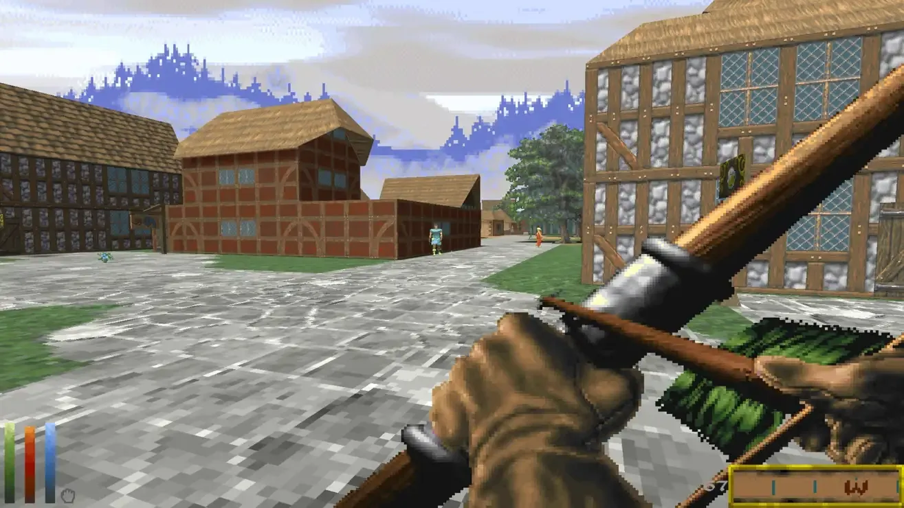

*엘더스크롤 2: 대거폴 플레이 스크린샷*

 90년대 RPG 중 오픈월드라는 키워드로 중점적으로 볼 수 있는 또다른 작품은 RPG 명가 <strong>베데스다(Bethesda)</strong>의 <strong><em>엘더스크롤 2: 대거폴(The Elder Scrolls II: Daggerfall)</em></strong>이다. RPG 최초로 전체 지형을 3D 폴리곤 그래픽으로 구현한 것도 놀라운 성취였지만, 1996년 출시된 이래 지금까지도 *가장 방대한 맵* 항목으로 기네스북에 올라있는 게임으로, 대륙 전체를 횡단하는데 실제 시간으로 2주일이 걸리는 충격적인 크기를 자랑했다. 그러나 이 게임은 후술하겠지만 넓기만 하고 밀도가 부족한 콘텐츠로 인해 많은 비판을 받았고 상업적으로는 그다지 성공하지 못했다.

 진정한 오픈월드의 전성기는 21세기에 와서야 열리게 되었다. 2001년 락스타 게임즈(Rockstar Games)의 GTA 3(Great Theft Auto 3)가 리버티 시티라는 가상의 도시를 통째로 3D로 구현하며 오픈월드의 시대가 열렸음을 알렸고, 2002년에 출시된 베데스다의 엘더스크롤 3: 모로윈드(The Elder Scrolls III: Morrowind)는 전작의 상업적 실패를 딛고 수백만장의 판매고를 올렸다.

 이때부터 오픈월드 게임은 전성기를 맞았다. ***마피아(Mafia)***, ***어쌔신 크리드(Assassin's Creed)***, ***파 크라이(Far Cry)***, ***폴아웃(Fallout)***, ***세인츠 로우(Saints Row)***, ***저스트 코즈(Just Cause)***, ***불리(Bully)***, ***프로토타입(Prototype)*** 등 흥행한 오픈월드 게임을 논할 때 빠지면 섭섭할 프랜차이즈의 시작이 이 2000년대에 대부분 출발선을 끊었고, 다양한 오픈월드 게임이 다양한 시대적, 문화적, 장르적 배경을 바탕으로 오픈월드의 여러 문법을 차례로 정립하기 시작했다.

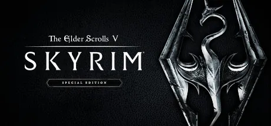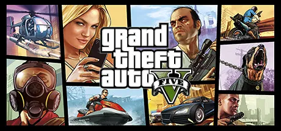

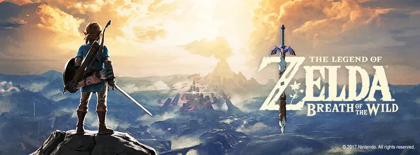

 2010년대에 들어서는 현재까지도 회자되는 오픈월드의 명작이 차례로 등장했다. ***엘더스크롤 5: 스카이림(The Elder Scrolls V: Skyrim, 2011)***, ***GTA 5(Grand Theft Auto V, 2013)***, 그리고 <strong><em>젤다의 전설 브레스 오브 더 와일드(The Legend of Zelda: Breath of The Wild, 2017)</em></strong>이 바로 그것이다. 이들 게임은 방대한 맵 뿐 아니라 다채로운 상호작용으로 오픈월드 게임의 정점을 보여주었으며, 각각 플레이어 경험이 반영된 서사의 자유도와 모드 활성화, 흡입력 있는 서사와 현실감 넘치는 현대 사회, 그리고 물체와의 상호작용과 탐험의 재미라는 각각의 특장점을 극대화하여 이후의 오픈월드 게임에도 막대한 영향을 끼쳤다.

 하지만 모든 오픈월드 게임이 성공적이었던 것은 아니다. 오픈월드의 문법이 정립되어 간다는 말은, 오픈월드 형식을 채택한 게임들이 점차 독창성을 잃어버린다는 말과도 유사했다. 특히 이런 현상이 두드러지게 드러난 오픈월드 게임을 꼽자면 단연 어쌔신 크리드 시리즈일 것이다. 훌륭하게 고증된 역사 속 도시에서 당대의 암살자가 되어 중요 인물을 암살하는 잠입 액션 게임인 어쌔신 크리드 시리즈는 파쿠르를 적극적으로 도입해 인기를 끌었고 후속작에서도 매력적인 주인공으로 시리즈를 잘 이끌어 나갔다. 그러나 1년 주기로 발매되는 과도한 시리즈 양산은 각 작품의 퀄리티를 조금씩 하락시켰고, 결국 2014년 스토리와 최적화, 게임 플레이에서 악평이 쏟아진 <strong><em>어쌔신 크리드 유니티(Assassin's Creed Unity)</em></strong>에서 그 문제점들이 폭발하고 말았다.

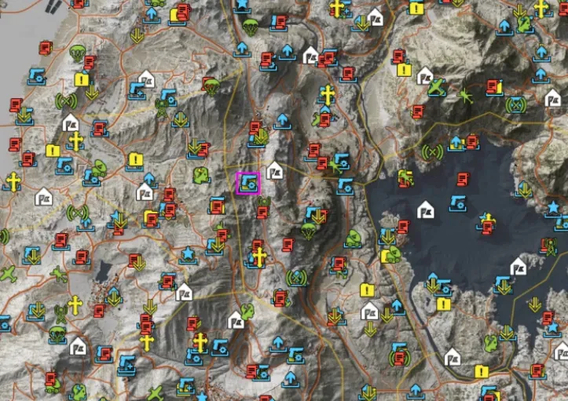

*고스트 리콘: 와일드랜드(Tom Clancy's Ghost Recon Wildlands, 2017)의 맵 스크린샷*

 어쌔신 크리드 시리즈 뿐 아니라 ***고스트 리콘(Ghost Recon)*** 시리즈, ***와치독(Watch Dogs)*** 시리즈, ***파 크라이(Far Cry)*** 시리즈 등 **유비소프트(Ubisoft)** 사의 게임은 모두 비슷한 오픈월드 양상을 가졌다. 3인칭 숄더뷰 시점, 플레이 타임을 강제로 늘리기 위해 월드 곳곳에 뿌려놓은 수집요소, 맵을 밝히는 뷰포인트, 퀘스트나 활동 요소가 표시된 지나치게 편의주의적인 맵 마커 등 여러 특징이 중복되는 게임이 1년 사이에도 여러 작품이 쏟아져 나오면서 게이머들의 피로감을 증폭시켰다. 그리고 마침내 이러한 특징들이 집약된 ***유비식 오픈월드***라는 멸칭이 자리잡기에 이른다.

 이러한 깊은 사유 없는 오픈월드에 대한 피로는 <strong><em>사이버펑크 2077(Cyberpunk 2077, 2020)</em></strong>에 와서 폭발하게 된다. 훌륭한 RPG 타이틀이었던 <em>더 위쳐 3: 와일드 헌트(The Witcher 3: Wild Hunt)</em>의 개발사인 <strong>CDPR(CD Projekt RED)</strong>에서 야심차게 개발한 이 액션 RPG는 출시 전부터 게이머들의 시선을 사로잡아 엄청난 기대를 하게 만들었지만, 수많은 버그와 처참한 최적화, 그리고 무엇보다 광고했던 것에 미치지 못하는 미완성된 게임을 출시함으로써 게이머들에게 배신감을 안겨주었고, 곧 이 배신감은 분노가 되어 CDPR을 성토하는 내용의 글이 커뮤니티를 휩쓸고 폴란드 당국에서 게임사에 대한 모니터링을 실시하는 등 초유의 사태마저 일으키고 말았다.

 물론 이들 게임의 실패에는 단순히 오픈월드라는 게임 형식의 문제 뿐 아니라 근본적으로 높아진 기술 수준과 그에 뒤따르는 개발 기간의 증폭이 게임의 개발비를 천문학적으로 끌어올린 와중에 이러한 개발 주기를 고려하지 않은 조급한 출시가 낳은 참패라는 분석이 우세하다. 오픈월드이기 때문에 망한 것이라기보다는, 제대로 된 오픈월드를 구현하지 못했기에 실패했다는 것이다.

 이 글에서는 이러한 오픈월드 게임을 서사, 이동, 상호작용이라는 큰 틀에서 바라보고 게임들을 비교하여 오픈월드의 정의와 특징을 정리하고자 한다. 성공한 오픈월드 게임과 실패한 오픈월드 게임을 이러한 틀에서 분석하여 게임 내 공간을 다루는 방법으로서의 오픈월드를 조망해보겠다.

## 오픈월드에서의 서사

 일반적으로 오픈월드 형식을 채택하는 게임의 장르는 RPG, 어드벤처 같은 서사가 있는 게임이다. 게임의 주 플레이 경험이 서사를 체험하는 것인 이러한 장르에서 오픈월드는 서사의 공간적 배경으로 등장한다. 게임이라는 미디어의 특성상 이 공간적 배경은 더욱 중요한데, 인물의 움직임을 따라갈 수밖에 없는 다른 매체와 달리 게임은 플레이어가 주체적으로 주어진 공간을 탐색하고 탐험할 수 있기 때문이다. 그리고 오픈월드라는 형태는 이렇듯 플레이어의 이동의 자유를 가장 극대화하는 방식이다.

 이 때 이 주체적인 이동의 자유로 말미암아 서사를 경험하는 순서가 달라질 수 있다. 단순하게는 맵에 흩어진 서브 퀘스트들을 플레이어가 경험하는 순서의 차이일 수도 있고, 서사의 분기가 잘 설정되어 있거나 이를 중시하는 작품이라면 선행되는 서사에 따라 후행 서사가 변화하기도 한다. 이런 서사의 순서 변경으로 인한 플레이어의 경험 다변화는 오픈월드 게임에서만 적용되는 것은 아니지만, 적당히 넓은 영역에서 플레이어에게 이동의 자유를 허락함으로써 발생하는 효과이다. <strong><em>디비니티: 오리지널 신 2(Divinity: Original Sin 2, 2017)</em></strong>이 이 대표적인 예시라 할 수 있다.

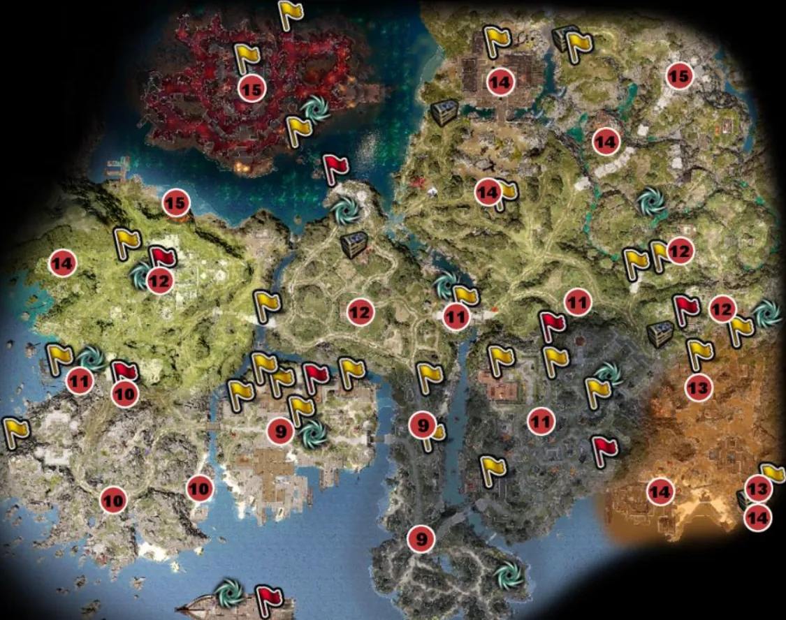

*디비니티: 오리지널 신 2(Divinity: Original Sin 2), 사신의 해안 지도*

 디비니티 오리지널 신 2는 몇 가지 넓은 영역으로 나누어져 각 챕터가 주로 다루는 지역 안에서 서사가 진행된다. 기쁨의 요새, 사신의 해안 등 각 지역의 내부에서 이동은 자유롭고 서사의 순서도 비선형적이지만, 이 두 지역을 오가는 것은 선형적이다. 그렇기 때문에 이 게임이 오픈월드라고 하기는 어렵지만, 이 때 발생하는 비선형적 서사는 플레이어로 하여금 '선택하지 않은 길'을 궁금하게 하며 다회차 플레이를 유도하는 또 다른 요소가 된다.

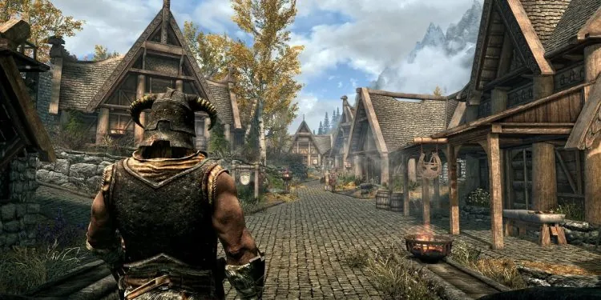

*엘더스크롤: 스카이림(The Elder Scrolls V: Skyrim), 화이트런*

 한편 오픈월드에서 이러한 비선형적 서사를 가장 적극적으로 활용한 예시는 역시 ***엘더스크롤 5: 스카이림***이다. 베데스다의 오픈월드 게임이 거의 그렇지만 플레이어의 자유도를 극도로 강조한 형태로, 튜토리얼만 지난다면 플레이어의 서사는 완전히 자유롭다. 플레이어는 제시된 대로 화이트런으로 이동해 해당 지역에서 NPC들로부터 퀘스트를 수주해 성장하며 서사를 경험할 수도 있지만, 바로 윈터홀드로 향해 마법사의 길을 걷거나, 윈드헬름으로 가 스톰클록에 합류할 수도 있다.

 스카이림의 오픈월드 활용이 극대화된 부분은 NPC들이 그저 배경으로만 존재하는 것이 아니라는 점이다. NPC 스케줄러의 개념이 스카이림에서 처음 도입된 것은 아니지만, PC-NPC 간 상호작용 뿐 아니라 NPC-NPC 간 상호작용 역시 어느 정도 구현되어 있으며, 전자의 경우도 대화를 걸거나 전투하는 것 뿐 아니라 도둑질을 한다던가, 그 NPC의 적대 NPC의 우호를 쌓는다던가 하여  NPC와의 관계가 변화함에 따라 다른 상호작용을 보여주기 때문에 더욱 살아있는 세계를 체험할 수 있고, 스토리 진행에 필수적인 NPC가 아니라면 그를 죽일 수도 있다.

 그렇다면 이러한 서사의 자유도가 오픈월드 게임을 평가하는 데 있어서 절대적인 지표인가? 라고 묻는다면, 글쎄, 라고 답할 수밖에 없다. 베데스다와 또 다른 오픈월드의 명가인 락스타 게임즈의 오픈월드 게임들은 서사에 있어서는 자유도를 거의 갖고 있지 않기 때문이다.

*레드 데드 리뎀션 2(Red Dead Redemption 2)*

 전에 리뷰한 바 있던 [레드 데드 리뎀션 2](/review/reddeadredemption2/)가 대표적 예시이다. 서사의 자유도를 중시했던 스카이림에서는 플레이어의 외관을 커스터마이징하거나 마법, 전투적 능력을 성장시키는 RPG적 요소가 두드러졌다. 하지만 레드 데드 리뎀션 2에서 플레이어는 아서와 존의 외모를 커스터마이징할 수 없고, 무기나 복장을 제한적으로 바꿀 수 있는 정도이다. 서브 퀘스트의 순서 정도는 바꿔서 플레이할 수 있지만 이 순서는 플레이어의 서사 경험에 큰 영향을 끼치지 않으며, 오히려 이러한 퀘스트 진행이 매우 일직선적이다. 이 일직선적인 퀘스트 진행은 다소 불합리할 정도로 깐깐하기까지 해서 오픈월드 게임인 주제에 개발자가 정해놓은 동선을 벗어나면 실패 판정이 나오는 등 전혀 자유롭지 않다.

 또 다른 락스타의 오픈월드 게임 GTA 5 역시 비슷한 문제를 갖고 있다. 주인공이 셋이나 되고 이 주인공 변경이 비교적 자유롭기 때문에 레드 데드 리뎀션 2보다는 좀 더 플레이어의 자유를 보장해주는 듯 하지만, 미션이 빡빡하기는 마찬가지이다. 이 쪽은 반대로 주인공이 여럿이기에 다른 주인공으로 여러 랜덤 인카운터를 일으키는 NPC를 만나는 이벤트가 있을 법도 하건만, 그러한 요소도 찾아보기 어렵다.

 이 두 게임 모두 서사의 분기마저 빈약하기 그지없다. GTA 5는 세 가지 엔딩이 존재하긴 하지만 이 엔딩을 결정하는 스토리 분기가 그다지 길지 않으며, 마지막 미션으로 결정되는 느낌인데다 두 엔딩에서는 세 인물 중 하나는 꼭 죽어야 하므로 그다지 매력적인 엔딩이 아니라 선호되지 않는다. 레드 데드 리뎀션 2는 서사의 분기가 없고 명예 수치에 따른 컷신이나 아서의 마지막 미션이 조금 달라지는 정도로 서사 경험이 다양하다고는 결코 할 수 없다.

 그럼에도 불구하고 이 두 게임은 역대 최고의 오픈월드 게임 중 하나로 손꼽히고 있다. 이는 곧 서사의 자유가 오픈월드 형식의 게임을 평가하는 데 있어 그다지 중요한 요소가 아님을 역설한다. 이러한 서사의 자유에 대한 논쟁에 대해서는 또 말할 기회가 있겠지만, 적어도 오픈월드에 있어서 서사의 자유가 필수적이지는 않다는 점 정도는 말할 수 있겠다.

 오히려 오픈월드에서 서사의 자유는 여러 오류를 낳기도 한다. 단순히 개발자의 실수로 인한 버그 뿐만이 아니라, 이동의 자유가 무한하게 제공됨에 따라 꼭 필수적인 NPC가 플레이어의 행동에 의해 죽임을 당한다던가, 스토리라인 상 이후에 발생해야 될 사건이 플레이어에 의해 미리 발생함으로서 논리적으로 결함이 생기는 경우가 생기지 않으리라고는 보장할 수 없는 것이다. 이러한 지점 때문에 스카이림에서도 에센셜 NPC를 지정한다던가 하는 등의 안전 장치를 해놓은 것이고, 그 외 여러 오픈월드 게임에서도 처음부터 맵을 전체 개방하지 않고 서사의 진행에 따라 개방하거나 플레이어의 레벨 제한을 통해 이러한 움직임을 통제하게 된다. 아이러니하게도, 서사의 자유가 오픈월드의 이동의 자유와 상호작용을 방해하는 요소가 될 수도 있는 것이다.

## 오픈월드에서의 이동

 오픈월드 게임에서 이동은 핵심적인 요소이다. 오픈월드의 광범위한 정의 중에서도 가장 핵심적인 것은 ***자유로운 이동***이기 때문이다. 하지만 오픈월드 게임의 또다른 주요 요소는 드넓은 공간이다. 오픈월드가 주요한 게임의 표현 중 하나로 자리 잡으면서, 이 넓은 공간을 이동하는데 드는 플레이어의 피로감을 해결해야 할 필요성이 생기기 시작했다.

 게임 내 공간이 그다지 크지 않을 때에조차 게이머들은 게임 플레이 상에서 가장 효율적인 동선을 찾곤 했다. 작은 공간 내에서조차 단순 이동의 반복은 플레이어에게 피로감을 안겨줬던 것이다. 이런 피로감을 해결하기 위한 방안으로는 여러 게임이 다양한 해결책을 내놓곤 했다. 그리고 그 중 가장 쉬운 방법은 이러한 이동 과정을 스킵하는 것이었다.

### 빠른 이동

 오픈월드를 채택하지 않았던 게임에서도 맵 간을 이동하기 위해 빠른 이동이라는 개념은 이미 널리 탑재된 방식이었다. 특히 심리스 방식을 채택하지 않은 게임에서는 이러한 빠른 이동을 위한 로딩 시간동안 로딩 화면 뿐 아니라 짧은 컷신이나 스토리 진행을 돕는 튜토리얼 메시지 등을 삽입함으로써 다른 맵을 불러오는 로딩 시간을 연속적으로 느껴지게끔 하는 방식도 적극적으로 사용되었다.

 오픈월드 게임에 있어서도 빠른 이동은 필수적이다. 오픈월드 게임에서의 빠른 이동의 특징은 빠른 이동 없이도 빠른 이동 지점 간의 이동이 가능하다는 점이다. 그렇기 때문에 이 빠른 이동 지점들의 위치는 맵의 시작이나 끝 부분에 있는 것이 아니라 각 지형에서 가장 접근하기 쉬운 교통의 요지에 있다.

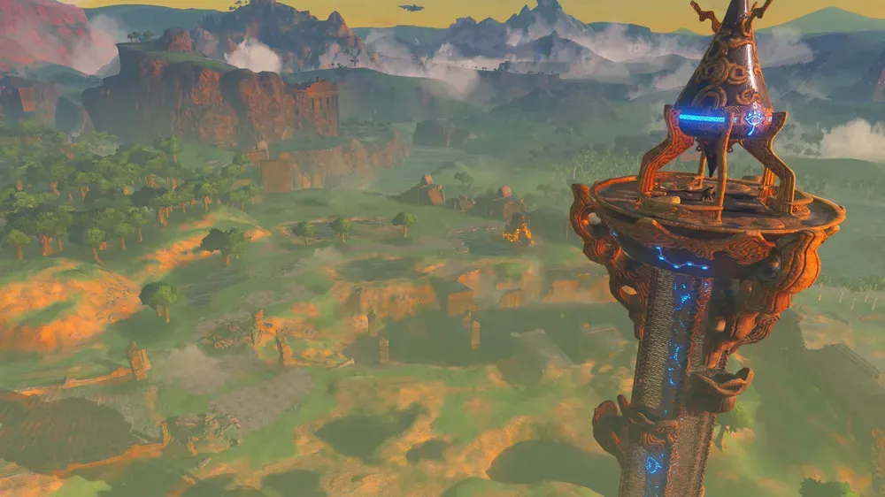

*젤다의 전설: 브레스 오브 더 와일드(The Legend of Zelda: Breath of the Wild)의 빠른 이동 지점, 시커 타워*

 빠른 이동 지점을 단순히 포탈로 표현하는 게임이 가장 많다. 앞서 언급했던 *디비니티 오리지널 신 2*와 같이 중세 판타지 배경이라면 더욱 그러하다. 또한 '유비식 오픈월드'에서는 빠른 이동 지점을 지도를 밝혀주는 높은 지점으로 지정하기도 한다. 그리고 이러한 요소는 *젤다의 전설 브레스 오브 더 와일드*에서도 채택한 바 있다. 이런 빠른 이동 지점들은 세계관 속에서 특별히 설명되지 않는 이상 게임의 편의를 위한 것이라고 플레이어 스스로 받아들여야 하는 부분이 크다.

 한편 이런 사소한 포인트에도 세계관의 디테일을 살리려는 시도들도 있었다. GTA 5에서 대표적인 빠른 이동은 택시를 통해 이루어진다. 현대 도시, 특히 LA를 모델로 한 리버티 시티에서 플레이어는 스마트폰으로 택시를 호출하여 목적지를 지정하고 이곳으로 가는 동안 차량 내부에서 바깥 풍경을 감상할지, 혹은 이 과정을 스킵하고 목적지에 바로 도착할 지 선택할 수 있다. 이는 세계관에 놀랍도록 잘 어울릴 뿐 아니라 목적지를 자유롭게 지정할 수 있다는 점에서 매우 매력적이다.

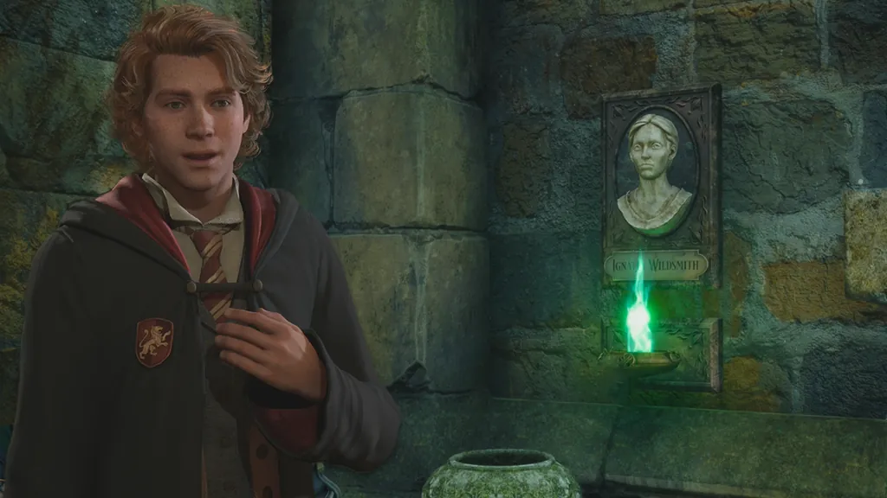

*호그와트 레거시(Horgwarts Legacy)의 빠른 이동 지점, 플루 가루 네트워크*

*호그와트 레거시*에서는 위저딩 월드 세계관에서 흔히 사용되는 플루 가루 네트워크를 빠른 이동 지점으로 삼았다. 물론 원작 세계관에서 플루 가루 네트워크는 벽난로에 사람이 들어가서 가루를 뿌리고 이동하는 형태라 게임에서처럼 교내 곳곳에 있지도 않을 뿐더러 그 크기가 다소 작은 편에 속하지만, 어쨌든 세계관을 활용해 빠른 이동 지점을 설정함으로써 빠른 이동의 당위를 훌륭하게 표현하고 있다 하겠다.

 이 중 가장 극단적인 케이스는 *레드 데드 리뎀션 2*이다. 레드 데드 리뎀션 2에는 일반적인 의미의 빠른 이동이 존재하지 않는다. 물론 도시마다 있는 마차와 역에서 탑승할 수 있는 기차가 그 역할을 하긴 하지만, 마차와 기차가 다니는 지점이 극도로 적고 맵의 넓이는 그이 반해 매우 넓기 때문에 그다지 접근성이 좋지 못하다. 다만 게임을 진행하며 갱단 업그레이드를 하다 보면 캠프에서나 혹은 야영 중에 특정 도시로 빠른 이동하는 메뉴가 등장하긴 하는데, 이 빠른 이동 지점조차 마차가 다니는 지점에 더해 마차가 다니지 않는 소규모 마을 정도라서 대부분의 맵을 직접 이동해야 한다. 말을 타고 있다면 시네마틱 카메라를 켜 설정한 목적지까지 자동으로 가게 할 수도 있지만, 실제로 이동하는데 드는 시간은 짧아지는 것이 아닌데다 중간에 랜덤 인카운터를 조우하거나 싸움에 휘말린다면 즉시 게임 플레이로 전환되기 때문에 이 또한 빠른 이동이라고 하기에는 어렵다.

 빠른 이동은 플레이어의 피로감을 줄이고 불필요한 이동 시간을 쳐내기에 적합한 요소이다. 그러나 지나치게 많은 빠른 이동 지점과 지나치게 친절한 경로 안내는 플레이어로 하여금 게임 내 공간을 탐험하는 동기를 저해한다. 앞서 언급했던 '유비식 오픈월드'의 가장 큰 단점 중 하나인 셈이다. 그렇다고 해서 모두가 레드 데드 리뎀션 2처럼 빠른 이동이라는 개념을 최소화하면서 탐험을 강요하기는 어렵다. 빠른 이동이 없다면 이동하는 데 걸리는, 플레이 경험에 유의미하지 않은 시간을 플레이 타임으로 소모해야 하는데, 이 시간동안 플레이어는 **지루함**을 느끼게 되고, 게임의 평가에 악영향을 끼칠 수 있다.

 훌륭하게 디자인된 오픈월드 게임들은 자신들이 준비해놓은 공간을 플레이어가 더 샅샅이 탐험해보길 바란다. 이들은 빠른 이동 지점을 준비해놓되, 빠른 이동 지점을 활용하기보다 공간 내에서 직접 이동하는 것을 유도하는 여러 방책을 내놓았다.

### 직접 이동을 유도하는 방법

#### 랜덤 인카운터

 락스타 게임즈의 간판 오픈월드 시리즈 GTA와 레드 데드 시리즈는 이러한 고민을 ***랜덤 인카운터***를 도입함으로써 해결했다. 이는 특정한 조건에서 어느 공간을 지날 때 랜덤으로 어느 이벤트가 발생하는 것이다. 플레이어는 이를 무시할수도, 반응할 수도 있는데, 이 이벤트 체인은 이동하는 중간중간 예상치 못한 즐거움을 주기 위해 삽입되어 어디서 이것이 발생되는 지 게임 내에서는 전혀 표시되지 않기 때문에 플레이어에게 우연한 만남처럼 여겨진다.

 이런 우연한 만남은 특정 서브 퀘스트로 이어질 수도 있고, 특정한 보상이나 세계관을 보여주는 일련의 경험으로 이어질 수도 있다. 그리고 이 랜덤 인카운터는 비슷한 형태로 다른 곳에서 진행되어 다른 결과를 낳아 플레이어에게 더 신선한 경험을 제공할 수도 있다. 예를 들어, 레드 데드 리뎀션 2에서 길을 가다 보면 말 편자를 고치는 남자를 만날 수 있다. 이 때 어떤 경우에는 플레이어가 말을 거는 순간 말이 뒷발로 고치던 사람의 머리를 걷어차 즉사할 수도 있고, 말을 거는 순간 말이 도망가 이를 추격해달라는 퀘스트를 얻을 수도 있다. 또 뱀에 물려 죽어가는 사람에게 약품을 주면 나중에 그가 총포상 앞에서 말을 걸며 아무거나 원하는 총을 하나 사준다던가, 도시를 돌아다니다 큰 돈을 벌 수 있다고 해서 NPC를 따라가면 뒤통수를 맞고 소지금을 강탈당하게 되는 등 다양한 이벤트가 있기 때문에 드넓은 공간을 탐험하게 되는 주요 동기가 된다.

#### 이동 그 자체에 핵심을 부여

 반면 <strong><em>데스 스트랜딩(Death Stranding)</em></strong>은 다소 과격한 해결책을 내놓기도 했다. 이 게임은 화물을 가지고 이동하는 것 자체가 게임성의 알파이자 오메가이다. 특히 이동 수단이 없는 초창기에 이것은 이 게임의 진입장벽으로 작용했는데, 배달 루트를 지정하고 위험을 회피하며 물건을 배달하는 행위가 무슨 재미가 있을까라는 선입견에 더해 설치할 수 있는 구조물도 사다리, 앵커 등으로 제한되어 있는데다 BT, 뮬 등의 적들에게 대항할 수 있는 수단이 제한적이라 더욱 이 게임에 재미를 붙이기 어렵다. 이 때 플레이어가 이동 중에 할 수 있는 행동이라고는 물살이 거세거나 험한 지형에서 균형을 잡는 버튼을 누르는 것 뿐이다.

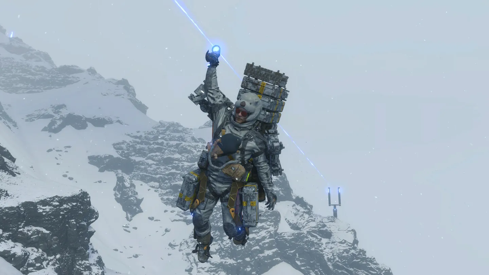

*데스 스트랜딩(Death Stranding)의 이동 옵션, 집라인*

 하지만 플레이가 진행될수록 오토바이, 트럭 등 대규모 화물을 운송할 수 있는 수단과 다리, 국도, 집라인 등 비동기 멀티플레이로 공유하는 구조물들이 등장하면서 플레이어는 진심으로 이 게임의 이동에 몰입할 수 있게 된다. BT와 뮬에게 대항할 수 있는 무기를 획득함에 따라 파밍을 위해 이들의 본거지를 쳐들어가 전투를 하는 것은 덤이다.

 데스 스트랜딩은 일반적인 액션 게임처럼 전투에 비중을 두기보다는 이동 자체에 비중을 두어 오픈월드를 누비는 재미를 플레이어에게 각인시키려 한다. 빠른 이동이 존재하고 이를 *프래자일 점프*라는 이름으로 세계관에서 설득력 있게 전개하려고 시도하기도 했지만, 가장 중요한 화물을 빠른 이동으로 운송할 수 없게 만듦으로써 플레이어는 반강제적으로 화물과 함께 미국 전역을 직접 누벼야 하는데, 이 때 다양한 이동 옵션을 제공함으로써 이동에서 발생하는 지루함을 최대한 제거하려고 한 모습이 인상적이다.

 한편 <strong><em>스파이더맨(Marvel's Spider-Man, 2018)</em></strong>은 이를 해결하려고 딱히 노력한 것으로 보이진 않지만 결과적으로 빠른 이동 사용을 최소화시키는 데 성공했다. 바로 **웹스윙**으로 빌딩 숲 사이를 빠른 속도로 이동하는 것이 빠른 이동보다 느릴지 몰라도 더 호쾌한 액션을 보여주기 때문에 이 과정이 전혀 지루하게 느껴지지 않는 것이다.

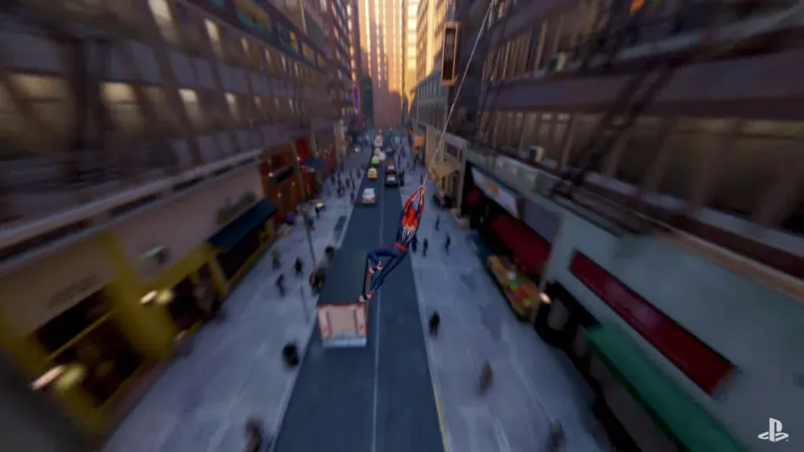

*스파이더맨(Marvel's Spider-Man)에서의 웹스윙*

 이 게임 역시 '유비식 오픈월드'라는 평가를 받으며 오픈월드의 깊이가 얕다는 평가를 받았지만, 마블 세계관 내 뉴욕을 충실히 그려낸데다 이런 이동의 재미를 충실히 살렸기에 플레이스테이션 진영의 새로운 간판 독점작으로 인정받을 수 있었다.

#### 탐험

 이러한 문제에서 가장 어려운 해결방안은 정공법이다. 바로 이 공간을 탐험하는 것이 즐겁게 만드는 것. 스카이림 역시 세계를 탐험하는 것이 즐겁긴 했지만, 이 원초적인 재미를 가장 잘 살린 것은 누가 뭐래도 *젤다의 전설 브레스 오브 더 와일드*이다.

 젤다의 전설 브레스 오브 더 와일드, 통칭 야숨(야생의 숨결)은 다른 오픈월드 게임과 다르게 자연을 주 배경으로 하며, 그래픽 역시 실사풍이 아닌 카툰 렌더링이다. 오픈월드 게임에서 자연은 당연히 주요 배경 중 하나지만 이 자연 배경보다는 도시의 콘텐츠 밀도가 압도적으로 높기 마련인데, 야숨은 많은 요소를 이 자연에 숨겨놓아 자연스럽게 탐험하고자 하는 동기를 플레이어에게 제공한다.

 무엇보다 야숨이 독보적인 영역은 맵에서 거의 모든 표식을 제거했음에도 플레이어는 이것이 불편하다고 느끼지 않게 되는 점이다. '유비식 오픈월드'의 요소인 뷰포인트를 도입하면서도 그 깊이는 차원이 다른데, '유비식 오픈월드'의 미니맵은 각종 수집요소, 빠른 이동 지점, 퀘스트 표시로 마커가 범벅이 되어 있어 번잡한 반면 야숨의 미니맵은 메인 퀘스트의 맵 마커와 플레이어가 탐험 중 이미 발견한 요소를 제외하면 전혀 존재하지 않는다. 이는 일견 막막하고 불편하게 느껴질 수 있는 고전 게임의 요소이지만, 이러한 수수께끼 같은 요소들을 단순화하고 단서를 제공하며 이미 탐험한 요소에 대해서는 편의성을 제공하는 등 적절한 균형을 찾아냈다.

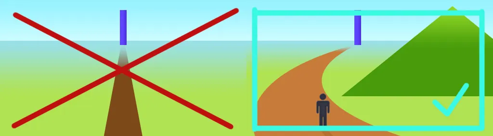

*젤다의 전설 브레스 오브 더 와일드의 레벨 디자인을 설명하는 프레젠테이션에서 소개된 삼각형의 법칙*

 또한 이 공간을 돌아다니면서 조우할 수 있는 수많은 수수께끼와 퍼즐, 그리고 이를 플레이어의 시야와 동선에 적절하게 배치하는 신들린 레벨 디자인 덕분에 오늘날 오픈월드의 모범답안으로 여겨지고 있다.

下편에서 계속...
