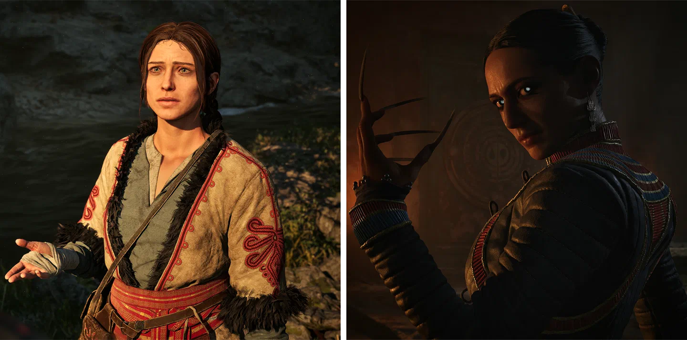
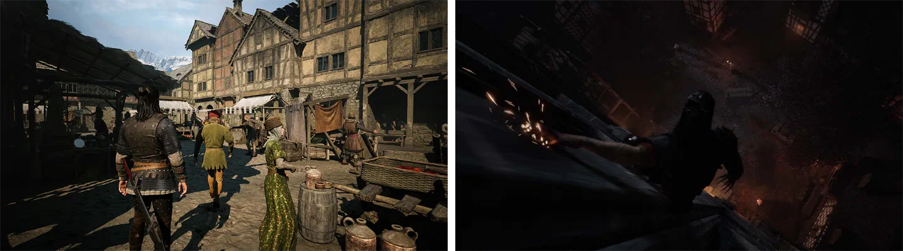
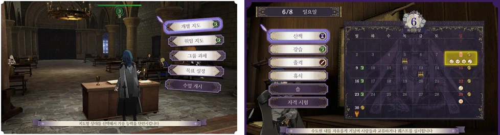
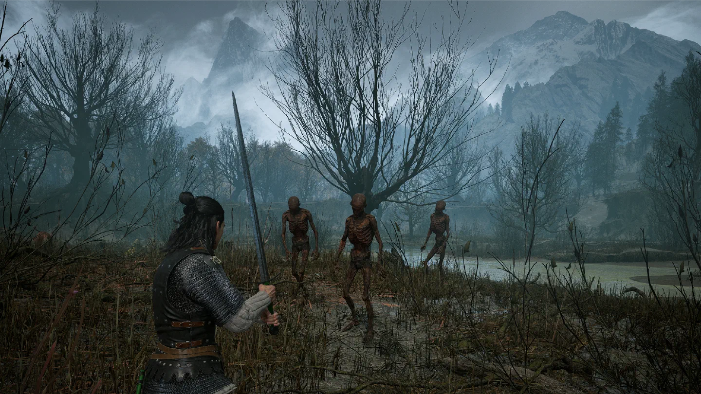
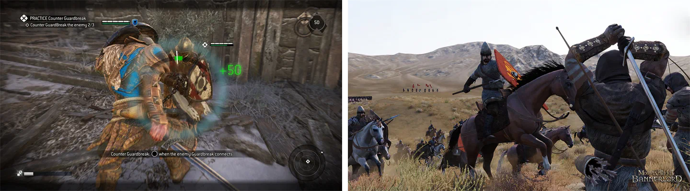
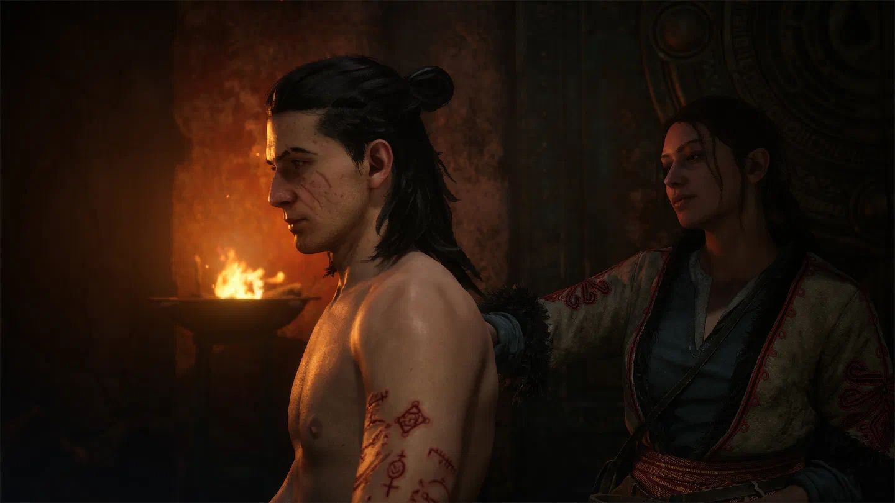
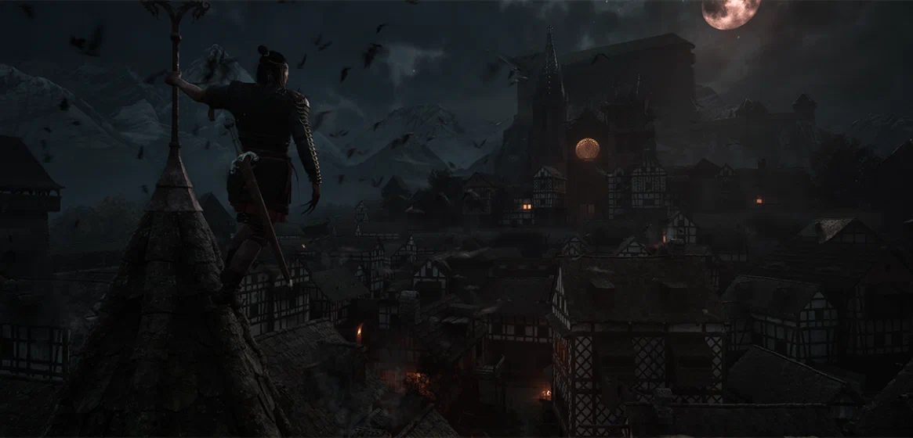

> | | |
> |:--|:--|
> | **개발** | 레벨 울브즈(Rebel Wolves) |
> | **유통** | 반다이 남코(Bandai Namco) |
> | **출시** | 2026년 9월 3일 |
> | **플랫폼** | PC, PS5, XSX |
> | **심의 등급** | 청소년 이용불가 |

 [<<사이버펑크 2077>>](/analysis/openworldandfreedom/)(Cyberpunk 2077)의 주인공 V는 게임 초반에 시한부 선고를 받는다. 머릿속에 박힌 칩이 V의 의식을 서서히 잠식해 가고, 남은 시간은 그리 길지 않다. 하지만 정작 플레이어는 서두를 이유가 없다. 메인 퀘스트를 미뤄 두고 나이트 시티 곳곳을 누비며 서브 퀘스트를 하더라도 V의 상태는 조금도 나빠지지 않기 때문이다. 서사가 강조되는 오픈월드 게임에서 이처럼 서사와 게임 플레이가 어긋나는 경우는 드물지 않다.

 <<블러드 오브 던워커>>(The Blood of Dawnwalker)는 이런 어긋남을 극복하려는 시도가 돋보이는 게임이다. <<더 위쳐 3: 와일드 헌트>>(The Witcher 3: Wild Hunt)의 게임 디렉터였던 콘라드 토마슈키에비치(Konrad Tomaszkiewicz)가 설립한 레벨 울브즈의 첫 작품으로, 가족이 제물로 바쳐지기까지 남은 30일이라는 기한을 게임 속 시간 시스템으로 구현했다. 이로써 이야기 속 기한은 게임 플레이의 제약이 되고, 퀘스트와 활동 하나하나가 한정된 시간을 어디에 쓸 것인가에 대한 선택이 된다. 서사 속의 시간 제약을 게임 플레이로 끌어들여 플레이어의 선택에 무게를 더하려 한 것이다.

 서사를 시스템과 결부시키면 게임의 경험은 어떻게 달라질까. 이 글에서는 시간을 자원으로 삼은 이 과감한 시도가 게임 경험 전체를 어떻게 좌우했는지, 그리고 어떤 부분에서 아쉬움을 남겼는지를 살펴보려 한다.

## 스토리

 주인공 코엔은 낮에는 인간, 밤에는 뱀파이어인 던워커다. 코엔의 가족은 뱀파이어, 즉 브라키르의 지도자 브랜시스에게 붙잡혀 갔다. 30일 뒤 브랜시스의 대관식에서 가족은 모두 제물로 바쳐질 예정이고, 코엔은 그 전에 브랜시스를 처단해야 한다.

 30일이라는 기한은 이야기 속 설정이면서, 동시에 시스템적 제약으로도 다가온다. 낮에는 인간, 밤에는 브라키르가 되는 코엔의 이중적인 상태 역시 캐릭터의 설정이면서, 동시에 낮과 밤에 할 수 있는 일을 나누는 게임 플레이의 제약이기도 하다. 서사와 게임 플레이가 유기적으로 연결되어 있는 셈이다.

 이야기 자체의 흡입력도 상당하다. 메인 스토리는 물론 곳곳의 퀘스트 역시 짜임새 있게 구성되어 있고, 앞서 말했듯 시스템과도 잘 결합되어 있다.

 캐릭터 중에서는 연애가 가능한 인물인 안카와 라크라가 특히 인상적이다. 두 인물은 여러모로 대조적인데, 수녀였다가 마녀가 된 안카는 자신의 힘을 저주처럼 여기며 코엔에게 끌리면서도 나이 차이와 지난 과거를 이유로 스스로 한 발 물러서려 하는 반면, 오랜 세월을 살아온 뱀파이어 라크라는 자신의 목적을 향해 거침없이 나아가며 코엔을 이용하는 듯하면서도 믿음직한 동료로 곁을 지킨다. 서로 다른 방식으로 코엔과 얽히는 두 인물은 각자의 매력으로 이야기에 깊이를 더한다.

 다만 결말부는 아쉬운 편이다. 코엔이 30일 동안 이룬 일에 비해 결말이 그만한 보상을 주지 못하고, 세계의 모든 비밀이 풀리지도 않아, 후속작을 다소 노골적으로 암시하는 느낌이 든다.

## 시간

### 30일이라는 예산

 먼저 시간이 흐르는 방식부터 보자. 단순히 이동하거나 전투를 하는 동안에는 시간이 흐르지 않는다. 시간은 퀘스트나 특정한 활동을 할 때만 흐른다. 퀘스트마다 정해진 소요 시간이 있고, 도적 캠프 소탕, 깃발 제거, 스킬 포인트 투자, 그리고 지역 보스의 단서를 찾는 하위 콘텐츠 같은 활동도 시간을 소모한다. 마지막 것은 <<어쌔신 크리드 오디세이>>(Assassin's Creed Odyssey)나 <<고스트 리콘 와일드랜드>>(Ghost Recon Wildlands), <<파 크라이>>(Far Cry) 시리즈에서 흔히 보던 그 구조다.

 즉 이 게임에서 30일은 흘러가는 시간이라기보다는 분배해야 할 자원에 가깝다. 돌아다니는 것만으로는 시간이 줄지 않고 무언가를 할 때에만 시간이 줄어들기 때문에, 퀘스트와 오픈월드에 흩어진 활동들 중 무엇을 할지 고르게 된다.

 이런 구조가 가장 긴장감 있게 다가오는 것은 퀘스트가 서로 겹칠 때다. 스토리상 중요한 인물의 퀘스트를 진행하다가 이동하는 길에 다른 인물의 퀘스트를 마주치면, 어느 쪽에 시간을 쓸지 고민하게 된다. 게다가 어떤 퀘스트는 시간이 너무 지나면 아예 할 수 없게 되는데, 이런 퀘스트에는 모래시계가 표시되어 있어 더더욱 마음이 급해진다. 시간 시스템으로 선택의 긴장감을 만들어내려 한 개발진의 의도가 가장 잘 엿보이는 부분이다.

 다만 이 긴장이 끝까지 이어지지는 않는다. 처음에는 30일이 빠듯할 것이라 생각했지만, 후반으로 갈수록 반복적인 활동이 늘어나고 그 활동을 모두 할 필요도 없어서, 10일쯤 남았을 때는 슬슬 지루해졌고 결국 8일을 남기고 엔딩을 봤다. 모든 활동을 하지 않아도 된다는 것 자체는 원래 의도였던 것으로 보이지만, 남은 활동들이 대부분 반복적인 것들이다 보니 이를 포기하는 데 별다른 고민이 들지 않았다.

 이 여유는 스킬 문제와도 맞물린다. 돌이켜보면 예산은 넉넉했지만, 스킬에 포인트를 찍던 초반에는 이를 알 수 없었다. 예산이 넉넉할지 빠듯할지 모르는 상태에서 되돌릴 수 없는 투자를 해야 했으니, 자연스럽게 가장 무난한 선택으로 손이 갈 수밖에 없었다.

### 낮과 밤

 30일 위에는 두 번째 제약이 얹혀 있다. 하루는 낮과 밤으로 나뉘고, 각각은 여덟 칸으로 이루어져 있다. 퀘스트나 활동으로 여덟 칸을 채우면 다음 시간대로 넘어간다. 낮의 코엔은 인간이고 밤의 코엔은 브라키르이므로, 시간대가 바뀌면 할 수 있는 일도 바뀐다. 무엇을 할 것인가에 더해 언제 할 것인가까지 골라야 하는 것이다.

 이 분할은 시간 시스템 위에서 중요한 전략적 선택 중 하나가 된다. 뱀파이어의 능력이 필요한 곳이라면 밤에 맞춰 찾아가야 하고, 시간대를 맞추기 위해 다른 활동으로 칸을 채우고 오는 식의 계획이 자연스럽게 생긴다.

 다만 칸을 채우는 단위가 퀘스트이다 보니 의도치 않은 전환이 일어나기도 한다. 퀘스트 하나를 진행하는 사이 칸이 다 차서 원치 않던 시간대로 넘어가 버리는 경우다. 낮에 끝내려던 일을 밤에 맞게 되면 세워 둔 계획은 그 자리에서 틀어진다.

 한편 밤의 코엔은 브라키르이기 때문에 흡혈 욕구도 느끼게 된다. 체력이 일정 수준 아래로 떨어진 채 NPC와 대화하면 강제로 흡혈을 하게 되기도 하는데, 이때 NPC가 죽을 수도 있고, 그러면 그 NPC와 이어지는 후속 퀘스트를 할 수 없게 되거나 다른 NPC들의 반응이 달라지기도 한다. 뱀파이어라는 설정이 게임 플레이에서도 실질적인 위험으로 작용하는 셈이다.

 다만 이 분할은 성장에 있어서는 다소 아쉬운 결과를 낳기도 한다.

### 스킬과 시간

#### 망설여지는 투자

 스킬 포인트가 한정된 자원이라는 것은 어느 RPG에서나 마찬가지지만, 이 게임에서는 스킬 하나를 익히는 데 스킬북과 스킬 포인트에 더해 시간까지 필요하다. 포인트를 찍을 때마다 30일이라는 기한이 줄어들고, 한 번 찍은 포인트는 되돌릴 수도 없다.

 이 때문에 검술이 아닌 스킬에 포인트를 투자하기가 다소 꺼려진다. 검은 낮이든 밤이든 쓸 수 있는 반면, 주술은 낮에만, 뱀파이어 능력은 밤에만 쓸 수 있기 때문이다. 시간이 곧 자원인 게임에서 하루의 절반만 쓸 수 있는 능력에 같은 값을 치르는 것은 아무래도 손해처럼 느껴지고, 30일이라는 기한이 얼마나 빠듯할지 모르는 초반이라면 더욱 그렇다.

 그렇다고 주술과 뱀파이어 능력이 쓸모없다는 이야기는 아니다. 이들만이 해결할 수 있는 순간은 분명 존재한다. 다만 그런 순간에 필요한 능력은 스토리를 진행하면서 자연히 주어지고, 시간도 들지 않는다. 오히려 아쉬운 것은 이런 순간들이 플레이어를 특정한 시간대에 묶어 둔다는 점이다. 시체와 대화해야 한다면 낮에, 그림자 걷기로 탑을 올라야 한다면 밤에 와야 하고, 다른 방법으로 풀 수 있는 길은 없다. 뒤에서 이야기할 퀘스트들이 같은 목적지에 여러 경로로 닿을 수 있게 짜인 것과 달리, 능력이 필요한 순간만큼은 문제마다 풀이가 하나로 정해져 있는 것이다. 낮의 능력으로 풀었을 때와 밤의 능력으로 풀었을 때 전개와 결과가 달라졌다면 선택의 재미가 더해졌겠지만, 지금은 낮과 밤이라는 이 게임만의 특징이 오히려 서사의 자유를 포기하게 만드는 결정이 되어버린 셈이다. 성장 역시 마찬가지다. 주술이나 뱀파이어 능력에 포인트를 더 투자한다고 해서 새로운 풀이가 열리는 것은 아니기 때문에, 성장이 서사의 선택지를 넓혀주지는 못한다.

#### 개발진의 의도

 그렇다면 개발진은 왜 스킬 포인트에까지 시간을 매겼을까. 몇 가지 짐작해볼 수 있는 이유가 있다.

 가장 그럴듯한 것은 이 게임의 규칙을 몸으로 익히게 하려는 의도다. 스킬 포인트는 퀘스트보다 훨씬 자주 쓰게 되는 만큼, 의미 있는 행동에는 시간이 든다는 규칙을 가장 자주 체감하게 만드는 수단이기도 하다. 한편 퀘스트 하나를 할지, 그 시간에 강해질지를 저울질하게 만들려는 의도였을 수도 있다. 전투와 이동에는 시간이 들지 않아 경험치는 얼마든지 쌓을 수 있으니, 이를 실제 힘으로 바꾸는 순간에 비용을 걸어 지나치게 강해지는 것을 막으려 했다는 해석도 가능하다. 다만 이는 다른 방법으로는 밸런스를 잡지 못했다는 이야기이기도 하다.

 강해지는 데에도 시간이 든다는 것이 설정에 충실한 방식이라고 볼 수도 있겠지만, 이 설명은 다소 약하다. 브랜시스는 천 년 묵은 뱀파이어인데, 코엔은 그런 뱀파이어를 단 30일 만에 처단해야 한다. 애초에 30일은 무언가를 수련하기에 지나치게 짧은 시간이고, 이런 설정 앞에서 수련에 드는 시간을 따지는 것은 큰 의미가 없어 보인다.

 어떤 의도였든, 결과적으로 이 구조가 만들어낸 플레이 경험은 검술이 아닌 스킬에 포인트를 넣기가 꺼려진다는 것이다. 물론 커뮤니티에서는 검술이 아닌 다른 빌드를 선택한 사례도 종종 찾아볼 수 있다. 다만 이런 빌드는 대개 공략이 쌓이고 게임에 대한 정보가 충분해진 뒤에야 등장하는데, 이는 스킬 트리에 정답이 하나만 있는 것이 아니라 처음 플레이하는 입장에서 정답이 하나뿐인 것처럼 보인다는 의미이기도 하다.

#### 성장의 부담

 그렇다고 성장이 재미없는 것은 아니다. 강해지는 감각은 확실하다. 스태미나도 대응 수단도 부족했던 초반의 코엔과, 상황마다 꺼내 쓸 능력을 갖춘 후반의 코엔은 전혀 다른 전사다. 다만 성장에 시간을 쓰는 것이 부담스러운 시점과 여유로워지는 시점이 다소 어긋나 있다는 아쉬움이 남는다. 강해질 필요가 가장 큰 초반에는 예산이 얼마나 빠듯할지 몰라 시간을 쓰는 것이 망설여지고, 예산이 넉넉해진 후반에는 더 강해질 필요를 그다지 느끼지 못했기 때문이다. 물론 어느 쪽이든 강해지기는 해야 하고, 어떤 방향으로 강해질지도 골라야 하는 것은 마찬가지다.

 결국 문제는 되돌릴 수 없는 선택에 시간이라는 비용까지 겹쳐 있다는 데 있다. 한 번 찍으면 되돌릴 수 없는데 찍는 데 시간까지 든다면, 플레이어는 자연스럽게 가장 무난한 선택, 즉 언제든 쓸 수 있는 검술로 향하게 된다.

 되돌릴 수 없는 선택은 흔히 선택을 무겁게 만든다고들 하지만, 이 게임에서 그 무게는 숙고보다는 가지 않은 길에 대한 두려움에 가깝게 느껴졌다. 주술에 포인트를 넣는 순간, 그 시간에 할 수 있었던 다른 일과 검술에 투자했다면 달라졌을 코엔의 모습을 함께 포기하는 셈이기 때문이다.

#### 대안

 그렇다면 어떻게 했어야 할까. 시간을 자원으로 쓰는 게임으로는 <<페르소나>>(Persona) 시리즈나 <<파이어 엠블렘 풍화설월>>(Fire Emblem: Three Houses)을 떠올려볼 수 있다. 이들 게임에서도 성장에는 시간이 들지만, 시간을 쓰는 것이 그다지 부담스럽게 느껴지지는 않았다. 이야기를 진행하는 것이 성장과 같은 시간을 두고 다투지 않기 때문이다. 블러드 오브 던워커 역시 실제로는 시간이 넉넉한 편이지만, 처음 플레이하는 입장에서는 이를 알 수 없다. 물론 넉넉하다는 것을 미리 알았다면 서사에서 느껴지는 조바심은 다소 옅어졌겠지만, 적어도 원하는 빌드를 타기에는 충분한 시간이라는 것 정도는 플레이어에게 알려줄 필요가 있지 않았을까. 페르소나처럼, 혹은 일부나마 풍화설월처럼 2회차에 성장을 이어갈 수 있게 했다면 이런 부담도 한결 덜했을 것이다.

 성장에 시간을 쓰게 하는 것 자체가 나쁜 선택은 아니다. 킹덤 컴 시리즈나 페르소나의 인간력처럼 캐릭터 자신의 능력치를 올리고, 그 능력치가 게임 플레이에 영향을 주는 경우라면 시간을 소모하게 하는 것도 충분히 고려해봄 직하다. 하지만 던워커는 스킬 하나를 익히는 데에도 스킬북과 스킬 포인트를 요구하는데, 여기에 시간까지 요구하는 것은 다소 지나치다. 차라리 스킬을 가르쳐줄 스승을 찾아가는 퀘스트처럼 이야기 속에서 시간을 쓰게 했다면 어땠을까. 투자한 포인트 역시 일정한 대가를 치르거나 회차 단위로라도 되돌릴 수 있었다면, 검술이 아닌 스킬에도 좀 더 쉽게 손이 가지 않았을까.

### 하지 않은 선택

 이 게임에서 선택의 결과는 대화 선택지에서만 나오지 않는다. 무언가를 하지 않은 것 역시 결과를 남긴다. 시간이 곧 자원인 만큼, 어떤 일을 하지 않았다는 것은 그 시간을 다른 곳에 썼다는 선택이기도 하기 때문이다.

 이를테면 초반에는 브랜시스가 한 여인에게 짜게 한 깃발을 누군가 훔쳐 가는 사건이 벌어진다. 범인을 찾아야 했지만, 그 대신 동생들을 돕고, 시비를 걸어오는 동네 청년을 두들겨 패주고, 마을 바깥에 사는 수녀 출신의 마녀 안카에게서 글을 배웠다. 그리고 그 대가로, 그 깃발을 짰던 여인은 교회에 매달린 채 발견됐다. 놓친 퀘스트의 결과를 이렇게 간접적으로, 때로는 한참 뒤에야 알게 되는 방식 자체는 위쳐 3나 <<킹덤 컴: 딜리버런스>>(Kingdom Come: Deliverance) 시리즈, <<발더스 게이트 3>>(Baldur's Gate 3)처럼 분기가 많은 퀘스트를 가진 게임들에서도 흔히 찾아볼 수 있다. 다만 이 게임에서는 여기에 시간이라는 제약이 맞물려, 하지 않은 일의 결과가 곧 시간을 어디에 썼는가에 대한 결과가 된다.

## 시스템

### 퀘스트

 이 게임에서 가장 인상적인 부분은 잘 짜인 비선형적 퀘스트다. 같은 퀘스트라도 전혀 다른 경로로 열 수 있는데, 위쳐 3 제작진다운 솜씨가 돋보인다.

 예를 들어 뱀파이어 라크라를 만나는 길은 적어도 세 가지다. 한 지역 보스를 처치하고 얻은 쪽지를 읽고 찾아갈 수도 있고, 스바르트라우의 브라키르 비초를 도와준 뒤 만나게 될 수도 있다. 혹은 성벽 근처의 흔적을 따라가다 마주칠 수도 있다.

 비슷한 설계는 곳곳에 있다. 전설 무기나 갑옷을 얻기 위한 퀘스트의 재료 중 일부는 지역 보스를 처치하다 보면 자연스럽게 손에 들어온다. 어떤 지역 보스는 밤에 우연히 성당에 들르면, 그를 쫓는 하위 퀘스트를 거치지 않고도 곧바로 대면할 수 있다. 대신 그 보스의 뒷이야기는 알 수 없다. 대도시의 폭력 조직에 관한 퀘스트를 어떻게 마무리했느냐에 따라, 산꼭대기 마을의 족장이 코엔을 대하는 태도가 달라지기도 한다.

 이런 비선형성은 시간이라는 제약과 맞물려 더욱 빛을 발한다. 같은 목적지에 닿는 길이 여럿이니 상황에 따라 시간이 덜 드는 길을 고를 수도 있는데, 앞서 말한 성당의 지역 보스처럼 하위 퀘스트를 건너뛰면 시간을 아낄 수 있지만 대신 보스의 뒷이야기는 알 수 없게 되는 식이다.

### 전투

 블러드 오브 던워커의 전투는 방향성 검술을 기반으로 한다. 오른쪽 스틱, PC라면 마우스로 공격과 방어의 방향을 상하좌우 중에서 고르는 방식이다. 이 입력 구조는 앞서 언급한 킹덤 컴 시리즈와 사실상 같다.

#### 같은 조작, 다른 체감

 그런데 체감은 전혀 다르다. 킹덤 컴 시리즈에서는 자연스러웠던 조작이 던워커에서는 다소 답답하게 느껴지는데, 이는 두 게임의 시점 차이에서 비롯된다.

 1인칭인 킹덤 컴 시리즈에서는 카메라가 바라보는 방향이 곧 캐릭터가 바라보는 방향이다. 그렇기 때문에 오른쪽 스틱으로 검의 방향을 정하더라도 시야를 다루는 데에는 별다른 영향이 없다. 반면 3인칭인 던워커에서 오른쪽 스틱은 캐릭터와 별개로 카메라를 돌리는 역할을 한다. 캐릭터가 적을 마주하고 있는 동안에도 카메라를 돌려 주변을 살필 수 있다는 것이 3인칭의 장점인데, 여기에 검의 방향까지 묶어버리니 전투 중에는 이 장점을 살릴 수가 없다.

 특히 여러 적을 상대할 때 이 문제가 두드러진다. 주변에 누가 있는지 확인하려면 카메라를 돌려야 하지만, 검을 계속 겨누고 있어야 하니 시야를 돌리기가 어렵다.

 3인칭 액션 게임에서 흔히 쓰이는 록온 역시 이 문제를 해결해주지는 못한다. 록온은 <<젤다의 전설 시간의 오카리나>>(The Legend of Zelda: Ocarina of Time) 이래 3인칭 3D 액션 게임의 일반적인 문법으로 자리 잡았고, 이 게임에도 록온 대상을 바꾸는 기능은 있다. 하지만 카메라를 움직일 수 없으니 다른 적이 어디에 있는지 확인하기 어려워, 대상을 바꾸는 일 자체가 번거롭다. 특히 늑대나 멧돼지처럼 계속 이리저리 움직이는 적을 상대할 때는 이 불편함이 더욱 커진다.

 대신 이 게임은 시야 바깥의 적이 공격해 오지 않도록 설계되어 있는데, 개발진도 카메라 문제를 어느 정도 알고 있었던 것으로 보이는 부분이다. 다만 2018년의 <<갓 오브 워>>(God of War)가 시야 바깥의 적도 공격하되 화면 가장자리의 표시로 이를 알려주는 방식을 택한 것과 달리, 이 게임은 공격하지도 않고 알려주지도 않는다. 그리고 이 사실을 한 번 알아차리고 나면 눈앞의 적에게만 집중하면 되기 때문에 전투가 지나치게 쉬워진다.

 그럼에도 방향 전투가 주는 재미는 분명하다. 무작정 칼을 휘두르기보다 상대의 자세와 모션을 읽고 빈틈을 노려야 하며, 패링과 반격도 그만큼 더 짜릿해진다. 여러 적에게 둘러싸이면 적마다 방어하는 방향이 달라 공격하기가 어려워지는데, 이 역시 방향 전투만이 줄 수 있는 긴장감이다. 던워커에서도 이런 재미는 분명 느낄 수 있었다. 다만 같은 조작이라도 어떤 시점의 게임에 들어가느냐에 따라 치러야 하는 대가가 달라진다. 1인칭에서는 오른쪽 스틱에 검의 방향을 맡겨도 잃는 것이 거의 없지만, 3인칭에서는 카메라라는 중요한 조작을 내주어야 한다.

 3인칭에서 방향 전투를 구현한 다른 게임들도 이 문제를 고민해왔다. <<포 아너>>(For Honor)는 가드 모드에 들어갔을 때만 오른쪽 스틱이 방향을 정하도록 하고, 대신 록온하지 않은 적의 공격 방향을 화면에 표시해 카메라를 돌리지 않아도 주변의 위협을 알 수 있게 했다. 물론 이 방식에도 문제는 있다. 같은 스틱이 가드 모드에서는 검의 방향을, 그 밖에서는 카메라를 조작하다 보니 찰나의 순간에 입력이 뒤섞이기 쉽고, 가드 모드가 아닐 때는 아예 방향을 제어할 수 없다는 치명적인 한계도 있다. 여러 적에게 둘러싸였을 때 화면의 표시만으로는 다가오는 공격을 모두 알기 어렵다는 불만도 적지 않다. 다만 실제로 플레이해 보면 공격할 때의 방향은 생각보다 크게 신경 쓰지 않게 되기 때문에, 완벽하지는 않더라도 충분히 의미 있는 대안이라 할 만하다. 한편 <<마운트 앤 블레이드 2: 배너로드>>(Mount & Blade II: Bannerlord)는 캐릭터가 바라보는 방향과 공격 방향을 모두 마우스에 맡겨, 3인칭에서도 킹덤 컴 시리즈처럼 시선과 검의 방향을 하나로 묶었다. 다만 적을 시야에 두려고 마우스를 움직이면 방어 방향까지 함께 틀어져 버린다는 불만이 나오고, 애니메이션도 굉장히 어색해 이 방식 역시 만족스럽다고 하기는 어렵다. 갓 오브 워처럼 화면 가장자리의 표시로 시야 밖의 공격을 알려주는 정도의 보완도 가능했겠지만, 이는 문제를 풀었다기보다 조금 덜어내는 수준에 그친다.

 어느 쪽도 완벽한 답은 아니지만, 적어도 이 게임들에서는 카메라를 내준 대가를 어떻게 치를지 고민한 흔적이 보인다. 반면 던워커처럼 시야 바깥의 적이 아예 공격하지 않도록 만드는 방식은 그 대가를 피하는 대신 전투의 긴장감을 내주었다. 방향 전투의 재미를 3인칭에서 살리려면, 카메라를 어떻게 돌려줄 것인가를 처음부터 함께 고민했어야 하지 않았을까.

#### 검술과 능력

 우선 주술과 뱀파이어 능력이 왜 한쪽 시간대에만 묶여 있는지부터 보자. 이 게임에서 주술은 자기 몸에 상처를 내고, 그 상처로 그린 문양을 통해 발휘하는 힘이다. 그런데 뱀파이어, 즉 브라키르의 재생력은 너무 뛰어나서 문양을 다 그리기도 전에 상처가 아물어 버린다. 밤에는 브라키르, 낮에는 인간인 던워커 코엔이 주술을 낮에만 쓸 수 있는 이유다. 반대로 뱀파이어의 능력은 밤의 코엔만 쓸 수 있다. 주술과 뱀파이어 능력을 한쪽 시간대에만 쓸 수 있다는 제약은 단순한 밸런스 장치가 아니라 세계관에 뿌리를 두고 있는 셈이다.

 그렇다고 두 능력이 쓸모없는 것은 아니다. 주술은 시체와 대화해야 하는 퀘스트나 특정한 의식을 치러야 하는 상황에서 유일한 해법이 된다. 뱀파이어의 *그림자 걷기*는 절벽이나 탑처럼 인간의 몸으로는 넘을 수 없는 지형을 넘게 해 준다. 그래서 이런 곳은 반드시 밤에 다시 찾아와야 한다.

 다만 이 순간들에 필요한 능력은 모두 스토리를 진행하면서 자연히 주어지고, 스킬 포인트도 시간도 들지 않는다. 그 밖의 주술과 뱀파이어 능력은 검술 대신 포인트를 넣었다가 낮이나 밤 중 한쪽에서 지나치게 약해지지 않을까 하는 걱정 때문에 좀처럼 손이 가지 않는다. 여기에 액티브 능력을 장착할 수 있는 슬롯까지 제한되어 있고, 심지어 이 슬롯을 차지하는 패시브 능력도 있어 여러 능력을 두루 활용하기는 더욱 어렵다.

#### 난이도 곡선

 전투는 초반에는 지나치게 어렵고, 후반에는 지나치게 쉽다. 적의 종류가 다양하지 않고 패턴도 명확한 편인데, 초반에는 이 패턴을 읽더라도 받아낼 스태미나와 대응할 수 있는 스킬이 부족하고, 후반에는 상황에 따라 꺼내 쓸 수 있는 능력이 다양해지기 때문이다. 역설적으로 그만큼 성장은 잘 체감되지만, 코엔은 강해지는데 적들은 그대로이니 후반의 전투는 싱거워질 수밖에 없다.

 원거리 적이 거의 없다는 점도 한몫하는데, 후반의 전투가 쉬워진 이유이기도 하고 앞서 말한 카메라 문제가 덜 드러난 이유이기도 하다. 다만 그만큼 전투의 변주도 줄어든다.

 예외라면 늑대 떼다. 늑대들은 계속 앞뒤로 움직이며 거리를 바꾸는데, 방향을 정해 검을 겨눠야 하는 전투에서 이런 적은 대응하기가 무척 까다로워 체감상 보스보다도 어렵게 느껴졌다. 이 역시 결국 카메라 때문인데, 이리저리 오가는 늑대를 따라가려면 시야를 돌려야 하지만 오른쪽 스틱은 검을 겨누는 데 쓰이고 있기 때문이다.

### 탐험과 이동

#### 지도와 탑

 블러드 오브 던워커의 세계는 심리스 오픈월드다. 대도시는 스바르트라우 하나, 산꼭대기 마을도 하나뿐이다. 지도는 중세풍으로 그려져 있고, 그 지도에 나오지 않는 지하 통로나 던전이 제법 있다. 지도만 보고는 알 수 없는 공간이 곳곳에 숨어 있는 셈이다.

 탐험은 전반적으로 잘 구성되어 있고, 시간 시스템과도 잘 어우러진다. 이동에는 시간이 흐르지 않기 때문에 길을 벗어나 구석구석을 살펴보더라도 남은 날짜는 줄어들지 않는다. 목적지로 이끄는 유도 역시 너무 친절하지도, 불친절하지도 않게 적절하다.

 다만 탑은 아쉽다. 높은 탑에 올라 주변을 관찰할 수 있지만 실제로 얻을 수 있는 정보가 지나치게 적어, 오르는 수고에 비해 얻는 것이 없다 보니 굳이 탑에 오를 이유를 느끼기 어렵다. 또한 사소하지만, 절벽 끝처럼 발을 잘못 디디면 안 되는 곳에서는 캐릭터를 원하는 대로 움직이기가 어렵다.

#### 말이 없는 세계

 이동에서 가장 눈에 띄는 점은 말이 없다는 것이다. 대신 낮에는 시간을 가속해 달리는 능력을, 밤에는 늑대로 변해 달리는 능력을 쓸 수 있다. 두 능력이 충분히 빨라서 말이 없다고 불편하지는 않았다. 하지만 의문은 남는다. 오픈월드 RPG에서 말은 거의 관례처럼 들어가는 요소인데, 이 게임은 왜 말을 뺐을까.

 굳이 이유를 짐작해보자면, 낮과 밤의 구분을 이동에서도 드러내려 한 것이 아닐까 싶다. 말은 낮이든 밤이든 똑같이 탈 수 있지만, 이 게임에서 낮의 코엔은 인간의 방식으로, 밤의 코엔은 브라키르의 방식으로 달린다. 다만 이것만으로 말을 뺀 이유가 충분히 설명되는지는 여전히 의문이다.

### 최적화

 그래픽은 현세대 AAA RPG로서 부족함이 없지만, 최적화는 다소 아쉽다. 라이젠 7950X3D, RTX 4070 SUPER, 램 64GB 환경에서 플레이했는데, 4K 해상도에서 60fps를 꾸준히 유지하지 못하는 것은 그렇다 치더라도 심한 스터터링이 자주 일어나는 것은 분명한 문제다.

## 정리

 블러드 오브 던워커는 서사가 말하는 긴박함을 시스템으로 옮기려 한 게임이고, 그 시도는 대부분의 경우 잘 작동한다. 가족에게 남은 30일은 플레이어가 분배해야 할 자원이 되고, 낮과 밤의 구분은 무엇을 할지뿐 아니라 언제 할지까지 고민하게 만든다. 흡입력 있는 이야기와 게임 플레이에 녹아든 주술과 브라키르의 설정도 인상적이다. 무엇보다 퀘스트가 훌륭한데, 같은 목적지에 여러 경로로 닿을 수 있고 하지 않은 일조차 결과로 남는다. 이동에는 시간이 들지 않아 탐험이 자유롭고, 성장 역시 초반과 후반의 코엔을 전혀 다른 전사로 만들 만큼 확실하게 체감된다.

 다만 아쉬운 점도 분명하다. 후반으로 갈수록 예산은 넉넉해졌고, 엔딩을 앞둔 며칠은 다소 지루하게 느껴졌다. 스킬 포인트에 드는 시간은 초반에 부담으로 느껴졌고, 능력이 필요한 순간의 풀이가 낮과 밤 중 한쪽으로 정해져 있다는 점도 조금은 아쉬웠다. 3인칭으로 옮겨 온 방향성 검술은 카메라 조작을 내주어야 했고, 강해지는 코엔과 달리 그대로인 적들은 후반의 전투를 싱겁게 만들었다. 여기에 아쉬운 최적화까지 더해져, 이 모든 경험을 매끄럽게 즐기기는 쉽지 않다.

 그럼에도 이 시도는 충분히 의미가 있다. 시간을 자원으로 삼는다는 발상은 서사가 강조되는 오픈월드 RPG의 오랜 고민에 대한 하나의 답이 될 수 있고, 블러드 오브 던워커는 그 답이 실제로 작동할 수 있다는 것을 보여주었다. 다소 아쉬운 밸런스와 최적화가 발목을 잡지만, 시간이라는 자원을 어떻게 게임에 녹여낼 수 있는지를 엿볼 수 있는 흥미로운 작품이다.

> | | | |
> |:--|:--|:--|
> | **시간 시스템** | ★★★★☆(9점) | 과감한 시도, 대부분 제대로 굴러가는 |
> | **스토리** | ★★★★☆(9점) | 흡입력은 충분, 결말은 다음 편으로 |
> | **퀘스트** | ★★★★★(10점) | 위쳐 3 제작진다운 |
> | **성장** | ★★★★(8점) | 시간은 금이다, 특히 초반에는 |
> | **전투** | ★★★☆(7점) | 코엔은 강해지는데 적은 그대로 |
> | **조작감** | ★★★(6점) | 평소엔 무난, 절벽 끝과 전투 중엔 글쎄 |
> | **탐험** | ★★★★☆(9점) | 잘 짜인 길, 시간 걱정 없는 발걸음 |
> | **세계관** | ★★★★★(10점) | 이야기가 곧 규칙 |
> | **그래픽** | ★★★☆(7점) | 현세대 AAA다운, 최적화만 아니었다면 |
> | **최적화** | ★★☆(5점) | 그래픽은 좋은데, 자꾸 끊겨서 |
> | | | |
> | **총점** | ★★★★(80/100) | *시간을 시스템으로 녹여낸 위쳐 3 제작진의 야심작, 다만 30일은 생각보다 넉넉했다* |
