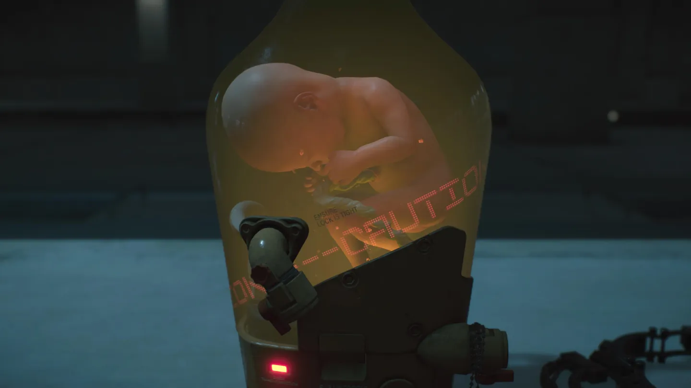
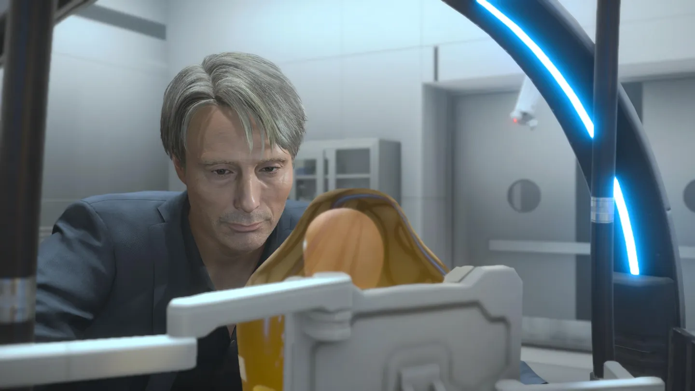
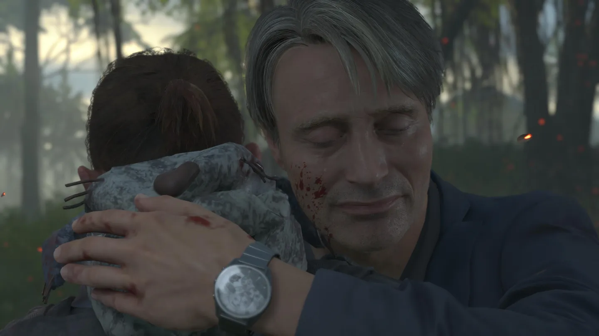
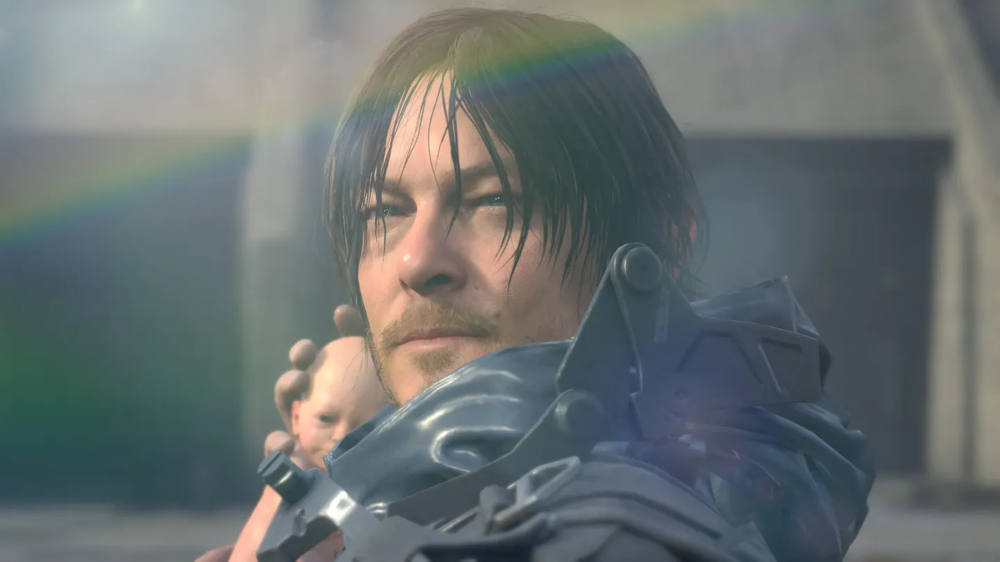
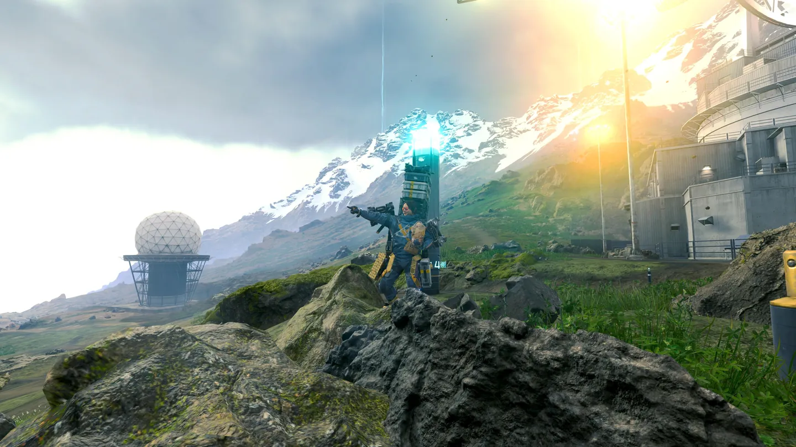

**개발** | 코지마 프로덕션(Kojima Productions)  
**유통** | 소니 인터랙티브 엔터테인먼트(Sony Interactive Entertainment) / 505 게임즈(505 Games)  
**출시** | 2019년 11월 8일 / 2020년 7월 14일 / 2021년 9월 24일(디렉터스 컷) / 2022년 3월 30일(디렉터스 컷)  
**플랫폼** | PS4 / Windows / PS5  
**심의 등급** | 청소년 이용불가

 전설적인 잠입 액션 게임 ***메탈 기어 솔리드(Metal Gear Solid)*** 시리즈의 아버지 **코지마 히데오**(小島秀夫)는 여러모로 호불호가 갈리는 인물이다. 주류가 아니었던 잠입 액션 게임을 순식간에 메이저한 장르로 끌어올리면서 장르의 문법까지 정립한 *메탈 기어 솔리드*에서 보여준 게임 플레이에 대한 깊은 이해도, 독특한 게임성, 훌륭한 스토리는 그를 가장 유명한 게임 개발자 중 한 명으로 기억되도록 만들었지만, 장황한 연출과 지나치게 긴 컷신, 무의미한 정보의 범람 등은 가장 호불호가 갈리는 개발자 중 하나로도 지목되게 만들었다.

 개발자를 푸대접하기로 악명 높은 게임 개발사 <em>코나미(Konami)</em>와의 갈등을 겪을 때 수많은 게이머들은 그를 응원했다. 게임 회사이면서도 게임을 홀대한다는 인상을 준 코나미의 소문으로 흘러나오는 이해할 수 없는 개발자들에 대한 대우와 게이머들에 대한 태도는 게이머들로 하여금 수많은 IP를 가진 코나미를 적대하게끔 만들었다. 호불호가 갈리지만 가장 유명한 프로듀서 중 하나인 코지마 히데오가  그런 코나미와 갈등을 빚는다는 소식이 나왔을 때, 거의 모든 게이머들은 그를 응원했다. 진통 끝에 코지마 히데오가 결국 퇴사해 자신만의 스튜디오 <strong><em>코지마 프로덕션(Kojima Production)</em></strong>을 설립했을 때, 경영진의 간섭 없이 드러날 코지마의 색을 기대하는 목소리가 높아졌다. 무성한 소문 끝에 마침내 나온 첫 작품이 바로 <strong><em>데스 스트랜딩(Death Stranding)</em></strong>이었다.

 메탈 기어 솔리드처럼 잠입을 하는 것도, 사일런트 힐처럼 호러 게임인 것도 아니고, 그저 배달을 하는 게임이라니. 전 세계가 충격에 빠졌고, 평단은 논쟁의 장이 되었다. 생소한 플레이 방식에 "게임을 할 의욕을 잃었다"며 혹평하던 매체도 있었고, "제멋대로지만 진정으로 독창적이다"라며 극찬을 쏟아낸 웹진도 있었다. 유저 평가 역시 극명히 갈렸는데, 중간 평가 없이 호불호가 극심했다.

*데스 스트랜딩*은 이렇듯 그 개발자만큼이나 게임계를 뒤흔들었던 화제작이었다. 과연 어떤 게임이었길래 이처럼 논쟁적인 게임이 되었을까? 어떤 게임이었길래, *'빠와 까를 모두 미치게 하는'* 2010년대의 슈퍼스타가 되었을까?

## 스토리

> 미래에는 데스 스트랜딩으로 알려진 초자연적인 사건으로 산 자와 죽은 자 사이의 문이 열리고, 이로 인해 사후 세계의 생명체들이 고립으로 상처 입은 외로운 세상을 방황하게 됩니다.   
> 샘 브리지스가 된 여러분의 임무는, 망가진 미국에 생존하는 사람들을 연결하여 인류에게 희망을 전달하는 것입니다.  
> 여러분은 한 걸음씩, 분리된 세상을 다시 연결하실 수 있습니까?[^1]

  어느 날, 생사의 경계가 무너졌다. 죽은 자들은 곧장 화장하지 않으면 검게 변하며 **BT**라 불리는 괴물들로 바뀌었고, 이 눈에 보이지 않는 괴물들은 산 사람을 집어삼켰다. BT가 산 사람을 먹는 순간 도시 전체를 날려버릴 수 있는 거대한 폭발, **보이드 아웃**이 일어났고, 인류가 지금껏 만들어온 문명은 처참히 파괴되었다.  다행히, 매우 발전된 인류 문명은 이런 기이한 상황에서도 새롭게 발견된 **카이랄리움**을 이용한 기술을 발전시켜 생존할 수 있었지만, 너무나도 많은 사람들을 잃었고, 더 이상 상처받지 않길 원했던 사람들은 각자 지하 쉘터나 도시에 고립되어 살아가기를 택했다. 지금까지 일어난 일련의 사건을 ***데스 스트랜딩(Death Stranding***)이라 칭했고, 쉘터와 도시 바깥에는 물자를 수송하기 위한 소수의 택배 기사, 포터(Porter)들만이 초토화된 세상을 누볐다. 그리고 플레이어는 *'전설의 배달부'* **샘 포터 브리지스**(**Sam Porter Bridges,** 노먼 리더스 분)가 되어 사람과 사람을 잇는 일을 하게 된다.

 데스 스트랜딩은 설정부터 매우 독특하다. 발전된 기술, 복식, 쉘터와 바이크, 트럭 등의 건물과 탈 것의 디자인은 매우 미래적이고 SF적이다. 한편 '죽음'에서 돌아오는 귀환자 샘, BT를 감지할 수 있는 **DOOMS**, 삶과 죽음의 경계인 **'해변'** 그리고 이 해변과 생명체를 잇는 <strong>'탯줄'</strong>은 판타지적이다. 어느 정도 정형화된 SF와 판타지와 달리, 코지마 히데오의 상상력은 이처럼 매우 독창적인 세게관을 창조해냈지만, 반대로 말하면 플레이어에게 매우 낯선 세계이기도 하다. 벌써 볼드체로 표시한 고유명사의 개수만 보더라도 그렇다. 하지만 어려운 세계관이라도 전달 방법이 쉽다면 훌륭한 세계관이다. 코지마 히데오는 능숙하게 게임 초반부터 장황한 설명 없이 자신이 창조한 세계를 *보여*준다.

*BB-28*

 데스 스트랜딩 이후 파괴된 미국 정부의 후신인 브리지스 기관과 UCA 소속이었던 샘은 아내의 죽음을 계기로 잠적, 프리랜서 포터로 일하고 있었다. 게임은 언제나처럼 바이크를 타고 물건을 운반하던 샘으로 시작한다. 바이크를 타고 있던 샘 앞에 갑작스레 프래자일(레아 세두 분)이 나타나고,  샘의 바이크는 망가졌다. 설상가상 맞은 물체의 시간을 빠르게 만드는 비, **타임폴**이 내리자 근처 동굴에서 몸을 피하던 둘은 곧이어 나타난 BT를 맞닥뜨리게 되고, 프래자일은 해변을 통하는 기술, **점프**를 통해 그를 구해준다. 이후 센트럴 노트 시티에 도착해 배달을 마친 샘에게 긴급 의뢰가 들어오고, 시체 처리반 이고르와, BT를 감지하는 **BB**와 함께 시체가 BT화하기 전에 시체를 소각하러 소각장으로 향한다. 소각장으로 향하던 중 다시 타임폴이 내리고, 설상가상 BB는 작동하지 않으며 BT가 나타나 트럭을 뒤집어버린다. 뒤집힌 트럭에 깔린 운전사는 타임폴을 맞아 급격히 늙어버리고, 숨을 참으며 BT가 사라진 것을 확인했지만 시체가 BT화, 이고르는 보이드 아웃을 막기 위해 운전사를 죽이고 BT에게 붙잡히자 자살하려 하지만 결국 BT에게 잡아먹혀 보이드 아웃이 일어난다. 귀환자 샘은 해변을 거쳐 자신의 육체를 찾아 이승으로 귀환하는데 성공하지만, 보이는 것은 거대한 크레이터뿐이었다.

 게임은 이처럼 수많은 정보를 자연스러운 스토리에 녹여내며 시작한다. 타임폴의 효과, BT의 탄생과 보이드 아웃, 귀환자, 해변에 대해 모든 정보를 처음부터 알 수는 없지만, 각각의 요소가 어떤 효과를 지녔는지, 그래서 이 세계가 어떻게 되었는지를 설득력 있게 보여준다. 이 때까지의 게임 플레이 곡선 역시 훌륭하다. 화물의 중량과 위치에 따라 달라지는 무게중심과 이를 잡기 위한 액션, 울퉁불퉁한 지면에서 길을 찾는 방법 등을 자연스럽게 알려주며, 이 '걸음'을 지루하지 않게 해주는 사운드와 배경 연출까지. 이 때까지의 게임은 앞으로 펼쳐질 세계를 기대하게 만든다.

 보이드 아웃 이후 샘은 캐피탈 노트 시티의 쉘터에서 깨어났다. 그곳에서 샘은 UCA의 의뢰를 받아 미국을 횡단하며 끊어진 네트워크를 복원하는 일을 맡게 되고, 고장나 폐기를 앞두었던 이고르의 BB, BB-28과 함께 서쪽으로의 여정을 시작한다.

 본작에 등장하는 수많은 캐릭터들은 유명한 배우, 감독들의 페이셜 캡처로 제작되었다. 할리우드에서도 이미 유명한 노먼 리더스, 레아 세두, 매즈 미켈슨, 마가렛 퀄리 등의 배우와 감독 기예르모 델 토로, 에드가 라이트, 작가 이토 준지, 디자이너 에롤슨 휴, 코미디언 코난 오브라이언까지, 코지마 히데오의 넓은 인맥을 유감없이 자랑하는 부분이다. 그리고 대부분 이 인물들의 연기력은 매우 흡입력 있게 게임 세계에 녹아있다. 물론 카이랄 아티스트의 사례와 같이 매우 아쉬운 NPC도 있었지만, 레아 세두가 연기한 프래자일과 트로이 베이커가 분한 힉스, 린지 와그너가 맡은 아멜리 등은 스토리 내내 등장하며 존재감을 뇌리에 각인시키기에 충분하다. 각자 그들의 배경 스토리는 데스 스트랜딩과 같은 아포칼립스 상황에서 닥치게 될 개인의 갈등을 훌륭하게 묘사하고 있으며, 그들이 맞는 엔딩 역시 플레이어로 하여금 충분히 납득할 수 있게 만든다.

 무엇보다 매즈 미켈슨이 분한 클리포드 엉거는 메인 서사가 진행되면서 엮이지는 않지만 계속 등장하는데, 그가 메인 서사로 진입하지 않았음에도 불구하고 강렬한 존재감으로 플레이어에게 계속 깊은 인상을 주고, 마침내 그가 메인 서사와 엮일 때 플레이어는 전율에 사로잡히게 된다. 이 반전은 데스 스트랜딩 게임 전체를 통틀어서 가장 강렬한 반전이므로 아래 더보기 란을 참조하기 바란다.

*BB의 기억 속에서 등장하는 클리포드 엉거(매즈 미켈슨 분)*

 데스 스트랜딩의 수많은 설정들은 흥미롭기도 하지만, 다소 억지스러운 부분도 있다. 화물을 운반하는데서 희열을 느낀다는 뮬(mule)의 존재가 그것인데, 화물을 훔치는 것만으로도 충분한 설명이 되지 않았을까 싶은 부분이긴 하다. 하지만 이 정도를 제외한다면 대부분의 설정은 납득 가능하고 게임 플레이에 충분히 녹아있다. 죽은 자들을 최대한 피하기 위한 비살상 플레이의 권장, 으레 멸망의 분위기다 싶으면 등장하는 죽음을 두려워 하지 않는 광신도 집단, 역시 다소 억지스럽다고 생각했지만 이후 스토리 진행을 하며 납득하게 되는, 게임 오버 대신 더 세련된 방식, 귀환자라는 설정, 카이랄 링크라는 SF적이면서 게임 플레이에 큰 도움을 주는 요소까지. 데스 스트랜딩의 설정은 낭비된다는 느낌이 전혀 들지 않는다.

 본작의 서사는 복잡하지는 않다. 일종의 로드 무비에 가깝고, 대부분의 플레이 타임을 혼자 세계를 돌아다니는 데 있으며, 서쪽으로 가야 한다는 명확한 길에서 벗어나지 않는다. 여러 낯선 설정들이 서사의 이해를 어렵게 하긴 하지만, 아기새에게 먹이를 주는 어미새의 심정으로 수없이 반복해서 들려주는 주제와 설정은 이 게임을 이해하기 쉽게 만들어준다. 오히려 이 점이 단점이 되기까지 하는데, 지나치게 많은 반복과 장황한 설명으로 플레이어를 지치게 만들기도 한다. 코지마 히데오가 본래 컷신을 많이 사용하는 것으로 유명하긴 하지만 이 작품은 컷신이 엄청나게 많은데, 대부분의 컷신은 이전에 했던 발언을 다시 확인해주거나, 장황해서 유의미한 정보를 찾기 힘들거나, 일본의 다른 작품에서도 곧잘 찾아볼 수 있는 추상적이고 오그라드는 대사로 흡입력 있는 스토리의 전달력을 저하시킨다.

 특히 이 게임은 초반부를 제외하면 설정을 풀어놓기만 하고 복선 회수를 천천히 하는데, 게임의 목가적인 분위기와 잘 어울리기도 하지만 그런 점과 결합하여 지루해서 그만두는 사람도 부지기수이다. 이렇게 뿌려놓은 떡밥들은 후반부에 가서 몰아치듯 회수하는데, 이 회수 방식이 시네마틱 어드벤처라는 이 게임의 장르에 맞게 컷신으로 진행되기 때문에 후반부에는 거의 영화 보듯 컷신을 보는 것 이외에 할 수 있는 게 없는 것도 단점이다. 물론 후반부의 컷신은 그만큼 품질도, 연출도, 스토리도 훌륭하지만, 그러한 장점들을 희석시킬만큼 긴 컷신은 이 게임의 서사를 아쉽게 만든다.

 그럼에도 불구하고 이 게임은 설정과 어우러져 흡입력 있는 스토리를 가진다. 데스 스트랜딩 서사를 관통하는 주제는 '연결'이라 할 수 있다. 재앙으로 멸망한 세계, 고립된 사람들. 그리고 이들을 이어주는 포터, 샘 브리지스. 코지마 히데오의 다른 게임들이 그렇듯 지나치게 직설적인 이름이 다소 '짜치는' 느낌을 주긴 하지만, 가장 직설적인 표현이기도 하다. 죽음으로 고립된 사람들을 연결(stranding)하고, 그들 사이에 다리(bridge)가 되어주는 포터(porter). 이 게임이 2019년 11월에 나왔음을 고려하면 이러한 설정들은 묘하게 소름이 돋는다. 19년 12월부터 시작된 범세계적 대재앙 COVID-19가 세상을 휩쓸며, 사람들이 각자 고립되는 게임 내 상황이 실제로 나타나게 된 것이다. 코지마 히데오가 이것을 알았을리도, 의도했을리도 없지만, COVID-19를 이겨낸 오늘날의 인류가 이겨낼 수 있었던 것은 전세계적인 협력의 결과(백신)였고, 이는 본작 내내 강조하는 바이기도 하다.

{}

다만 작품 내내 '연결'을 강조한 것과 달리 샘이 브리지스 기관과의 연결을 끊고 잠적한다는 엔딩은 게임의 전체적인 주제와 다소 배치되어 의아함을 자아낸다. 아멜리가 스스로 다른 사람들과의 연결을 끊고 자신의 해변을 고립시켰기에 그녀와 같은 행동을 한 것이라고 하기엔, 그간 게임 내내 카이랄 네트워크에 사람들을 연결하려 노력했던 플레이어의 노력을 없던 것으로 만드는 것처럼 보이기 때문이다.

 한편 컷신의 연출과 별개로 게임플레이 그 자체로 기가 막히게 서사를 전달했던 부분도 있다. 버그에 걸린 것이 아닌가 의심될 정도로 게임의 엔딩이 나오지 않았음에도 상호작용할 것도 없는 해변에서 아멜리를 찾아 지나치게 긴 시간을 소모하는 시퀀스가 있는데, 이 시퀀스동안 플레이어는 무척 당황하게 된다. 엔딩이 아직 다가오지 않았음에도 크레딧이 올라가고, 플레이어가 취할 수 있는 행동은 해변을 돌아다니는 것뿐이며, 심지어 '소리 치기' 상호작용을 하다보면 제 4의 벽을 뚫는 메타 발언[^2]을 하기도 한다. 긴 시간을 기다리면 이어서 컷신과 함께 정상적으로 게임이 플레이되는데, 곧 아멜리의 배경 스토리를 듣다 보면 이 시퀀스의 진정한 의미를 알게 된다. 아멜리는 찾아올 멸종을 막기 위해 해변에 혼자 고립되려 하는데, 해변은 현실 세계보다 시간이 압도적으로 느리게 가기 때문에 현실에서의 수십년이 해변에서는 수만년에 달하는 시간이었던 것이다. 추정컨대 코지마 히데오는 이 시퀀스에서 아멜리의 고독한 시간을 플레이어에게 체험시키고자 했을 것이다. 게임에서의 '체험'은 영화나 소설 등 다른 미디어에 비해 더 강력한 몰입감을 제공한다. 그런 의미에서 이 시퀀스에서 플레이어가 '체험'하는 시간은, 게임이라는 매체의 특징을 십분 활용한 훌륭한 연출이었다고 생각한다.

 또한 등장할 때마다 강렬한 인상을 주지만 메인 스토리와 크게 관련이 없어보이던 클리포드 엉거와 샘의 관계도 굉장히 충격적인 반전이다. 스캐너와 BB를 연결할 때마다 재생되던 기억은 사실 BB-28의 기억이 아니라, 샘 포터 브리지스, 첫 번째 BB의 기억이었던 것이고, 샘은 클리프의 친아들이었던 것이다. 그가 본래 폐기했어야 할 이고르의 BB-28을 구태여 살려 여정을 함께 했던 이유 중 하나도 이러한 무의식이었을지도 모른다. 마침내 그 여정의 마지막에 BB를 폐기하러 갔던 화장터에서 진실을 깨달은 샘이 황급히 살려낸 BB-28, 아니 루 와 함께 소각장 바깥에서 더 이상 타임폴이 아니게 된 비를 맞는 광경은 이 서사의 백미라 할 수 있겠다.

{}

## 시스템

 코지마 히데오는 이 게임의 장르를 <em>'소셜 스트랜딩'</em>이라며, 처음 이 게임이 나왔을 때 쏟아진 혹평에 대해 그가 이전에 만들었던 잠입 액션 장르의 게임처럼 완전히 새로운 장르의 게임이기에 낯설어서 그런 평가가 나왔을 것이라 한 바 있다. 이 말은 어느 정도 자신감의 표현이기도 하다.

 그의 말처럼 데스 스트랜딩의 게임 플레이가 완전히 새로운 장르인가라고 묻는다면, 지금껏 나온 게임들과 새로운 장르로 차별화될 정도라고 말하기는 어렵다. 기본적인 전투나 게임 플레이 메커니즘이 완전히 새로운 것이 아니었을 뿐더러, 아직 이 게임이 나온지 얼마 되지 않아 확언하긴 어렵지만, 메탈 기어 솔리드 시리즈 이후 스플린터 셀, 어쌔신 크리드 시리즈 등 잠입 액션 장르의 게임이 우후죽순 나왔던 것과 별개로 이 게임의 시스템은 데스 스트랜딩의 서사와 지나치게 밀접하게 연결되어 있어 쉬이 다른 게임이 나올 것 같지 않기 때문이다.

 하지만 그렇다고 데스 스트랜딩의 게임 플레이가 독창적이지 않냐, 라고 묻는다면 이것도 아니다. 수많은 오픈월드 게임에서 출발지와 도착지 사이에서 '이동'을 특별할 것 없는 것으로 치부하고  엄청나게 많은 빠른 이동 포인트를 삽입한 예에 비해, 이 게임은 '이동' 그 자체를 액션으로 삼았다. 모든 아이템은 도라에몽 주머니식 4차원 인벤토리가 아니라 샘의 등, 팔, 다리, 차량 등에 반드시 실려야 하며, 빠른 이동 시에는 이러한 화물이 옮겨지지 않기에 샘은 반드시 이들을 직접 옮겨야 한다. 그리고 이 아이템들은 각각 무게와 무게중심, 크기가 모두 다르기 때문에 화물을 실을 때도 순서가 중요하며, 보이드 아웃으로 울퉁불퉁해진 지면을 따라 걷다 보면 상당히 자주 중심을 잃어 이를 바로잡는 상호작용을 해주어야 한다. 결과적으로 플레이어는 세계의 몇몇 포인트만을 체험하는 것이 아니라 지도의 많은 부분을 실제로 가보아야만 하며, 이는 오픈월드 전체를 플레이어에게 체감시키는 효과적인 방법이었다.

 이동이 메인 컨텐츠이니만큼 자동 길찾기는 지원되지 않고, 그 대신 배달 목적지로 향하는 루트를 직접 짜는 것 역시 하나의 메인 컨텐츠이다. 보다 빠르지만 지형히 험하고 BT가 득실거리며 타임폴이 내리는 길을 찾을 수도, 안전하지만 보다 느리고 돌아가는 길을 택할 수도 있다. 이렇듯 단순한 이동에도 전략성을 부여했으며, 감시탑과 스캐너, 사다리, 앵커, 다리, 국도 등 갈수록 옵션이 해금되며 이러한 전략성이 강화된다.

 사실 데스 스트랜딩 초반 플레이는 꽤 지난하다. 오프닝 컷신에서 타던 바이크는 망가졌기에 두 다리로 걸어야 하며, BT에 대응할 수 있는 수단도 전무하기에 마치 알몸으로 바깥에 나가는 것과 같은 느낌이 든다. 지형을 극복할 수 있는 수단도 제한적이고, 하나씩 옵션이 해금되기는 하지만 이런 식이라면 게임을 진행하기 어렵겠다고 느끼는 순간이 들 때, 그 때 바이크가 등장한다.

 바이크가 해금되고 나서는 점차 BT에 대응할 수 있는 수단도, 각종 유틸리티 옵션들도 증가한다. 화물을 자꾸 빼앗으려 드는 뮬들을 제압하기 위한 비살상수단과 살상수단, BT에게 데미지를 줄 수 있는 무기, 무엇보다 배달을 도와주는 바이크와 트럭, 집라인 등이 해금되면서부터는 이 게임이 왜 액션 게임인지를 실감하게 된다. 이렇듯 섬세하게 디자인된 학습 곡선은 초반부의 지루함을 이겨내고 나면 배달이라는 행위 자체에서 재미를 느낄 수 있게 한다.

### 비동기 멀티플레이

 이 게임의 또다른 독창점은 비동기 멀티플레이에서 나온다. 이동을 위해 깔아놓은 사다리, 앵커, 표지판, 구조물, 자원, 차량 등은 서버 상에 업로드 되어 다른 플레이어의 세계에서도 등장한다. 다른 플레이어의 세계에 등장한 나의 구조물을 누군가 사용하게 되면 '좋아요'를 받을 수 있으며, 사용한 후 이 구조물이 유용하다면 추가로 '좋아요'를 보낼 수 있기 때문에 이 게임의 경험치 역할을 함께 하는 '좋아요' 시스템에 큰 영향을 준다.

  이 구조물들은 설정상 카이랄 네트워크에 연결되어 있어야만 등장할 수 있기 때문에 아직 네트워크에 연결되지 않은 지역을 가는 첫번째 여정에는 내가 만든 구조물들로만 이 구역들에 도달해야 하지만, 이후 네트워크에 연결하게 되면 다른 사람들이 만들어놓은 구조물을 쉽게 이용할 수 있어 네트워크 연결 이후에 이 곳을 방문하는 것이 더 수월해 반복적으로 느껴지지 않게 하는 역할도 한다. 이러한 구조물들은 타임폴에 의한 내구도 저하도 일어나고, 카이랄 네트워크 대역폭에 의해 수량 제한도 있기 때문에 지속적으로 자원을 소모해 수리하지 않으면 망가지거나 사라지고 무제한으로 깔 수는 없기 때문에 이 역시 전략성을 배가하고, 네트워크 대역폭을 넓히기 위해 각 의뢰인들의 호감도를 올리는 것을 유도한다.

 적절한 위치에 설치된 구조물들은 좋아요를 받기에 최적화되어 있으며, 설령 표지판이나 구조물들을 악의적으로 배치하여 플레이어를 사망케 하더라도 게임적 재미를 느낄 수 있다. 설정 상 배달부들은 이 '좋아요'를 받으면 라이크신이라는 호르몬이 분비된다는데, 실제로 플레이어가 적절한 위치에 배치해서 다른 사람에게 좋아요를 받은 구조물을 보면 실제 인간에게도 이 라이크신이 분비되는 것 아닐까라는 생각이 들게 된다.

 무엇보다 이 구조물의 하이라이트는 국도와 집라인인데, 트럭과 바이크가 안정적으로 다닐 수 있는 국도를 재건하는 데에는 엄청난 양의 자원이 들어 혼자 국도를 완성하는 것은 불가능하지만, 부분부분 재건된 국도에 자원을 함께 부어 국도를 완성하게 되면 화물의 대량 수송이 가능해지기 때문에 게임이 수월해진다. 다만 국도는 뮬이나 테러리스트의 본거지를 지나는 경우도 있고, 지형에 따라 다소 돌아가는 부분이 있을 수 있는데다 자원 소모가 극심하고 유지 기간도 길지 않은데, 일종의 밸런스 조정으로 보인다. 한편 집라인은 지형을 극복할 수 있는 유용한 수단으로, 대역폭을 무지막지하게 잡아먹지만 속도가 빠르고 험지를 주파하는데 유용하기 때문에 후반부에는 국도와 집라인을 타고 다니며 더욱 재미있는 플레이를 할 수 있다. 디렉터스 컷에서는 플로팅 캐리어에 짐을 싣고 집라인을 탈 수 있기 때문에 더욱 유용한 건 보너스다.

*집라인을 타며 물건을 수송할 수 있다.*

## 비주얼

 배경은 아이슬란드에서 영감을 받았다고 하며, 사운드 역시 아일랜드의 밴드 Low Lore가 맡은 스코어들이 주로 나온다. 배경은 미국이지만 데스 스트랜딩으로 인해 파괴된 자연이 매우 아름답고 슬프게 그려지며, 이에 SF적 디자인이 적용된 건물과 복식은 포스트 아포칼립스 상황에 매우 어울린다.

 UI 역시 SF에 걸맞은 디자인으로 깔끔하며, 전체적으로 흠잡을 데 없는 비주얼을 보여준다.

 특히 걸어서 배달할 때, 주변의 위협이 없으면 자연스럽게 카메라가 원경을 잡으며 Low Lore의 곡이 나오는데, 특별할 것이 없는 상황임에도 불구하고 자주 전율을 느낄 수 있을 정도로 훌륭한 연출이 돋보였다.

## 정리

 데스 스트랜딩은 여러모로 독창적인 게임이다. 일반적인 AAA급 게임의 작법을 따르지 않고 상당히 많은 부분 새로운 시도를 했다. 그리고 이들 대부분은 꽤 성공적으로 보인다. 호불호가 갈리는 평가를 받기는 했지만, 설정과 어우러진 게임 플레이, 이동 그 자체의 액션성, 섬세하게 고안된 학습 곡선과 혁신적 비동기 멀티 플레이는 이 게임을 호평할 수밖에 없게 만든다. 흡입력 있는 스토리는 덤이다.

 그러나 초반의 지루함, 지나치게 긴 컷신, 그로 인해 너무 많이 반복되는 은유와 상징은 스토리의 매력을 반감시키며, 오히려 몇몇 구멍을 만들기까지 한다. 심지어는 게임 전문 리뷰어로 하여금 엔딩을 볼 생각이 들지 않는다라는 평을 듣기까지 했으니, 이 단점이 결코 무시할 수 없는 것 역시 분명하다.

 종합적으로 봤을 때 코지마 프로덕션의 첫 작품은 코지마 히데오 그 자체라고 볼 수 있다. 그의 독창적이고 혁신적인 게임 디자인과 연출이, 장황하고 늘어지는 설명과 어우러져 세상에 없던 평하기 어려운 작품이 나왔다. 하지만 적어도 코지마 히데오 이외에는 만들 수 없었던 작품이었던 것은 분명하며, 시간이 지날수록 재평가되는 요새의 기류에 더욱 이 스튜디오의 차기작을 기대하게 만드는 기념비적인 작품이었다.

> **그래픽** | ★★★★★(10점) 할리우드 블록버스터급  
> **스토리** | ★★★☆(7점) 맛있는 밥도 다섯 끼 연속 먹으면 질린다  
> **참신함** | ★★★★☆(9점) 배달이 이렇게 재밌을 일이야?  
> **사운드** | ★★★★☆(9점) 지난한 보행을 즐겁게 한다  
> **연출** | ★★★★★(10점) 코지마 히데오  
> **컷신** | ★★★☆(7점) 하나하나의 품질은 좋지만... 이거 영화 아니고 게임인데...  
> **설정** | ★★★★(8점) 코지마 히데오, 그는 예언자인가?  
> **전투** | ★★★★(8점) 살상도, 비살상도 즐겁게... 하지만 초반엔 너무 힘들어  
> **캐릭터** | ★★★★☆(9점) 레아 세두는 신이다  
> **좋아요** | ★★★★★(10점) 나도 라이크신이 분비될지도
>
> **총점** | ★★★★(87/100)  
> *코지마 히데오가 '코지마 히데오'했다.*

[^1]: https://www.playstation.com/ko-kr/games/death-stranding-directors-cut/
[^2]: "이거 버그 아냐?", "이거 미완성으로 출시한거지?"
