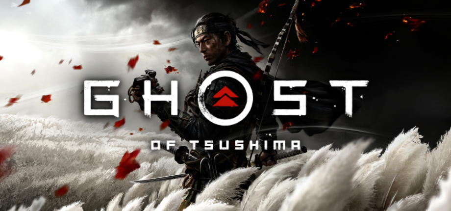

**개발** | 서커 펀치 프로덕션(Sucker Punch Productions)  
**유통** | 소니 인터랙티브 엔터테인먼트(Sony Interactive Entertainment)  
**출시** | 2020년 7월 17일 / 2021년 8월 20일(디렉터스 컷)  
**플랫폼** | PS4 / PS5(디렉터스 컷)  
**심의 등급** | 청소년 이용불가

 1274년, 몽골은 고려를 넘어 일본으로 향했다. 이윽고 쓰시마에 상륙한 여몽 연합군은 반나절만에 쓰시마 군을 전멸시키고 이키를 넘어 본토 규슈의 하카타 만에 상륙했다. 전세계를 휩쓴 몽골의 군세는 이렇게 쉽게 일본마저 집어삼키는듯 했지만, 마침 불어닥친 태풍, 이른바 신풍(神風)이 연합군의 함대를 침몰시켰고, 몽골은 후퇴할 수밖에 없었다.

 이 시기를 다룬 게임은 이 게임이 처음이 아니다. 전략 시뮬레이션의 대표작 중 하나이자 대규모 회전(會戰)을 다루는 거의 유일한 시리즈, **토탈 워** 시리즈의 첫 작품인 **_쇼군 : 토탈 워__(Shogun : Total_ _War)_** 의 확장팩 _몽골 인베이전(The Mongol Invasion)_ 역시 이 시기를 다룬 대표적인 게임이다.

 **_고스트 오브 쓰시마(Ghost Of Tsushima)_** 는 위 역사적 사실을 바탕으로 하는 **3인칭 오픈월드 액션 어드벤처** 장르의 게임이다. 플레이어는 코모다 해변의 전투에서 살아남은 사무라이, **사카이 진**이 되어 쓰시마를 몽골의 손아귀에서 해방시키고자 한다.

## 스토리

> 진은 사무라이의 방식을 배우며 자랐습니다. 그리고 사무라이가 몽골군에 패하자, 그의 세상은 부서집니다. 진은 가장 어려운 선택을 할 수밖에 없습니다. 사무라이 정신에 기반한 명예와 전통을 유지하며 승리할 수 없는 전쟁을 할지, 아니면 사무라이의 길에서 벗어나 수단과 방법을 가리지 않고 섬과 주민을 보호할지 결정을 내려야만 합니다.<a href="https://cstrnull00.tistory.com/2#footnote_2_1" id="footnote_link_2_1" onmouseover="tistoryFootnote.show(this, 2, 1)" onmouseout="tistoryFootnote.hide(2, 1)" style="color:#f9650d; font-family: Verdana, Sans-serif; display: inline;">[각주:1]</a>

  몽골군이라는 거대한 적의 침입을 물리치는 영웅의 서사를 가지고 있으면서도, '부시도'라는 기존의 가치관과 현실의 충돌,  위기 앞에서 방황하는 인간 군상 등을 알기 쉽게 표현하고 있다. 특히 주인공 사카이 진과 외숙부 시무라 공의 서사는 전통과 다른 새로운 것을 받아들이는 일본 문화의 일면을 제대로 통찰하고 있는 것처럼 보인다.

 서브 퀘스트의 진행 방식은 낡았고 대개 평면적이지만, 주요 인물들의 서브 퀘스트 라인은 몇몇 반전과 함께 비극을 맞닥뜨린 인물들의 변화를 충분히 공감할 수 있게 풀어냈다.

 디렉터즈 컷의 무대인  이키 섬의 서사는 보다 사카이 진이라는 인물에 대해 깊이 탐구할 수 있도록 해 준다. 환상이라는 매개를 통해 본편에서도 보여졌던 사카이 진의 아버지에 대한 부채감과 그 아버지의 양면성을 보여주는 해적들의 이야기는 흥미로운 파고들거리라는 측면에서 훌륭한 DLC로 볼 수 있지만, 이 과정에서 다소 평면적으로 묘사되는 해적과 사무라이의 면모들 때문에 이야기 그 자체의 깊이는 조금 아쉽다.

 시무라 공은 전통적인 부시도에 따라 정정당당하게 몽골군과 맞서길 원하지만, 나노리를 하다 불태워진 아다치 하루노부의 예에서 볼 수 있다시피 몽골군은 이러한 가치관으로 상대할 수 없는 시대의 변화와도 같은 존재였다.

 한편 코모다 해변에서 평민, 그것도 부시도를 따를 리 없는 도적 여자 유나의 손에 구해진 사카이 진은 전통적인 가치관으로는 시대의 변화에 대응할 수 없다는 것을 느꼈고, 유나의 영향으로 다소 수단과 방법을 가리지 않는, 그러나 피해를 최소화할 수 있는 방법을 모색하여 '사무라이'가 아닌 '망령'이 되어 쓰시마를 수호하고자 했다.  
  
 이러한 시무라 공과 사카이 진의 대립은 천천히 고조되어 가다가, 사카이 진이 독단적으로 몽골군의 술에 독을 탐으로써 절정에 달한다. 열세인 전력으로 시무라 성 탈환에 결정적인 도움이 되었던 행위였지만, 분명 부시도적이지 않은 비도덕적 행위였기에 그는 수감된다. 그런 사카이 진이 탈옥하여 북쪽에서 세력을 모아 침략자의 우두머리 코툰 칸을 처단한 이후에도, 전통적인 가치관을 위배한 그를, 쇼군의 대리자로서 쓰시마를 통치하는 시무라 공은, 개인적인 감정은 어떠했든 용서할 수 없는 처지였다.

 결국 히든 보스로서 시무라 공과 사카이 진의 마지막 결투가 이어진다. 이 결투는 본작 서사의 백미로, 절정에 이르러 뜨겁게 진행되었던 코툰 칸과의 전투와 달리 잔잔하게 진행됨에도 불구하고 수많은 감정들이 뒤섞여, 결투 이후 플레이어의 선택에 관계 없이 플레이어에게 깊은 울림을 준다.

 그러나 사카이 진의 독을 타는 행위가 다소 급진적인 행위로 느껴지는데, 이는 훌륭한 초반과 후반부에 비해 중반 두 인물의 갈등 구조가 비교적 적었던 점에 기인한다. 당면한 시무라 성 탈환에 대해 이견을 나누는 컷신이 있고 독단적으로 진행하는 미션이 있지만 조금 더 플레이 타임을 할애해 이 충돌을 묘사했더라면 좀 더 자연스러운 갈등 구조가 될 수 있지 않았나라는 아쉬움이 남는다.

 해적은 악행이, 몽골군은 선행이 묘사되지 않은 부분 역시 아쉽다. 몽골군은 선행을 하지 않았기에 플레이어의 입장에서 처단하는데 있어서 죄책감을 가질 이유가 없으며, 해적은 악행을 하지 않았기에 사카이 카즈마사에 대해 플레이어는 좋지 않은 감정을 가질 수밖에 없는 것이다. 자국민과 침략자라는 차이가 분명 존재하지만, 이러한 묘사의 부재로 작품에서 다루는 도덕적 논의가 다소 희석될 수 있는 것은 아쉬운 부분이다.

## 시스템

 전반적인 시스템은 소위 AAA급 게임에서 흔히 찾아볼 수 있는 양식인 여타 오픈월드 액션 어드벤처 게임과 대동소이하다. 컷신과 플레이가 반복되는 구조, 경험치나 장비를 얻기 위한 획일화된 서브 퀘스트, 빠른 이동 등이 그러하다.

 한편 그러한 게임들이 특히 요새 도입하고 있는 RPG 요소, 레벨을 통해 공격력과 방어력이 향상되거나 하는 등의 요소 없이 경험치를 통해 새로운 기술을 개방하는 보다 어드벤처 게임에 가까운 형식을 가지고 있다. 개인적으로 이런 부분을 선호하기 때문에 더 흥미로웠던 부분이었다.

### 인터페이스

 본작은 플레이하는 동안 각종 인터페이스 화면을 오래 볼 일이 없다. 전투에 들어가지 않는 한 모든 인터페이스는 노출되지 않으며, 이는 플레이어로 하여금 더욱 게임 내 세계에 몰입할 수 있도록 해준다.

위 스크린샷은 모두 사진 모드를 사용하지 않고 캡처하였다.

 으레 인터페이스를 자제했다고 하는 다른 게임의 경우와 달리 미니맵조차 없이 깔끔한 화면 구성 덕분에 길찾기가 다소 어려워진 감은 있지만 이를 위한 시스템으로 '바람'이 있다. 듀얼센스<a href="https://cstrnull00.tistory.com/2#footnote_2_2" id="footnote_link_2_2" onmouseover="tistoryFootnote.show(this, 2, 2)" onmouseout="tistoryFootnote.hide(2, 2)" style="color:#f9650d; font-family: Verdana, Sans-serif; display: inline;">[각주:2]</a>의 터치패드를 위로 스와이프하면 게임 화면에 바람이 부는듯한 효과가 일어나는데, 이 바람이 곧 목적지로 향하는 방향을 알려준다. 이러한 방식이 실내나 입체적인 공간에서 사용하기 어려운 것은 사실이나, 게임 내 지형을 대부분 개활지와 파쿠르 가능한 절벽 위주로 구성하여 몰입감이라는 장점을 극대화하기 위해 노력한 부분이 엿보인다.

### 탐험

 여러 플레이에 도움을 주는 인터페이스를 제거하는 가장 큰 목적 중 하나는 자연스러운 탐험의 유도일 것이다. 흔히 단순화된 오픈월드 게임의 전형의 멸칭을 소위 '유비<a href="https://cstrnull00.tistory.com/2#footnote_2_3" id="footnote_link_2_3" onmouseover="tistoryFootnote.show(this, 2, 3)" onmouseout="tistoryFootnote.hide(2, 3)" style="color:#f9650d; font-family: Verdana, Sans-serif; display: inline;">[각주:3]</a>식 오픈월드'라고 하는데, 이 유비식 오픈월드의 가장 큰 특징이 바로 미니맵과 게임 내 흩뿌려진 수집 요소, 그리고 맵을 밝히는 빠른이동 포인트이기 때문에, 플레이 타임을 늘리기 위해 이러한 수집 요소를 집어넣더라도 무의미한 이동이 되지 않도록 인터페이스를 제거하고 게임 내 상호작용으로 플레이어가 직접 이러한 요소들을 찾아갈 수 있게 배치해 두었다.

#### 이나리 신사

 맵을 돌아다니다 여우를 발견하면 여우를 따라가 '이나리 신사'로 향할 수 있다. 이나리 신사는 전투나 탐험에 도움을 주는 호부를 장착할 수 있는 슬롯을 개방해주는데, 굳이 여우를 찾지 않더라도 신사 인근에서는 BGM이 바뀌기 때문에 쉽게 알아차릴 수 있다.

#### 신사

 토리이를 따라가다 보면 막힌 길이 나오는데, 이 막힌 길을 우회하여 파쿠르를 하다 보면 신사로 갈 수 있다. 이 신사에서는 메인 호부를 얻을 수 있으며, 퀘스트 등에서 얻을 수 있는 보조 호부보다 성능도 강력하다.

#### 기타

 그 밖에도 최대 체력을 올려주는 온천, 장신구를 제공하는 하이쿠 짓기, 특수 스킬 등을 쓸 수 있게 하는 의지 슬롯을 늘려주는 대나무 훈련장 등의 장소가 있으며, 이러한 장소 이외에도 의외의 장소에서 장신구 등을 얻을 수 있고 이런 장소 역시 맵 상에 날아다니는 황금 새를 따라가 찾아낼 수 있다.

 특히 하이쿠 짓기 부분에 대해서는 제작진의 일본 문화에 대한 깊은 이해가 돋보이는데, 주인공 사카이 진의 유교적, 불교적 사상과 개인적인 경험을 제작진이 선정한 뷰포인트에서 자연물의 요소와 연결지어 시를 통해 드러내는 흥미로운 컨텐츠였다.

### 전투

 전투는 크게  '사무라이'와 '망령'으로 나뉜다. '사무라이'는 대개 전면전과 결투에 특화된 타입이며, '망령'은 은신과 암살에 특화된 타입으로 볼 수 있다. 두 타입 모두 일종의 마나인 '의지'를 소모하여 특수한 기술을 사용할 수 있다.

 스토리 진행에 있어서 은신하여 암살로 진행할지, 정정당당하게 상대할 지는 몇몇 은신이 강제되는 미션을 제외하고 플레이어의 자유이나, 스토리에 미치는 영향은 전무하다.  대부분의 경우 은신과 암살이 번거롭고 전투가 그다지 어렵지 않기 때문에 서사적 측면에서 섬세하다고는 할 수 없다.

 특히 몇몇 미션 중 선행되는 '정찰'은 맵을 미리 플레이어에게 보여준다는 의미 이외에는 전혀 역할이 없는데, 표시된 부분을 보고 상호작용 버튼을 누르면 설명이 나오는 정도라서 능동적인 전투 경험이라고 느껴지지 않았다.

 그러나 보여지는 액션이 화려하고, 다양한 적 병종과 그를 상대하는 여러 '자세', 그리고 스킬들을 익혀가는 구성 덕분에 전투가 매우 매력적이다. 특히 '결투'의 경우 결투 직전 재생되는 컷신 연출이 시대극의 로망을 자극해 더욱 흥미진진한 플레이 경험을 만들어준다.

#### 사무라이

 게임 내 대부분의 전투는 이 타입으로 진행되며, 특히 보스전에 해당되는 '결투'의 경우 망령 무기를 사용할 수 없어 이 타입으로 고정된다. 가드를 사용하는 적을 대상으로 가드를 깨고 검격을 통해 적을 해치워야 하며, 네 가지 '자세'가 있어 각 적의 타입에 따라 가드를 깨기 용이한 자세를 택하여 전투에 임해야 한다.

 한편 적을 처음 조우했을 때 '맞대결'을 신청하여 1대1로 적의 수를 줄일 수도 있는데, 적이 공격하는 순간 반격 키를 입력하여 무기의 공격력과 상대의 가드 여부에 상관 없이 일격사시키고 다량의 의지를 수급할 수 있다.

 게임이 진행되면서 가드 불가능한 기술이나 여러 적에게 데미지를 주는 특수 기술들을 익힐 수 있다.

#### 망령

 '망령 무기'를 사용하여 상대를 암살하거나, 주의를 돌려 은신에 도움을 주는 플레이를 할 수도 있고, 전투 중 상대의 가드를 깨거나 광역 피해를 주는 종류의 무기도 존재한다.

 한편 중반 이후에 해금되는 '망령 자세'는 사무라이의 네 가지 자세와 달리 피해를 입지 않고 연속으로 적을 처치할 시 발동하는 기술로, 화면이 흑백으로 바뀌면서 적들이 공포에 질려 도망가는데 이를 천천히 걸어가 일격사시킬 수 있다.

#### 활

 본작이 이른바 '찬바라'물인만큼 활은 어디까지나 보조 무기로서의 성격이 강하지만, 여러 호부나 장비와 조합하면 꽤 쓸만한 전투 장비가 될 수 있다. 대개 상대의 궁수 등 원거리에서 공격하는 적들을 제거하는 용도로 사용하지만, 맵에 배치된 각종 물품들을 폭파시키거나 불을 질러 상대를 교란하고 혹은 주요한 적들의 머리를 맞춰 즉사시키는 무기로써 사용한다.

## 비주얼

 본작의 비주얼에서 특기할 부분은 그 어느 게임보다도 입자의 표현이 사실적이라는 데 있다. 소위 AAA급 게임의 대부분이 흩날리는 낙엽이나 눈 따위를 단순 비주얼 이펙트로 구현한 반면 본작은 땅에 자라난 풀 한 줄기마다, 흩날리는 낙엽마다 입자가 살아있는 듯한 느낌을 준다. 이를 강조하려는듯 탑재된 포토 모드에도 입자 관련 옵션이 따로 존재할 정도이다.

은행 낙엽의 표현이 매우 사실적이다.

바람이 불면 풀과 갈대가 한 방향으로 눕는 것을 관찰할 수 있다.

 전반적인 비주얼은 PS4의 마지막 독점작이니만큼 훌륭하며, 구름과 태양, 비와 눈과 같은 날씨 효과도 특출난 수준이다.

 얼굴이나 표정 역시 충분히 몰입할 수 있을 정도의 퀄리티를 보여주며, 특히 다른 AAA급 게임에서 좀처럼 볼 수 없었던 동양인이 다수 등장하는 게임이니만큼 이 부분 역시 주목할만 하다.

 다만 바위, 특히 파쿠르가 가능한 바위를 표시하는 텍스처의 경우 매우 해상도가 떨어져 다소 거슬릴 수 있으며, 물 텍스처도 실망스러울 정도로 좋지 못하다. 위의 장점들이 매우 빼어나게 구현된 것과 대비되어 더욱 아쉬운 부분이다.

### 고증

 전반적으로 작품의 시대 배경인 가마쿠라 막부 시기의 갑옷과 도검 양식 등을 기반으로 하면서도, 필요하다면 과감하게 후대의 것이라도 도입하는 모습을 보여준다. 본작의 모티브가 된 여러 시대극들이 그러하듯 소위 '사무라이 뽕'을 자극하는 당세구족을 비롯한 멋진 갑옷들이 등장하면서도, 대부분의 갑옷은 당대 착용했던 오오요로이를 기반으로 하여 구현되었다.

게임에 등장하는 '고사쿠 갑옷'. 오오요로이에 가까운 갑옷 형태이다.

디렉터즈 컷에 등장하는 이키 섬에서 얻을 수 있는 사루가미 갑옷. 훨씬 후대의 갑옷인 당세구족과 비슷한 형태를 가지고 있다.

 한편 몽골군의 경우 다소 후대의 무기나 판타지적 요소를 많이 차용했다. 본작의 메인 보스이자 몽골군의 지휘관 코툰 칸은 당대 송나라에서 사용하던 무기인 언월도를 주력으로 사용하거나,  정예 병사들은 황금 가면을 착용하는 등 비교적 화려하게 디자인되었다. 화차의 경우도 조선 문종 때 개발된 무기라 본작의 배경에서 몽골군이 가지고 나올 수는 없지만, 게임적 허용으로 받아들일 수 있다.

게임에서 얻을 수 있는 몽골군 갑옷.

### 연출

 일본 영화의 거장 구로사와 아키라 감독의 영향을 받아 흑백 필름 영화 같은 효과를 주는 이른바 '구로사와 모드'를 탑재하는 등 전반적으로 일본에서 제작된 일본 시대극의 향취가 느껴진다. 특히 여러 컷신에서 보여지는 광원과 입자의 활용은 탄탄한 스토리와 맞물려 영화와 같은 연출을 보여준다.

## 정리

 오늘날 오픈월드 액션 어드벤처 게임이 어느 정도 정형화되어 있다는 것은 부정할 수 없는 사실이다. 추적, 은신, 암살, 구출, 아이템 파밍, 파쿠르 등 여러 요소에서 '고스트 오브 쓰시마'는 아주 새로운 부분을 보여주지는 못했다.

 하지만 시대극이라는 배경과 이에 어울리는 서사, 그리고 매력적인 전투 경험으로 '고스트 오브 쓰시마'는 또 다른 훌륭한 게임으로 거듭날 수 있었다. 이를 그려내는 수려한 그래픽 역시 이 게임을 고평가하게 한다.

 다소 아쉬운 디테일과 허리가 부실한 서사가 이 게임을 그 이상으로 고평가 할 수 없게 만드는 걸림돌이지만, 그럼에도 불구하고 여전히 플레이스테이션이 있다면 꼭 한 번쯤 해봐야 할 게임 중 하나이다.

> **그래픽** | ★★★★(8점) 역대급 입자 표현, 아쉬운 디테일  
> **스토리** | ★★★☆(7점) 빼어난 도입부와 훌륭한 엔딩, 아쉬운 허리  
> **캐릭터** | ★★★(6점) 아주 매력적이지는 않은 캐릭터들  
> **조작감** | ★★★★☆(9점) 불편한 건 오직 시야각 뿐  
> **사운드** | ★★★★(8점) 흠잡을 데 없는 동양의 미  
> **연출** | ★★★★★(10점) 사무라이 영화 그 자체  
> **엔딩** | ★★★★☆(9점) 어떤 선택이든 납득하게 만드는  
> **전투** | ★★★★☆(9점) 결투는 만점, 은신 플레이가 아주 약간 아쉽  
> **시대극 로망** | ★★★★★(10점) 사무라이 영화 그 자체 (2)  
> **오픈월드 상호작용** | ★★★☆(7점)  좀 더 지도를 돌아다니는 맛을 느끼게 해줬으면  
>   
> **총점** | ★★★★ (83 / 100)  
> _시대극의 로망 총집합_

1. https://www.playstation.com/ko-kr/games/ghost-of-tsushima/ [\[본문으로\]](https://cstrnull00.tistory.com/2#footnote_link_2_1)
2. PS5 기준 [\[본문으로\]](https://cstrnull00.tistory.com/2#footnote_link_2_2)
3. 유비소프트 [\[본문으로\]](https://cstrnull00.tistory.com/2#footnote_link_2_3)