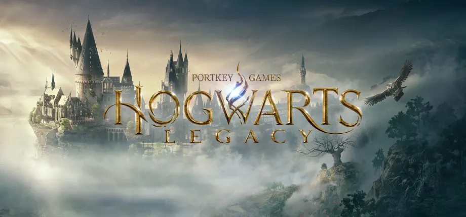
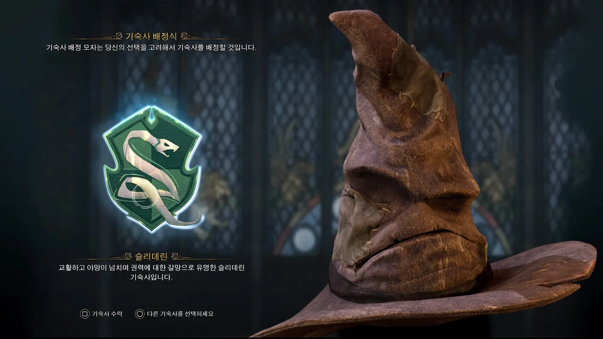
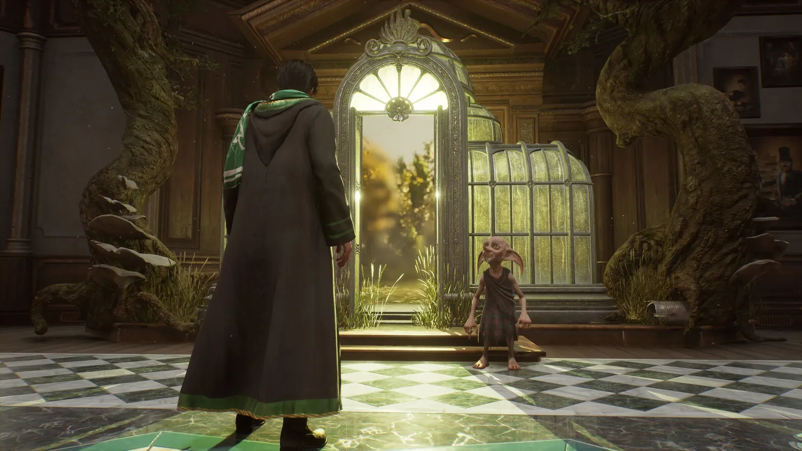
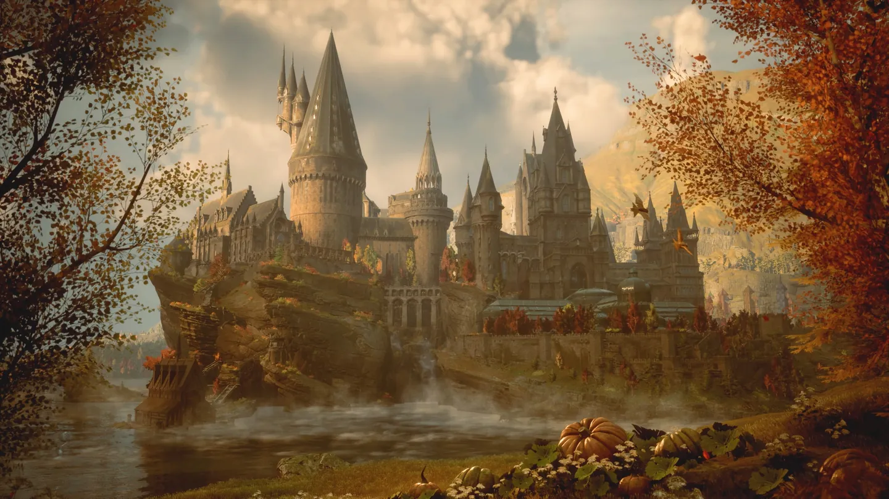
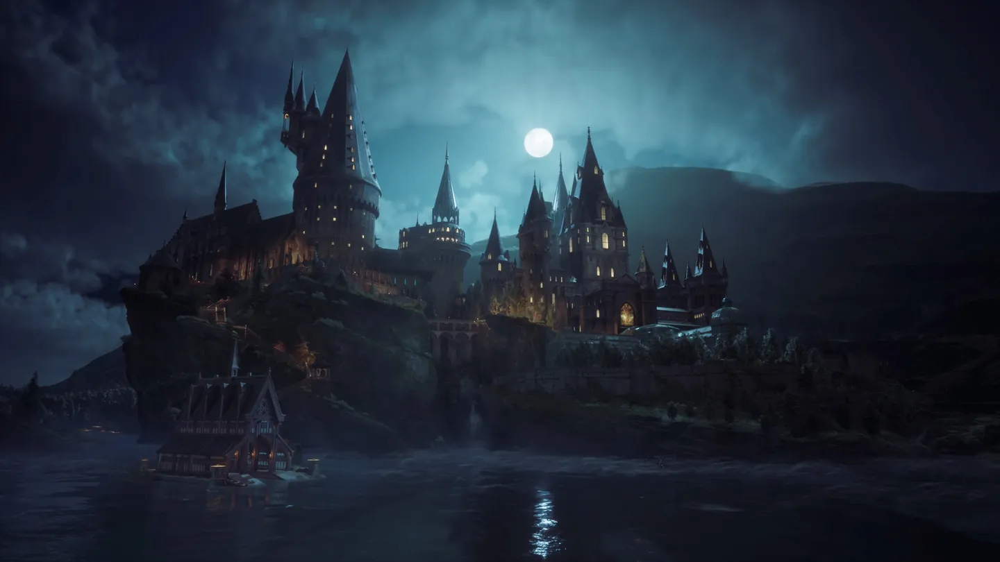
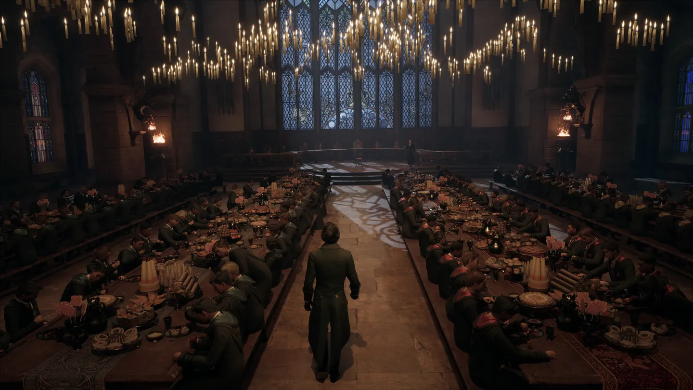

**개발** | 아발란체 소프트웨어(Avalanche Software)  
**유통** | 포트키 게임즈(Portkey Games) / 워너 브라더스 인터랙티브 엔터테인먼트(Warner Bros. Interactive Entertainment)  
**출시** | 2023년 2월 10일 / 2023년 2월 11일 / 2023년 5월 5일 / 2023년 11월 14일

**플랫폼** | PS5, XSX|S / PC / PS4, XBO / NS

**심의 등급** | 12세 이용가

 아마존에서 가장 많이 팔린 소설, 워너 브라더스 역사상 가장 성공한 프랜차이즈, 공식적으로 판매량이 확인된 소설 중 세계에서 가장 많이 팔린 소설 시리즈. **해리 포터** 시리즈를 수식하는 수많은 수식어들이다. 몇 번이나 퇴짜 맞은 후 가까스로 한 중소 출판사에서 출간한 가난한 싱글 맘의 데뷔작은 전세계적인 신드롬을 불러일으키며 5억 부 이상이 팔렸고, 불과 출간 4년 만에 영화화까지 이루어지며 새로운 신화의 시작을 알렸다.

 톡톡 튀는 캐릭터, 동심을 자극하는 '마법 세계'라는 신비한 배경, 그리고 그와 대비되는 탄탄한 서사와 세밀한 묘사로 해리 포터 시리즈는 영화, 연극, 테마파크, 게임에 이르기까지 다양한 방면의 미디어로 진출했고, 확장된 세계관은 <strong><em>위저딩 월드(Wizarding World)</em></strong>라는 이름으로 명명되어 지금까지도 프랜차이즈로서의 명맥을 이어가고 있다.

 대부분 위저딩 월드의 미디어 믹스는 성공적이었다. 영화는 말할 것도 없고, 연극, 테마파크 모두 전 세계 사람들의 뇌리에 박힐 성공을 거두었다. 하지만 유독 게임만큼은 그럴듯한 성공작이 나오질 못했다. 2001년 콘텐츠 공룡 <strong>일렉트로닉 아츠(Electronic Arts, EA)</strong>에서 *해리 포터와 마법사의 돌*을 시작으로, 모든 영화마다 영화의 스토리를 따라 간 게임을 출시했으며, 그 중간중간 EA와 그 외 회사에서 개발한 *퀴디치 월드컵, 원더북 : 북 오브 스펠, 레고 해리 포터 시리즈* 등 수많은 게임이 나왔으며, 2018년부터는 모바일 환경에서 구동되는 해리 포터 게임이 연달아 나오기도 했다. 그러나 이 모든 게임들은 일반 대중들에게 크게 알려진 편은 아니었으며, 대부분 영화 기반 게임이 그렇듯 좋은 평가를 받지도 못했다.

 이런 상황에서 이렇다 할 히트작도 없던 중소규모 스튜디오 <strong>아발란체 소프트웨어(Avalanche Software)</strong>가 갑자기 AAA급 오픈월드 해리 포터 게임을 만든다고 했을 때, 많은 사람들이 그 결과에 대해 의심하는 것도 무리는 아니었다. 그렇게 반신반의 속에서, 해리 포터 게임 역사상 최초로 **오픈월드 액션 RPG**로 출시한 게임이 바로 <strong><em>호그와트 레거시(Hogwarts Legacy)</em></strong>이다.

## 스토리

> 1800년대의 호그와트를 경험하세요. 플레이어는 마법 세계를 산산조각낼 위험이 있는 오래된 비밀의 열쇠를 쥐고 있는 학생이 되어 게임을 플레이하게 됩니다. 친구를 만들고, 어둠의 마법사와 전투를 펼치고, 마법 세계의 운명을 결정하세요. 레거시를 직접 개척해나가세요. 새로운 이야기를 써 내려가세요.[^1]

 1890년대 호그와트를 배경으로, 고대 마법에 재능이 있는 주인공이 이례적으로 호그와트에 5학년 때 입학하며 1년간 겪는 일을 다루며, 시대가 꽤 차이가 나는 만큼[^2] 본편의 등장인물이 등장하지는 않는다.[^3]

 주인공은 이례적으로 교감 위즐리 교수로부터 특별 입학 허가를 받아 5학년으로 입학하게 된 호그와트 신입생으로, 호그와트로 가는 여정부터 어떠한 사건에 휘말리며 고대 마법에 재능이 있음을 알게 된다.

 전반적인 서사는 매우 평면적이다. 고대 마법을 찾는 악당이 있으며, 고대 마법에 재능이 있는 주인공이 이를 막는다 정도로 요약할 수 있다. 이런 단순한 스토리에서 중요한 것은 결국 캐릭터들의 매력인데, 이 주요 서사를 이끌어갈 인물이 영 보이지 않는다.

 주인공에게는 고대 마법에 재능이 있는, 5학년이 되어서야 호그와트에 입학한 학생이라는 것 이외의 그 어떤 서사도 부여되지 않았다. 이런 점이 주인공과 플레이어를 동일시하는 데에는 도움이 되었지만, 악당 타도에 대한 동기 부여가 썩 되지는 않았다. 해리 포터 본편에서 해리 포터 본인과 볼드모트가 일종의 수미상관을 이루는 운명의 숙적이었던 것과 대비되는 부분이다.

 한편 메인 빌런 역시 무게감이 떨어지는 건 마찬가지다. 인간 마법사 빅터 룩우드는 서사에서는 완전히 배제되어도 큰 영향이 없는 인물로, 서브 퀘스트를 진행하지 않았더라면 이 인물이 마법사 사회에 어떤 해악을 끼쳤는지 모를 정도이다. 물론 게임의 서사에 있어서 서브 퀘스트를 빼놓고 이야기한다면 미디어의 특성을 고려하지 않은 평이겠지만, 그만큼 메인 서사에서의 역할이 빈약하다는 의미 역시 되겠다. 룩우드의 강력함이 크게 드러나지 않는 것도 아쉽다. 그의 부하들에 대한 서사는 서브 퀘스트로나마 주어져서 역시 여기저기서 악행을 저지르고 있었구나, 라고 이야기할 수는 있지만 그의 강력함을 느낄 수 있는 보스전의 설계가 란록에 비하면 힘이 빠져 보여 아쉬운 부분이었다.

 란록의 경우는 사정이 낫다. 해리 포터 시리즈의 가장 큰 주제가 사랑이었다면, 그 다음으로 큰 주제는 차별에 관한 이야기였다. 머글과 마법사의 차별, 순수혈통과 혼혈, 머글 태생의 차별, 집요정의 차별 등 혈통과 종족에 따른 차별은 해리 포터 시리즈에서 줄곧 다뤘던 주제 중 하나였고, 란록의 도깨비라는 정체성과 호그와트 레거시에서 이를 다뤘던 방식은 아마 이 점을 염두에 두었던 것으로 보인다. 하지만 역시 해리 포터 본편에서 집요정과 머글 태생에 대한 차별을 소설이 진행되는 동안 충분히 설명했던 반면, 호그와트 레거시에서는 이 점이 두드러지지는 않는다. 도깨비로서 받는 차별은 지나가는 대사로만 나오고, 다른 도깨비들의 등장 자체도 두드러진 차별의 행태가 보이지 않기에 란록의 동기가 썩 체감되지 않는다. 란록의 강대함 역시 두드러지지 않는다. 물론 빅터 룩우드와 다르게 충실히 설계된 보스전은 비주얼과 환경 모두 만족스러웠지만, 오히려 그 마지막 전투를 제외한다면 게임 전체적인 서사에서 룩우드 패거리의 악행이나 영향보다도 란록의 행보가 적게 묘사되는 것처럼 느껴졌다.

 이렇게 악당들의 묘사가 부실하게 된 것은 오픈월드라는 무대 설정에서 기인한다. 설정 상 호그와트는 마법부에 준하는 최중요 시설이며, 온갖 고대 마법으로 보호되어 해리 포터 본편에서도 대규모 침공은 시리즈 마지막에 와서야 가능했다. 호그와트 레거시는 호그와트 학생이기를 원하는 해리 포터 팬들의 욕구를 충족하기 위해 학교 생활에 대부분의 힘을 쏟아야 했다. 결국 빌런이 서사를 이끄는 힘을 얻으려면 플레이 타임의 대부분을 차지하고, 설정 상으로도 가장 강력한 보호를 받는 학교에서 진행했어야 했다. 그러나 호그와트 레거시에서는 이를 둘로 분리했다. 빅터 룩우드와 란록의 악행은 대부분 호그와트 바깥에서 일어나며, 그나마 호그와트와 연결된 곳은 결말에서야 치닫는 고대 마법의 파수꾼들이 지키는 지하 뿐이다. 이러한 공간 설정은 해리 포터 팬이 학교 생활을 온전히 즐기는 데에는 좋은 영향을 줬지만, 메인 서사에서 힘을 빼는 행위이기도 하다.

 반면 서브 퀘스트는 매우 흥미롭다. 위저딩 월드 세계관에 존재하는 학교에 대한 설정들을 적절히 배치하고 각 기숙사마다 가진 특징을 십분 가진 캐릭터들로 대표성 있는 스토리를 꿰어 놓았다. 용기 있게 룩우드 일당과 맞서는 그리핀도르의 낫사이 오나이, 조금 괴짜인듯 별자리와 역사에 관심이 많은 래번클로의 아밋 타카르, 동물을 좋아하는 후플푸프의 포피 스위팅, 가족을 위해 가족이 원치 않는 어둠의 마법에 손을 댄 세바스찬 샐로우까지 기숙사 서브 퀘스트에서 가장 큰 줄기를 맡고 있는 캐릭터들은 각각 기숙사의 대표적 이미지를 잘 활용한 캐릭터들로, 특히 슬리데린의 서사는 메인 서사로 활용해도 좋을 정도로 입체적이다. 거기에 스토리 라인이 있지는 않지만 단발적으로 퀘스트를 주는 NPC들도 정말 학교에 한 명쯤 있을 것 같은 캐릭터성을 부여하고 교수와의 수업 컷신에서 그런 캐릭터성을 강조하는 등 학교 내부에서의 즐길거리를 충분히 보장해준다. 주인공이 배정된 기숙사에 따라 달라지는 분기는 거의 없고 메인 스토리와 연결되는 중간 퀘스트 하나 뿐인데, 각각 기숙사의 역사에 따라 메인 스토리와 자연스럽게 연결한 점 역시 좋았다.

 결국 학교 내에서의 분위기가 메인 서사와 어느 정도 분리가 되어 있는 셈인데, 해리 포터 팬들이 온전히 호그와트라는 공간을 테마파크처럼 즐기기 위해 서사에 힘을 뺐다라고도 풀이할 수 있겠다. 하지만 해리 포터 프랜차이즈가 인기를 얻었던 요인 중 하나가 몰입감 있는 서사였다는 점을 고려했을 때 여러모로 아쉬움이 남는 스토리였다.

## 시스템

### 커스터마이징

 게임을 시작하면 캐릭터를 커스터마이징할 수 있다. 2023년에 출시된 게임 치고는 커스터마이징 옵션이 다양한 편은 아니지만, 미형의 캐릭터를 만드는 게 어렵지는 않다. 이름과 성도 지정해 줄 수 있고, 목소리는 성별을 선택한 후 피치도 다섯 가지로 조절할 수 있다.

 지팡이도 커스터마이징할 수 있다. 지팡이의 목재, 길이, 소재 등을 선택할 수 있는데, 포터모어 계정이 있다면 기숙사와 함께 이를 연동하는 것도 가능하다. 커스터마이징할 당시 지팡이 소재에 따라 나오는 설명이 있는데 게임 내 성능에는 전혀 체감이 없었다.

 장비는 능력치가 달려 있는 얼굴, 손, 머리, 목, 망토, 의상과 외형 요소만 존재하는 빗자루, 비행 탈 것, 지팡이 손잡이가 있다. 전자에는 각각 등급이 있으며, 필요의 방 해금 이후에는 주문 옵션도 달 수 있다. 장비 레벨이 있고 장비 교체 주기가 빠른 편이지만 외형 변경 옵션이 있기 때문에 마음에 드는 착장을 찾았다면 옵션이 더 좋은 장비를 착용하고 외형 변경을 통해 원하는 외형으로 플레이할 수 있다.

### 학교 생활

#### 기숙사

 처음 호그와트에 도착하면 기숙사를 선택할 수 있다. 해리 포터 시리즈의 팬이라면 익숙할 그리핀도르, 슬리데린, 래번클로, 후플푸프 네 기숙사 중 하나인데, 처음부터 선택하는 것이 아니라 질문을 몇 개 하고 그 답변에 따라 기숙사 모자가 배정해준다. 그러나 자신이 원하는 기숙사에 배정받지 못했다고 실망할 필요 없이 자유롭게 선택할 수도 있기 때문에 걱정할 필요는 없다.

 기숙사에 따라 달라지는 건 계절이 바뀔 때마다 주인공이 기상하는 컷신의 방이 각 기숙사라던가, 기숙사 망토의 색, 그리고 초중반부 퀘스트 정도 뿐이다. 아주 유의미한 콘텐츠가 아니라고 생각할 수 있겠지만, 해리 포터 시리즈의 팬이라면 빼놓을 수 없는 부분이다.

#### 수업

 호그와트에서의 학창생활을 다루는 작품이니만큼 호그와트에서 수업을 받는 것 역시 콘텐츠 중 하나이다. 설정 상 5학년으로 입학한 주인공은 많은 마법을 익히진 않은 상태인데, 수업을 듣고 각 교수들이 주는 특정 과제를 수행하면 새로운 주문을 배울 수 있다. 이 특정 과제들은 대부분 타 서브 퀘스트를 수행하거나 오픈월드를 탐험하다 보면 자연스럽게 수행된다.

 그 외에도 몇몇 서브 퀘스트는 수업을 듣고 그 이후에 대화를 통해 발생하는 경우가 있는데, 이런 퀘스트를 통해 학교 곳곳에 위치한 각 교실에서 수업을 들어볼 수 있다.

 수업 콘텐츠 그 자체는 정해진 컷신이 재생되는 것에 불과한데, 약간의 개그 신과 함께 이 수업이 어떤 것을 다루는 지 간단하게 보여주기 때문에 해리 포터 테마파크라는 측면에서는 나쁘지 않은 콘텐츠였다.

### 전투

 전투는 호그와트 레거시에서 가장 재미있는 콘텐츠 중 하나다. 위저딩 월드 세계관에서 가장 큰 장점 중 하나인 다양한 주문을 실제로 사용해볼 수 있다는 것이 매우 흥미로운데, 앞서 언급했던 교수들에게서 배우는 주문 이외에도 어둠의 마법이나 잠금 해제 주문은 다른 서브 퀘스트를 통해 획득할 수 있다.

 수많은 주문이 등장하는만큼 이 주문들을 리얼타임으로 적절히 사용할 수 있게 하는 것이 관건이었을텐데, 이러한 고민의 끝에 나온 결과물은 어느 정도 납득은 가지만 여전히 불편한 형태였다.

 기본 주문, 레벨리오, 프로테고, 스투페파이, 고대 마법 던지기, 고대 마법, 알로호모라, 페트리피쿠스 토탈루스 8개의 주문은 '필수 주문'으로 주문 슬롯에 배정하지 않더라도 사용 가능한 주문들이다. 일부는 특정 상황에서만 특정 키에 할당되어 발동할 수 있으며, 기본 주문은 여타 게임의 '평타'와 같은 효과를 가지고 있다.

 이 외 등장하는 26개의 주문은 제어/위력/피해/유용/변환/저주 각각의 카테고리에 속하며, 주문 슬롯에 배정해 사용 가능하다. 등장하는 적들은 각각 약점 속성을 갖고 있고, 그 약점 속성을 노리는 주문을 사용하는 것도 좋은 공략 요소이며, 인간형 적을 상대할 때 제어/위력/피해 각각의 주문으로만 해제되는 방어 마법을 두르고 나오는 경우도 있으므로 정확한 적을 타게팅하여 주문을 쓰는 것이 중요하다. 타게팅이 자동으로 이루어지므로 적이 많아질 때는 다소 힘들지만, 은신 플레이를 유도하기 위한 난이도 조절의 일환이라고 생각한다면 납득할 수 있는 부분이다.

 하지만 주문 슬롯은 16개뿐이란 것이 다소 문제가 된다. 주문 중 상위/하위 호환에 해당하는 주문이 없는 것은 아니지만, 실시간으로 벌어지는 전투에서 슬롯이 한정되어 사용할 수 있는 주문의 개수가 한정되는 것은 다양한 주문을 사용하는 재미를 반감시킨다. 각지에 있는 퍼즐을 풀 때 특정 속성의 주문이 강요된다는 점을 고려하면 더 아쉬운 부분이다. 특히 후술할 필요의 방 컨텐츠에서만 사용 가능한 변환 주문과 마법 생물과 소통하는 데 필요한 일부 유용 주문의 경우 해당 컨텐츠를 할 때만 사용되기 때문에 전투를 할 때는 슬롯을 차지하는 애물단지가 되기 마련이다.

 주문 슬롯을 세팅해 놓고 이러한 주문 세트를 교체할 수 있는 기능이 없기 때문에, 전투와 일상 콘텐츠를 오갈 때 다소 불편함이 야기되는 것은 아무래도 아쉬운 요소다.

### 오픈월드

 호그와트 레거시의 세계는 크게 호그와트와 호그스미드, 그리고 그 바깥으로 나눌 수 있다. 모든 맵은 로딩 없이 드나들 수 있으나, 호그와트 내부와 외부를 드나들 때 약간의 로딩이 필요할 때가 있으며 필요의 방을 드나들 때도 역시 그러하다. 하지만 전체적으로 단절되는 느낌 없이 돌아다닐 수 있으므로 오픈월드라는 분류에서 벗어나지는 않는다.

#### 호그와트

 주요 컨텐츠가 진행되는 장소이다. 해리 포터 시리즈에 나왔던 요소들을 충실히 구현했으며, 각 과목 교실이나 교수들의 집무실, 병동, 기숙사 등 영화에서 익히 봤던 비주얼을 충실히 옮겨놓았다. 비밀의 방은 훨씬 후대, 볼드모트와 해리 포터 때에 열리는만큼 들어가볼 수는 없지만 그 입구에 표식을 알아볼 수 있으며, 그 이외에도 탐험할 수 있는 장소가 많아 탐험하는 재미가 쏠쏠하다.

  몇몇 퀘스트에서는 설정에 충실하게 밤에는 반장과 교수, 관리인이 순찰을 돌고 걸리면 초기 위치로 돌아가는 등의 요소가 있지만 그 퀘스트들을 제외하면 밤에도 자유롭게 통행이 가능하다. 이것마저 구현했다면 지나친 제약이라고 생각했을 수도 있지만 원작의 팬으로서 더 몰입하기에는 아쉬운 점이라 하겠다.

 콘텐츠 밀도도 높고 인물도 많은만큼 가장 오랜 시간을 이곳에서 보내게 되며, 해리 포터 시리즈의 중심인만큼 가장 완성도가 높은 장소이다. 다만 옵션 버튼으로 진입하는 지도 메뉴에서 층별 맵을 제공하지 않아 처음에는 조금 헤매일 수밖에 없다.

#### 호그스미드

 해리 포터 본편에서도 자주 등장하는 장소로, 본편에서 언급되었던 호그와트와 호그스미드 간 비밀 통로도 하나 구현되어 있다. 일반적으로 호그와트에서 야외로 나가면 비행이 가능하지만, 호그스미드 일대에서는 마법으로 보호되어 비행이 불가능한 것으로 구현되어 있다.

 대부분의 상점과 많은 퀘스트들이 집중되어 있어 자주 들리게 되는 장소고, 학교 밖에서의 많은 사건이 이 곳에서 발생한다.

#### 호그와트 바깥

 해리 포터 본편에서는 호그와트 바깥의 마을에 대한 설명이 거의 되어있지 않다. 금지된 숲을 비롯해 많은 장소가 등장하는데, 대개 스코틀랜드식 지명이 붙은 마을들이 대거 등장한다. 호그와트 레거시가 오픈월드 게임임을 표방한만큼 다양한 장소가 등장한다.

 그러나 대부분의 마을에 특색이 없고, 다소 무의미해보이는 플레이 타임 늘리기용 콘텐츠들이 여기저기 분산되어 있다. 어느 정도 메인 스토리 혹은 서브 퀘스트를 위해 방문하는 몇몇 마을을 제외하면 아예 들릴 이유조차 없으며, 해리 포터 시리즈의 팬으로서도 정보가 없었기에 애착이 생길 수도 없었기에 텅 빈 듯한 느낌이 드는 곳이다.

 본작에 있어서 가장 실망스러운 부분으로, '굳이 오픈월드였어야 하나?' 라는 의문이 들게 하는 공간이었다. 풍경이 아름답기는 하지만 그 뿐으로 오히려 호그와트에 더 집중해서 호그와트와 호그스미드 두 공간으로 이원화했어도 충분히 훌륭한 경험이 되지 않았을까 하는 아쉬움이 있다.

### 필요의 방

*필요의 방*

 필요의 방은 본작에서 가장 재미있는 콘텐츠 중 하나였다. 동물들을 포획해 이들과 상호작용하며 재료를 얻을 수도, 마법 식물을 재배하고 마법약을 만들 수도 있으며, 장비를 식별하고 강화하거나 방을 꾸미는 행동을 할 수 있다. 집요정의 퀘스트를 해결할 때마다 넓어지는 방에 맞춰 각종 장식품을 인테리어하는 재미가 쏠쏠했다.

### 그 외

 그 외에도 미니 게임으로 소환사의 코트, 교차한 지팡이들 챔피언전, 빗자루 경주가 있고 그 외에도 퍼즐과 수집 요소들이 준비되어 있다. 해리 포터 시리즈의 작중 인기 스포츠인 퀴디치가 구현되어 있지 않은 점은 아쉽지만, 퀴디치 자체가 룰이 다소 조잡한 관계로 일부러 넣지 않았을 것이라는 추측도 있다.

 교차한 지팡이들 챔피언전이 가장 아쉬운 부분이었다. 교내 결투 클럽이라는 매력적인 소재를 가지고 있지만 게임 초반 등장해 전투 튜토리얼의 역할을 하는 정도에 그쳤는데, 대부분의 액션 RPG에서 이러한 콘텐츠를 온라인 혹은 히든 콘텐츠로 기획하여 사실상의 엔드 콘텐츠로 활용하는 점을 생각하면 아쉬운 부분이다.

## 비주얼

*가을의 호그와트 밤의 호그와트*

*대연회장*

 호그와트 내외부, 각종 자연 환경을 아주 뛰어나게 묘사하였다. 해리 포터 프랜차이즈가 이미 영상화되었던 전적이 있었던만큼 해당 비주얼을 매우 충실하게 옮겼다고 볼 수 있겠다. 인물들의 경우 약간의 데포르메가 된 스타일로 보이는데 오히려 작품의 분위기와 잘 맞는 적절한 선택이었던 것 같다.

## 정리

  '호그와트 레거시'는 해리 포터 팬들에게는 아주 특별한 게임이다. 해리 포터 세계관을 바탕으로 오픈월드 이곳저곳에서 마치 그 세계에 있는 것처럼 행동할 수 있으며, 주문을 외워 퍼즐을 풀고 지역을 탐험하고 결투를 할 수 있다. 심지어는 어둠의 마법을 배워 본편에서는 금지되어 있던 행위를 할 수도 있다.

 하지만 그런 테마파크와 같은 정체성 때문일까, 호그와트와 호그스미드 이외의 세계는 생기가 없는 단순 배경에 그쳤으며 스토리 역시 고작 배경으로 전락했다. 오히려 호그와트와 호그스미드에 집중했다면 세계와 서사를 둘 다 잡을 수 있지 않았을까 생각하게 된다.

 해리 포터 시리즈를 잘 모르고 잘 짜여진 오픈월드 게임을 원한다면 별로 추천할 수 없다. 하지만 주문 슬롯의 한계에도 불구하고 전투는 꽤 새로운 느낌으로 즐겁고, 무엇보다 해리 포터 시리즈의 팬이라면 즐길 요소가 매우 많으므로 새로운 전투 방식을 원하고 해리 포터 시리즈의 팬이라면 적극 추천할 수 있겠다.

> **그래픽** | ★★★★(8점) 준수한 그래픽  
> **스토리** | ★★☆(5점) 테마파크에는 어울리는, 깊이 없는 스토리... 학교 내부에 더 집중했더라면  
> **전투** | ★★★★☆(9점) 마법은 이렇게!  
> **탐험** | ★★★★(8점) 학교 내부는 만점, 학교 바깥은...  
> **장비** | ★★★★(8점) 19세기풍 캐릭터 옷입히기  
> **사운드** | ★★★★(8점) 웰컴 투 위저딩 월드  
> **세계관** | ★★★★★(10점) 해리 포터의 팬이라면  
> **롤플레잉** | ★★★★☆(9점) 액션 RPG라면 이렇게  
> **오픈월드** | ★★☆(5점) 꼭 오픈월드였어야만 했을까?  
> **필요의 방** | ★★★★☆(9점) 사실상 엔드컨텐츠
>
> **총점**| ★★★☆ (79/100)  
> *해리 포터 시리즈의 팬이라면 훌륭한 테마파크... 하지만 '게임'으로서는 약간 아쉬운*

[^1]: https://store.playstation.com/ko-kr/concept/232447
[^2]: 해리 포터 본편은 1991년~1997년이 배경
[^3]: 단, 초상화로 등장했던 해리 포터의 대부(代父) 시리우스 블랙의 고조할아버지 피니어스 나이젤러스 블랙이 현직 교장으로 등장한다.
