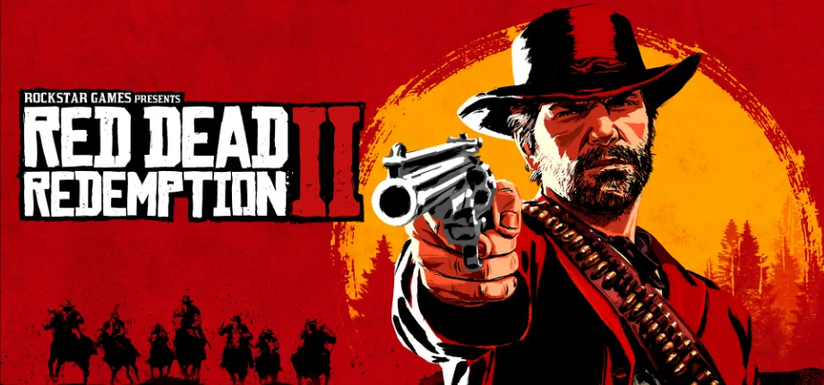

**개발** | 락스타 스튜디오(Rockstar Studio)  
**유통** | 락스타 게임즈(Rockstar Games)  
**출시** | 2018년 10월 26일 / 2019년 11월 5일  
**플랫폼** | PS4, XBO / PC  
**심의 등급** | 청소년 이용불가

 오픈월드의 명가 락스타 게임즈의 간판 게임이라고 하면 단연 ***GTA**(Grand Theft Auto)* 시리즈를 꼽을 수 있다. 광대하면서도 특정 현대 도시를 디테일하게 구현한 맵, 다양한 상호작용, 매력적인 캐릭터와 서사, 살아있는 듯한 세계에 살벌하게 드러나는 현대 사회에 대한 풍자, 무엇보다도 폭력이 난무하는 자유로운 행동들은 GTA 시리즈를 명작의 반열에 오르게 하였다.

***레드 데드**(Red Dead)* 시리즈는 서부극 GTA라고 볼 수도 있겠다.  오픈월드의 시대 배경이 바뀌었을 뿐 탑승물 탈취, NPC에 대한 자유로운 공격, 랜덤 인카운터 등 많은 요소가 GTA의 정신을 계승하고 있다. 하지만 GTA 시리즈가 전반적으로 유쾌한 블랙 코미디에 가까운 서사를 가지고 있다면, 레드 데드 시리즈는 비교적 진지하고 무거운 분위기를 가지고 있다.

 서부극의 특징이라 한다면 황야와 초원 등 미개척지를 중심으로, 그곳에서 활동하는 무법자들이 주요 인물인, 말과 결투가 중심이 되는 장르라 할 수 있겠다. 세계 최초의 극영화였던 <strong><em>대열차강도(The Great Train Robbery, 1903)</em></strong>의 등장 이래 할리우드의 고전기(1930~50년대)를 풍미했던 서부극은 선악 구도, 결투, 카우보이 모자 등 여러 서부극의 요소를 정립했지만 시대가 흐름에 따라 인종차별적인 묘사나 마초적 내용으로 혹독하게 질타받았다. 50년대 이후로는 이러한 백인들의 오만함을 꼬집는 수정주의 서부극이 등장했고, 아예 이탈리아에서는 선악 구도가 제거된 피카레스크물마저도 나오기 시작했다.

 서부극의 기나긴 전성기동안 수많은 영화와 그 바리에이션이 나왔기 때문에, 대중의 피로감이 쌓인데다 지나친 클리셰의 남용으로 서부극은 어느새 옛날의, 케케묵은, 흘러간 장르 취급을 받게 되었다. 물론 서부극에서 정립한 여러 서사 요소들이 여타 장르에도 영향을 주며 발전했기 때문에 그 영향력을 무시할 수는 없지만, 서부극의 요소, 특히 시대적 요소를 차용한 작품이 오늘날에는 그다지 자주 나오지는 않고 있는 편이다.

 흘러간 시대의 흘러간 이야기. 이러한 서부극의 특징은 <strong><em>레드 데드 리뎀션 2(Red Dead Redemption 2)</em></strong>를 설명하는 하나의 좋은 키워드가 되지 않을까 싶다. 말 그대로, 이 게임은 흘러간 시대의, 흘러간 이야기를 다루고 있다.

## 스토리

> 1899년 미국. 아서 모건과 반 더 린드 갱단은 도주 중인 무법자입니다. 정부 요원과 일류 현상금 사냥꾼들에게 추격당하는 그들은 살아남기 위해 강도질과 도둑질, 싸움을 거듭하며 미국의 험난한 심장부를 달려 나갑니다. 심해져 가는 내부 갈등으로 갱이 해체될 위기 속에서, 아서는 자기를 키워 준 갱에 대한 의리와 자신의 이상 중 하나를 선택해야만 합니다.[^1]

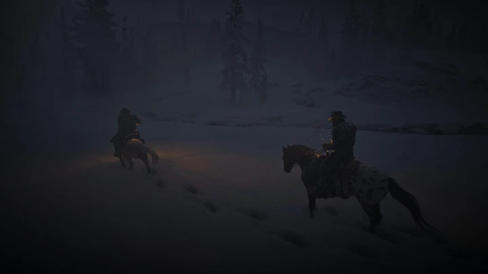

 1899년, 눈보라가 휘몰아치는 미국 서부. 반 더 린드 갱단은 도망치고 있었다. 1890년대 연방 정부와 보안관들이 치안을 강화하면서 무법자들이 판을 치던 서부 개척 시대는 막이 내려가고 있었다. 다른 모든 무법자들이 이때 그랬듯, 반 더 린드 갱단 역시 안전한 은신처를 찾아 도망치고 있었다. 블랙워터라는 지역에서 크루즈선을 약탈하려다 실패하고 꼬리를 잡혀 여러 갱단원을 잃고 도주하던 차였다.

 반 더 린드 갱단에 소속된 인물들은 19세기라는 점을 감안하면 조금 의아하기까지 하다. 백인 중에서도 차별받는 아일랜드계 션 맥과이어나 몰리 오셰이는 그렇다 치더라도, 흑인 소년인 레니 서머와 히스패닉인 하비에르 에스쿠엘라, 심지어는 흑인과 인디언의 혼혈인 찰스 스미스까지. 다양한 연령과 성별, 인종이 뒤섞인 이 갱단은 누구나 자기 몫을 할 수 있다면 일원이 될 수 있는 유사 가족과도 같은 공동체이다.

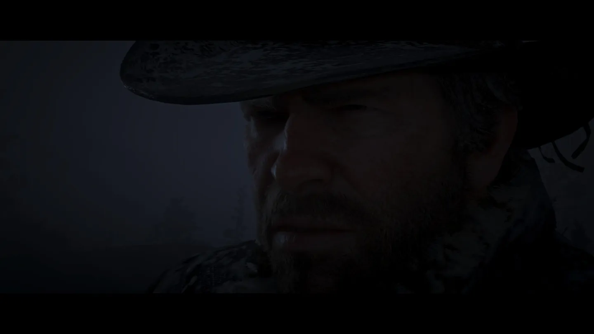

 그리고 플레이어는 반 더 린드 갱단의 집행자(Enforcer)이자 가장 강력한 전력, 아서 모건이 되어 격변하는 시대 속을 살아가게 된다.

 눈이 뒤덮인 산에서 그들은 적대 갱단 오드리스콜에게 집과 남편을 잃은 세이디 애들러를 구출해 마침내 서부를 탈출해 발렌타인 인근에 캠프를 차리게 된다. 반 더 린드 갱단은 흩어진 갱 멤버들과 블랙워터에 두고 온 갱단의 자금을 모아 다시금 자유로운 서부로 돌아가고자 한다.

 발렌타인에 이르기까지 본 게임은 아주 천천히 진행된다. 눈이 무릎에서 허리까지 올라오기 때문에 움직임은 느리고, 변변찮은 돈도 없고 무기도 없는데다 아직 스토리에 대해 잘 모르는 채로 미션을 수행해야 되는데, 이 느린 템포의 게임에 여러 사람들이 여기까지만 했다가 그만두기 일쑤이다. 하지만 이 설산을 벗어나기만 하면 19세기 말 미국을 자유롭게 탐험할 수 있다.

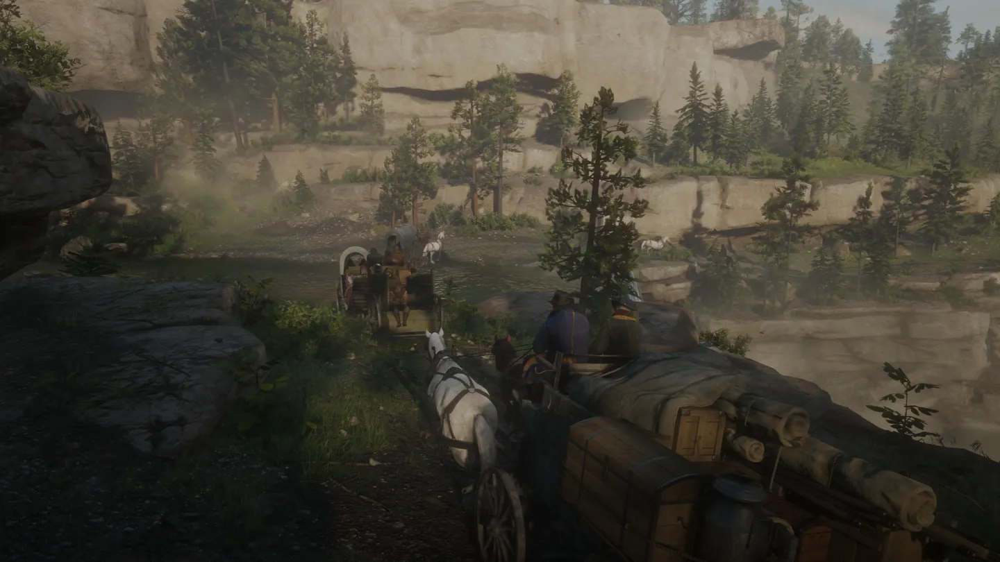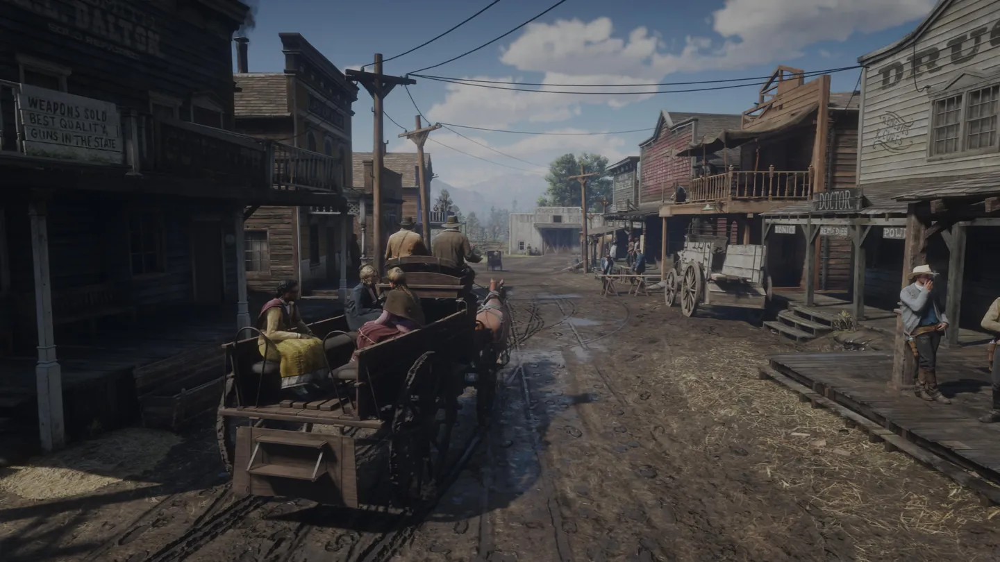

 발렌타인 인근에 정착한 갱 멤버들은 각자의 방식대로 돈을 모아 갱단에 기여한다. 여자들은 마을로 가 도둑질을 하거나 매춘을 했고, 총잡이들은 사냥을 하거나 강도질, 혹은 현상금 사냥으로 돈을 모았다. 피어슨은 해군 경력을 살려 취사를 하고, 호제아는 마을 주민을 속여 말이나 마차 따위를 훔쳐 판다. 물론 엉클이나 몰리처럼 아무것도 안 하는 사람들도 있지만, 이 때의 갱단은 그럭저럭 평화롭다. 한편 오스트리아에서 온 스트라우스는 고리대금업을 하는데, 아서에게 수금 일을 맡긴다.

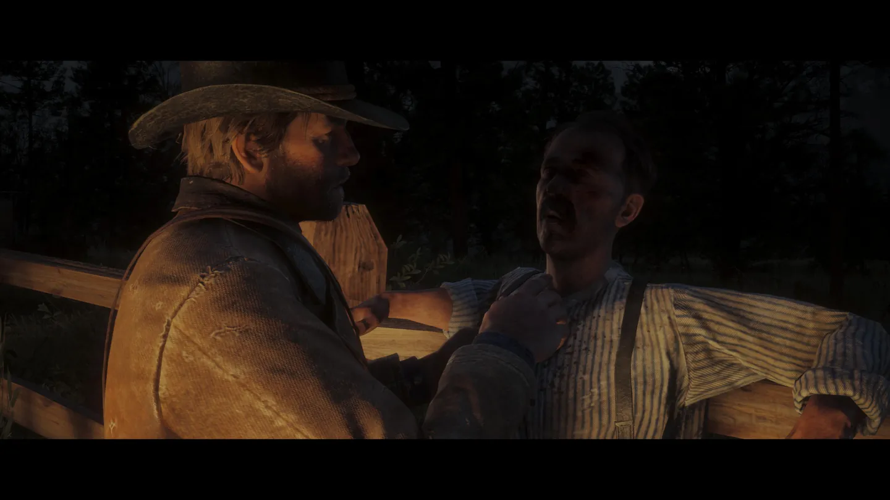

 이 갱단은 결코 선량하지 않다. 아서 모건은 채무자가 결핵에 걸려 거동조차 힘든 사람일지라도, 피가 섞인 기침을 얼굴에 맞을지라도 돈을 받아내고야 만다. 채무자가 죽었다면 유족을 찾아가 돈을 뜯어낸다. 이것이 그들의 방식이다.

 하지만 아서 모건은 블랙워터에 잡힌 동료를 구출하러 간다. 스트로베리에서 난동을 피워 보안관에게 잡힌 마이카가 맘에 안 들지라도, 그가 갱단의 일원이기 때문에 구하러 간다. 발렌타인 인근에서 집을 짓는 부자(父子)를 도와주기도 하고, 버팔로를 밀렵하는 사냥꾼을 위협해 쫓아내기도 하며, 다른 갱단에게 끌려간 한 가족의 아버지를 구출하기도 한다. 절벽에서 떨어질뻔한 남성을 구하기도 하고, 전설의 총잡이들을 취재하는 기자를 위해 그들을 만나러 가기도 한다.

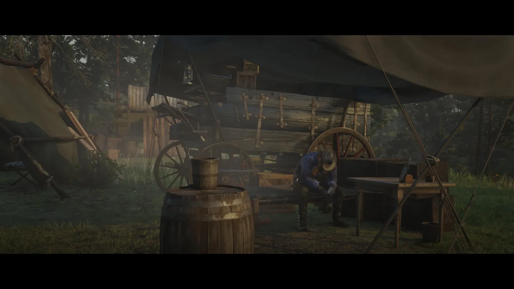

 이렇듯 아서 모건은 선인도, 악인도 아니다. 19세기 말 서부 개척이 저물고 행정력이 전 연방에 미칠 무렵, 격동의 시대에 살아남으려 몸부림치던 한 무법자일 뿐이며, 그가 선인인지 악인인지는 플레이어의 선택에 달려 있다.

### 장소 이동에 따른 서사

 이 게임의 서사는 갱단의 본거지가 옯겨감에 따라 변화한다. 눈보라치던 설산을 벗어나 발렌타인 인근 말굽 언덕에 들어서면 가볍고, 유쾌한 갱단의 이야기가 시작된다. 레니와 술에 거나하게 취해 주점에서 깽판을 치고, 양떼를 몰기도 하며, 여기저기 도박을 하러 돌아다니는 스완슨 목사를 잡으러 다니기도 한다.

 발렌타인의 은행을 털고 옮겨간 전형적인 남부의 대농장이 있는 로도스에서는 로미오와 줄리엣을 떠올리게 하는 그레이 가문과 브레이스웨이트 가문의 사이에서 한탕 하려고 노리기도 하다가 역습을 받기도 하며, 이들이 잭을 납치하면서 선을 넘을 때는 강력하게 응징하기도 하는 등, 다소 왁자지껄 우왕좌왕한 분위기가 여전히 게임을 지배한다.

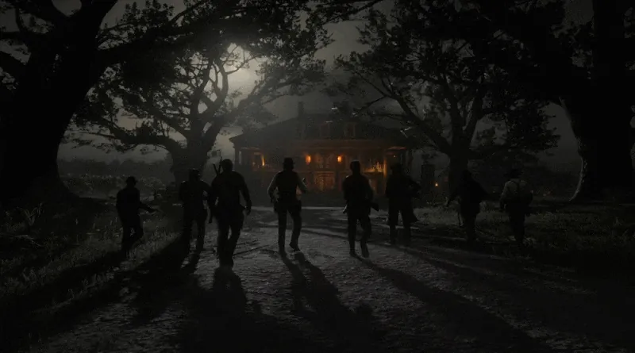

 하지만 뉴올리언스를 배경으로 한 생 드니에 들어서면서부터 게임은 보다 어두워진다. 아서는 생 드니의 도시화된 풍경을 별로 좋아하지 않는듯 푸념했고, 그의 안 좋은 예감대로 갱단은 더 큰 위기에 봉착한다. 생 드니를 장악한 이탈리아 마피아 브론테의 함정에 빠지질 않나, 오드리스콜과 핑커튼의 습격을 받지를 않나. 더치의 큰 계획들은 이들이 파놓은 함정이었고, 마침내 갱단은 뿔뿔이 흩어지게 된다.

 메인 서사가 진행되는 동안 이 게임의 본거지는 몇 번씩 바뀌곤 한다. 그리고 바뀔 때마다 서사의 분위기와 적들은 더 어둡고 강력해진다. 마냥 밝은 목가적인 발렌타인, 쿠엔틴 타란티노의 장고:분노의 추적자를 보는듯한 로도스, 현실의 뉴올리언스를 떠올리게 하는 생 드니, 북동부 탄광 도시 앤즈버그까지.

 그리고 갱단의 본거지를 옮길 때마다 보여지는 인물들의 면모도 달라진다. 갱단원을 가족처럼 아끼고, 인종과 성별, 나이에 구애되지 않고 사람들을 대하며, 불합리한 세상에 대항하는 것처럼 보였던 갱단의 리더 더치는 갈수록 자신의 행위를 정당화하고, 자신이 지켜야 한다던 사람들을 이용하고 버리는 것에 익숙해진다. 갱단이 위험에 처할 수록 그는 편집증적으로 남을 의심하고, 가장 가까운 호제아를 잃고 나서는 아서의 말에도 귀기울이지 않는다.

 이러한 서사의 변화를 상징하는 것 중 하나는 갱단과 임무를 함께 하면 받는 금액의 차이인데, 처음에는 나름 합리적으로 분배하던 갱단의 몫은 앤즈버그에 와서는 플레이어에게는 단 한 푼도 떨어지지 않는 수준이 되고 만다.

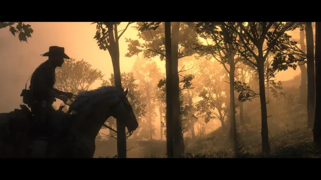

 한편 아서 모건은 변해간다. 자신이 아무렇지 않게 해왔던 행동들에 죄책감을 느끼고, 그 일들을 되돌리려 노력한다. 그러던 중에 역시 자신이 가족처럼 아끼던 갱단원들을 떠나보내고, 그가 했던 몇몇 선한 일들로 보답받으며, 그는 무슨 일을 해야할 지 깨닫는다. 그는 마침내 구원을 위해 달린다.

### 서사의 자유도

 GTA 시리즈가 그렇듯, 레드 데드 리뎀션 2의 서사 역시 플레이어가 몇 가지 큰 줄기를 선택할 수는 있지만 큰 변화를 주지는 않는다.  오히려 GTA 시리즈가 더 다양한 결말을 제공하는 것과 달리, 이 게임에서의 결말은 보는 컷신이 달라질지언정 하나다. 락스타의 게임들이 본래 오픈월드의 자유도와 반비례해 서사에서의 자유도가 떨어진다는 비판을 받곤 했는데, 하지만 적어도 이 게임을 해봤다면 아서 모건의 서사에 집중하기 위한 선택 중 하나라고 생각할 수도 있을 것이다.

 하지만 플레이어의 행동에 따라 아서 모건의 명예가 오르내리는 설정과 아서 모건이 맞게 되는 단 하나의 결말이 다소 불합치하기는 하다. 플레이어가 명예롭게 플레이했다면 이 작품의 주제 의식 중 하나인 '위악을 벗어던지고, 해야할 일을 함으로써 얻는 구원'에 온전히 부합하는 서사를 경험할 수 있지만, 그렇지 않다면 조금은 애매한 결과를 낳게 되기 때문이다. 이 명예 수치로 인해 달라지는 컷신과 플레이 경험이 결말 부분에 집중되어 있기에 더욱 그러한 면이 강조되는 것처럼 보인다.

 긍정적으로 생각해본다면, 락스타는 명예로운 플레이를 아서 모건의 정사(正史)로서 인정한다는 의미일 수도 있다. 아서 모건은, 플레이어가 하는 행동대로, 남들에게 악인일수도 선인일수도 있는 인물이지만 결국에는 ,플레이어의 선택에 따라, 자신이 자라왔던 무법자의 행동양식을 버리고 갱단의 양심을 지키면서 구원을 얻은 인물일수도, 무법자의 행동양식을 버리지 못하고 위악을 저질렀지만 가족처럼 여기던 갱단원의 구원을 바라며 자신을 내던진 인물일 수도 있는 것이다.

## 시스템

### 오픈월드

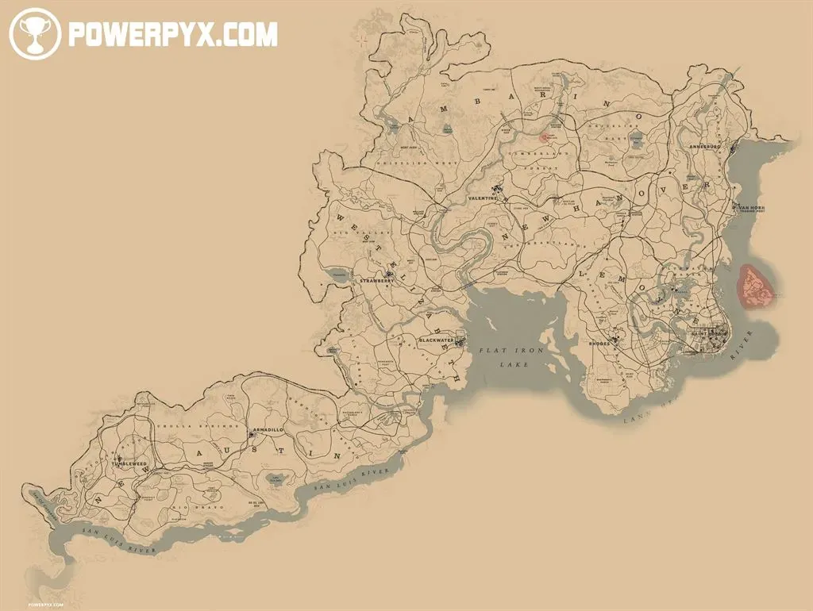

 레드 데드 리뎀션 2의 가장 큰 장점이라고 한다면 단연코 오픈월드일 것이다. 단순히 지역의 광대함뿐만 아니라 텍사스와 애리조나를 모티브로 한 사막과 황무지로 구성 뉴 오스틴부터, 콜로라도의 록키 산맥과 뉴멕시코의 넓은 평원을 모티브로 한듯한 웨스트 엘리자베스,  초원과 아칸소의 탄광을 모티브로 한 뉴 하노버, 루이지애나의 늪지와 플랜테이션을 모티브로 한 르모인, 아칸소의 탄광과 오클라호마의 인디언 보호구역을 모티브로 한 앰버리노까지 미국의 다양한 환경을 훌륭하게 맵에 녹여냈다.

 서로 인접한 이 6개의 주에 사막, 설원, 초원, 늪지, 삼림, 도시 등 다양한 자연과 인문 환경을 갖추었으며, 이것이 실제 미국의 당대 모습과 굉장히 흡사하게 구현됨으로써 플레이어로 하여금 1899년의 미국의 모습에 더욱 몰입하게 만든다. 생 드니는 도시 이름이 불어이며, 도시 내에 트램이 다니고 경찰이 상주하는 등 부유하며, 여러 이민자들의 정착지가 존재함과 동시에  마피아가 장악하고 있는 등 현실의 뉴올리언스를 떠올리게 하며, 아메리카 원주민이 상주하는 와피티 인디언 보호구역은 현재도 많은 아메리카 원주민이 거주하는 오클라호마를 떠올리게 한다.

 도시와 마을에 존재하는 NPC들의 생동감 있는 움직임과 함께, 서사가 진행됨에 따라 맵의 환경이 바뀌는 것 역시 극찬할 만하다. 하나의 예시로 발렌타인에서 집을 짓는 NPC들에게 다가가 집 짓는 것을 도우면 챕터가 진행되면서 점점 집의 형태를 갖춰가며, 에필로그에서 찾아가면 완전한 집의 형태가 되어 있는 것을 확인할 수 있다. 약간 요점은 다르지만 블랙워터에서 사고를 치고 들어갈 수 없게 된 블랙워터 인근 지역에 대한 접근 금지 방법도 단순히 시스템적으로 막아놓는 것이 아니라 진입할 시 여러 현상금 사냥꾼이 동원되게 해 게임 속에서 이곳에 출입하면 안 되겠구나를 체험하게 한 요소도 매우 훌륭하다.

#### 랜덤 인카운터

 락스타의 장점인 랜덤 인카운터도 이 오픈월드를 경험하는데 있어 큰 장점 중 하나이다. 이 게임은 일반적인 빠른이동이 존재하지 않고, 주요 도시나 역에서 마차나 기차를 타거나, 갱단 업그레이드를 진행하다 보면 겨우 캠프에서 주요 도시로 가는 빠른이동이나 열리는 게 전부인데, 이렇듯 편의성을 희생하는 대신 이동하는 동안 여러 랜덤 인카운터들을 조우할 수 있게 만들어놓음으로써 이 세계를 온전하게 즐길 수 있게 하였다. 플레이어는 발렌타인에서 로도스로 말을 타고 가며 보안관들을 만나 그들이 호송하고 있는 죄수를 풀어줄 수도 있고, 혹은 단순히 죄수에게 면박을 줄 수도 있으며, 보안관과 죄수를 모두 죽이고 마차를 강탈해 팔아버릴 수도 있다. 탈출한 죄수들을 만나 그들이 도움을 달라고 하기도 하며, 공룡 화석을 연구하는 학자를 만나거나, 혹은 점쟁이를 만나 앞으로의 서사에 대한 힌트를 얻을 수도 있다.

#### 생태계

 여러 동물들이 상주하는 생태계는 레드 데드 리뎀션 2가 자랑하는, 그 어떤 게임도 따라올 수 없는 디테일이다. 동물들 간의 먹이 사슬이 구현되어 있어 독수리가 지나가는 토끼나 헤엄치는 물고기를 낚아채 가거나 사슴끼리 뿔을 부딪혀 가며 싸우고, 곰과 늑대들이 서로 경계하며 신경전을 벌이거나 죽은 동물이나 사람 시체에 야생 동물이 꼬여 먹고 시간이 지나면 이것이 썩어 파리로 들끓는 등, 섬세한 디테일이 눈에 띈다.

 이러한 동물들의 행동 양식 덕분에 준비된 콘텐츠 중 하나인 사냥이 더욱 즐거워지기도 한다. 가죽만을 벗겨 다닐수도 있고, 사체를 통째로 실어 도축업자에게 팔거나 갱단에 기부할 수 있다. 혹은 각지에 퍼져있는 전설의 동물을 사냥해 특별한 장신구나 복장을 획득할 수도 있다.

#### 디테일

 그 외에도 '변태적'이기까지 한 여러 디테일들이 이 세계를 진짜처럼 느끼게 하는 요소이다. 총을 쏠 때 NPC들도 장탄 수에 맞춰 장전을 하는가 하면, 총을 맞추면 총을 떨어뜨리고 모자를 맞추면 모자가 날아가기도 하며, 액체가 담긴 용기를 쏘면 아래를 쏠수록 더 많이 흘러나오고, 낮과 밤에 따라 PC(Player Character)의 동공이 확장 또는 축소되기도 하고, 심지어는 온도에 따라 말 고환이 늘어지거나 하는 등 끝도 없는 디테일들을 찾아보는 것도 플레이어를 즐겁게 한다.

### 무기와 데드아이

 서부극하면 으레 떠올릴 법한 여러 무기들이 등장한다. 서부극의 꽃이라 할 수 있는 리볼버부터, 피스톨, 샷건, 리피터, 라이플이 존재하고, 카우보이 하면 떠올리는 올가미로 사람이나 동물을 포획해 죽이거나 사로잡아 이동할 수도 있다.

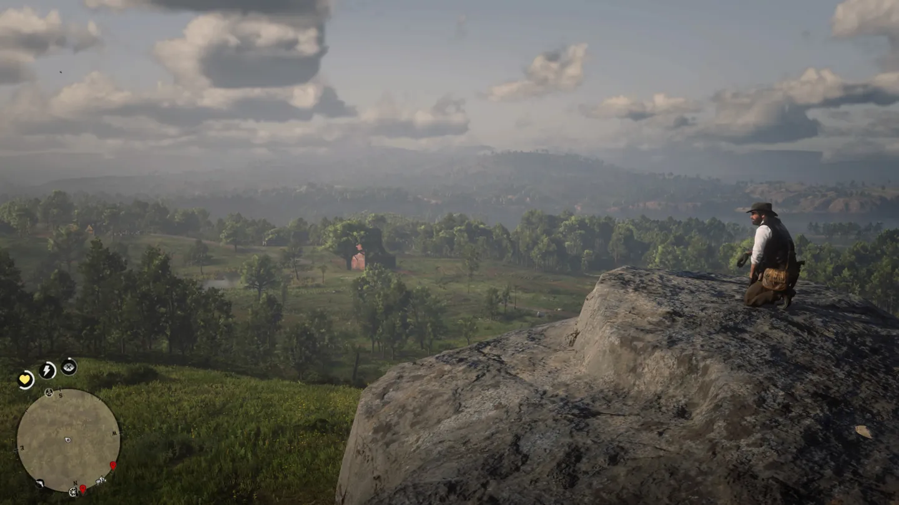

 데드아이 시스템은 레드 데드 시리즈의 아이덴티티라고 할 수 있는데, 각종 행동(아이템 섭취, 사격 명중 등)을 통해 얻을 수 있는 데드아이 게이지를 소모해 시간을 느리게 하여 여러 적을 마킹한 후, 또다른 서부극의 로망 중 하나인 리볼버 패닝으로 여러 적을 단숨에 처리할 수 있는 시스템이다.

### 조작감

 레드 데드 리뎀션 2의 조작감은 꽤 악명이 높다. 전술했듯 훌륭한 여러 디테일함에 비례하여, 현실을 반영했다고 주장하는 불필요한 모션이 디테일이라는 이름 아래 여럿 존재하기 때문이다. 전반적으로 차분하고 느린 초반부의 서사에 더해 이 게임의 진입장벽을 높여주는 주요한 요인 중 하나이다.

 적응되면 다른 액션 어드벤처 게임에서는 쉽사리 볼 수 없는 여러 행동의 디테일에 감탄하게 되지만, 여러 적을 쓰러뜨리고 전리품을 털 때나 집에서 물건을 취할 때 한 서랍에서 여러 물건을 꺼내기 위해 여러 동작을 단계에 걸쳐 계속 이행하는 모습은 살짝 부자연스럽기도 하며, 이 관성 때문에 다소 곤란한 일을 겪기도 한다.

 이러한 점이 호불호가 갈리는 요소이다.

### 명예

전술했듯, 아서 모건의 행위에 따라 그의 명예가 높아질 수도, 낮아질 수도 있다. 단순하게는 서브 퀘스트를 행하면서 NPC들에게 도움을 주거나, 현상금이 걸린 여러 인물들을 포획해 보안관이나 경찰서에 데려오거나, 갱단에 자금이나 물품을 기부하는 행위로 명예가 오르기도 한다. 한편 아무 이유 없이 도시의 NPC들을 쏴죽이거나, 현상금이 걸릴 행위를 한다거나, 심지어는 사냥한 동물에게서 아무것도 취하지 않고 계속해서 사냥을 하면 명예가 감소하기도 한다.

 명예는 전술한 서사의 갈림길에서 체크하게 되는 요소이며, 서사의 진행에 따라 그 한계치가 정해져 있어 아서 모건의 행위가 현재 어떻게 평가받는지에 대한 지표이지만, 그 이외에 특별한 요소는 없다. 오히려 전술했듯 특별히 서사가 크게 달라지지 않을 뿐더러 재생되는 컷신과 본 게임 말미의 플레이 경험이 아주 살짝 달라지는 것 외에 큰 영향이 없기에 서사의 자유도를 확보했다고 하기에는 많이 부족한 시스템이다.

 그렇다고 해서 게임의 재미를 저해하는 시스템적 요소는 아니므로 감점이 들어갈 정도는 아니고, 플레이어의 행동을 유도하는 장치라는 점에서는 적절하다고 볼 수도 있겠다.

## 비주얼

 앞서 언급했던 여러 디테일들을 훌륭한 그래픽으로 담아내었다. 다만 콘솔에서 30프레임 고정인 것이 아쉽다.

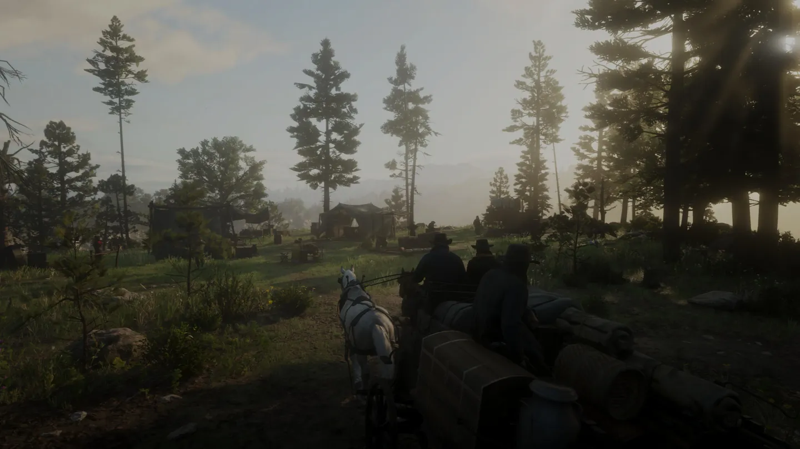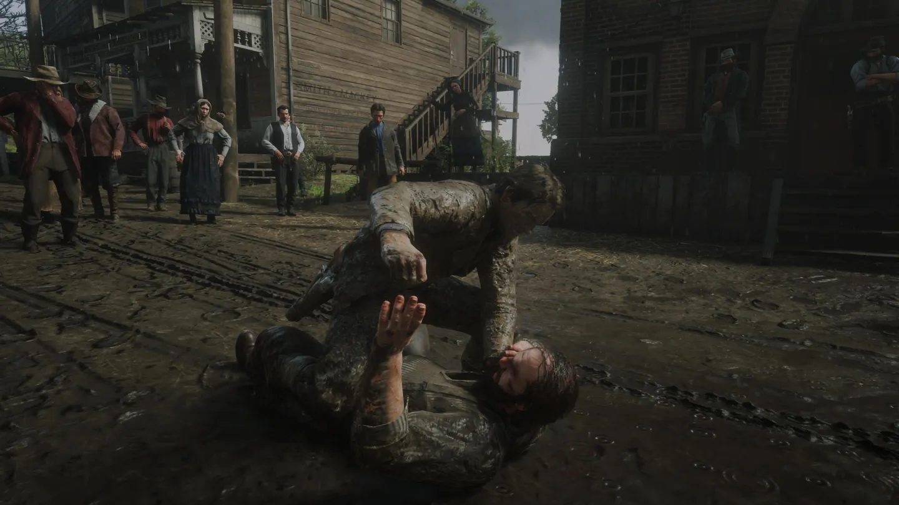

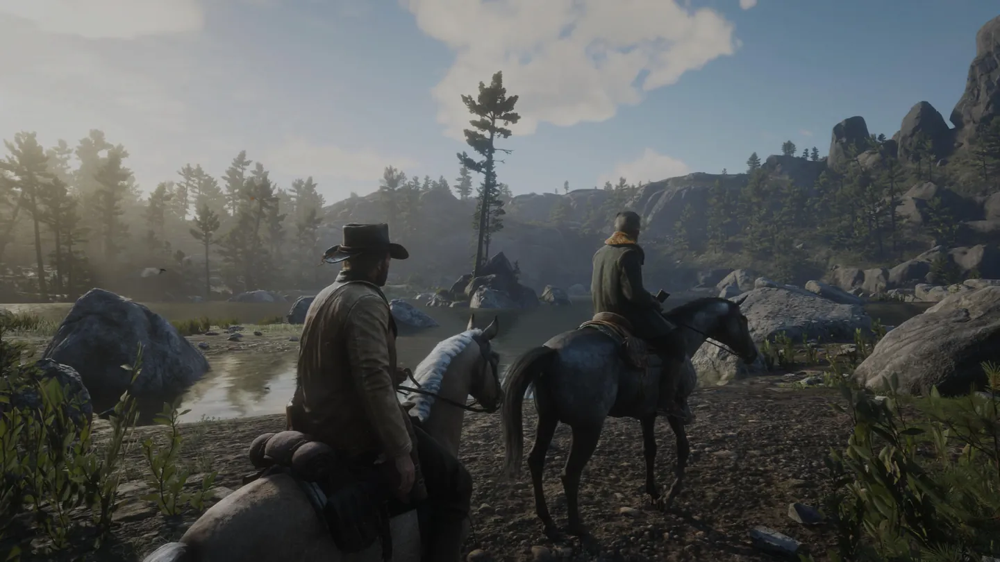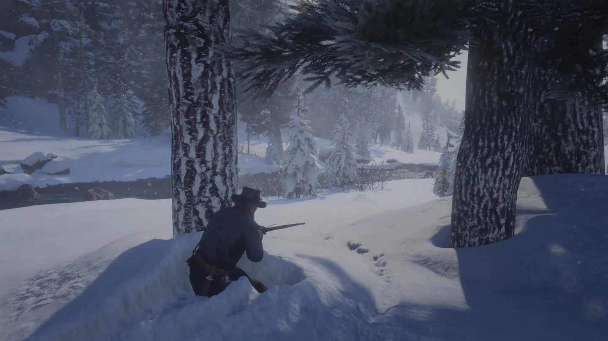

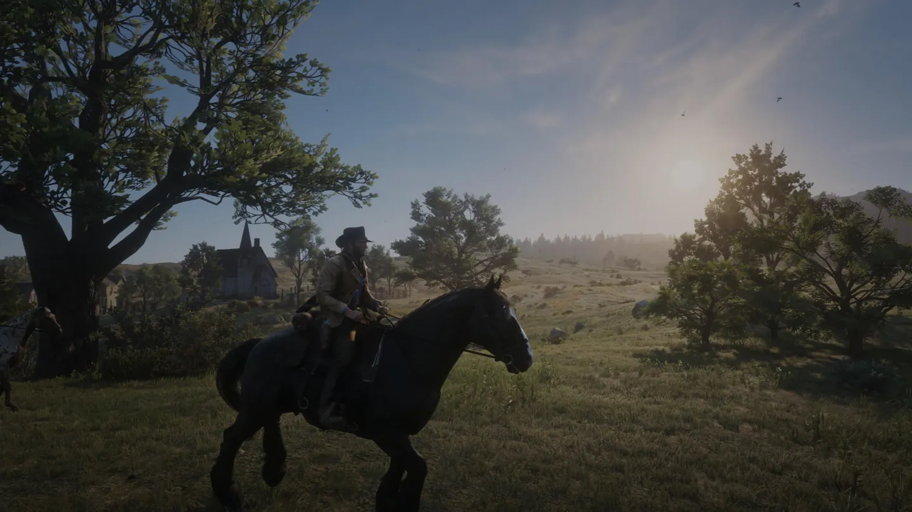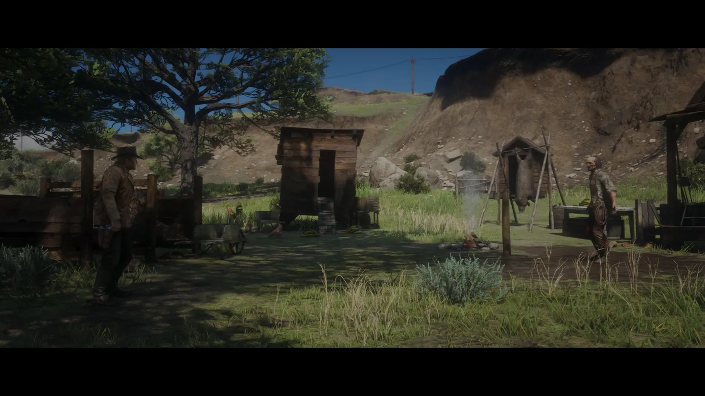

## 정리

 레드 데드 리뎀션 2는 그 명성을 듣고 처음 플레이해보는 사람들에게, 불친절하고 느린 템포로 게임을 소개한다. 눈으로 뒤덮인데다 할 수 있는 것도 많지 않은 초반부에도 꽤 긴 플레이타임을 할애하여 이 세계에 몰입해야 하기 때문에 진입장벽으로 작용하는 것이다. 하지만 그 설산을 벗어나며 마을로 진입하는 순간, 이 게임은 플레이어를 1899년의 미국으로 데려다 놓는다.

 서부극의 로망을 자극하는 카우보이 모자, 말, 복장, 그리고 무법자의 삶을 오픈월드에 충실히 옮겨 놓은 이 게임은 그 오픈월드의 유기성과 완성도에 플레이어를 놀라게 할 뿐더러 디테일로 하여금 진짜 '세계'란 무엇인지 다른 게임들에게 가르쳐주는 듯 하며, 이는 단순히 그 오픈월드에 구현된 식생이나 환경 뿐 아니라 현실과 유사한 인문 환경과 여러 인물들과 함께 오픈월드에서 빠른이동 없이 온전히 레벨 전체를 누비는 재미를 알게 해준다.

 거기에 더해 완성도 높은 스토리는 전작의 주인공이었던 존 마스턴을 기억의 한편으로 치워버릴 정도로 멋진 캐릭터, 아서 모건과 함께 플레이어의 가슴 속에 스며들며,  진정으로 이 시대를 살아가는 아서 모건이 되는 경험을 하도록 만든다.

 미션이나 서사의 분기가 존재하지 않아 서사의 자유도에 대한 비판의 목소리도 종종 있지만, 서사의 자유도가 꼭 모든 게임에 적용되어야 하는가에 대해서는 논의할 필요가 있으므로 구태여 잡은 옥에티에 불과하다.

 누군가에게 오픈월드 게임을 제일 먼저 권해야 한다면 레드 데드 리뎀션 2는 그리 일찍 권하고 싶지는 않다. 이 게임으로 오픈월드 게임에 입문한다면 다른 오픈월드 게임들을 하며 온전히 재미를 느낄 수 없을 것이라 확신하기 때문이다.

> **그래픽**| ★★★★★(10점) 훌륭한 디테일  
> **스토리** | ★★★★★(10점) 서부 시대의 마지막 **사운드** | ★★★★★(10점) 게임을 끝내고 나서도 찾아듣게 되는 음악 **캐릭터** | ★★★★★(10점) 살아숨쉬는 캐릭터  
> **디테일** | ★★★★★(10점) 어드벤처가 아니라 시뮬레이션인가 싶을 정도 **연출** | ★★★★★(10점) 그 세계에 빠져들게 하는 **전투** | ★★★★★(10점) 19세기 총기를, 무법자처럼  
> **탐험** | ★★★★★(10점) 직접 가보지 않으면 모르는 수많은 것들 **조작감** | ★★★★(8점) 디테일하지만 어떻게 보면 번잡한 **오픈월드** | ★★★★★(10점) 락스타식 오픈월드의 정점
>
> **총점**| ★★★★☆ (98/100)  
> *느리고 진득하게, 마음 속 끝까지 스며드는 거친 서부의 세계*

[^1]: https://store.playstation.com/ko-kr/concept/209441
