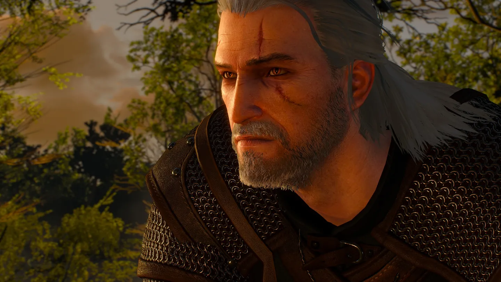
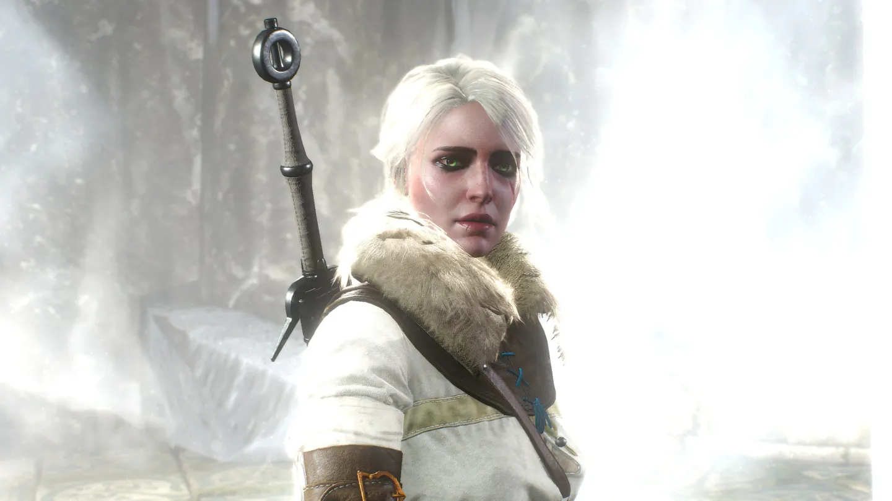
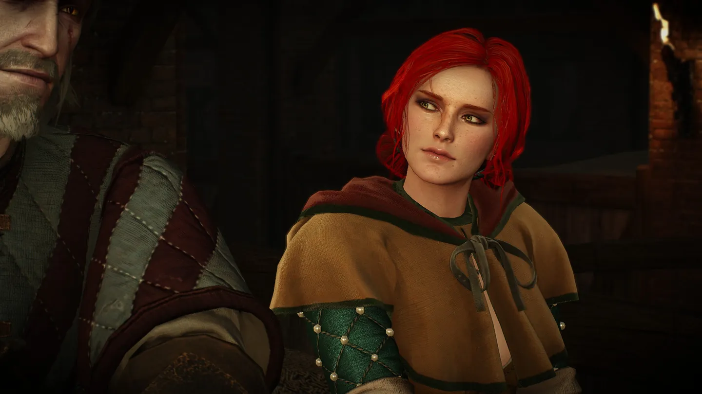
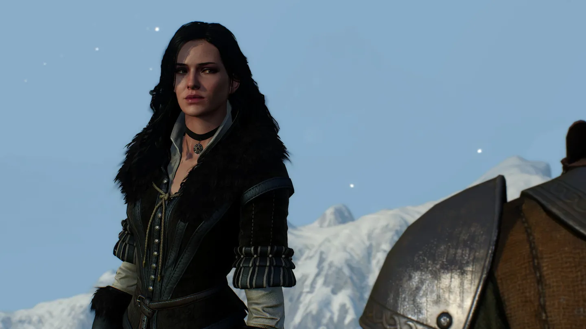
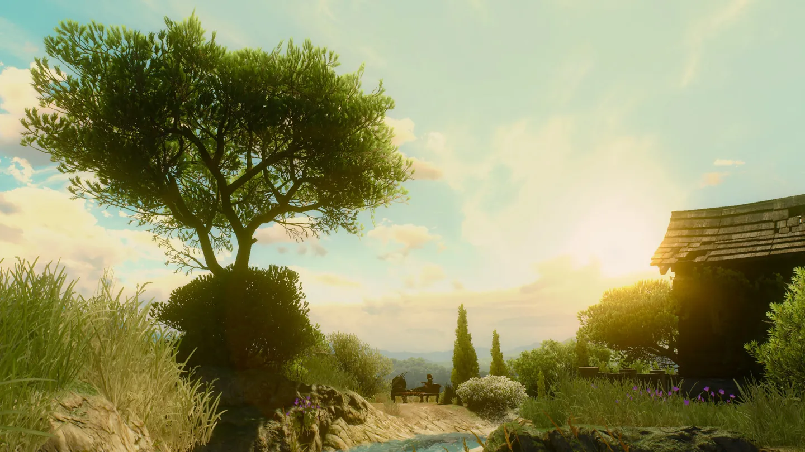
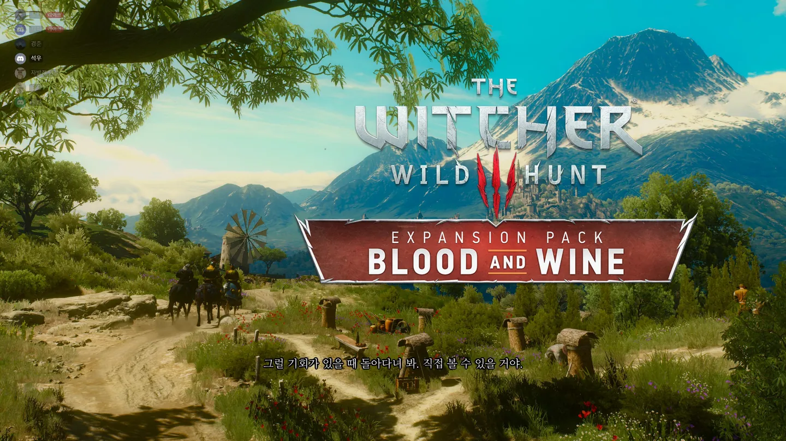
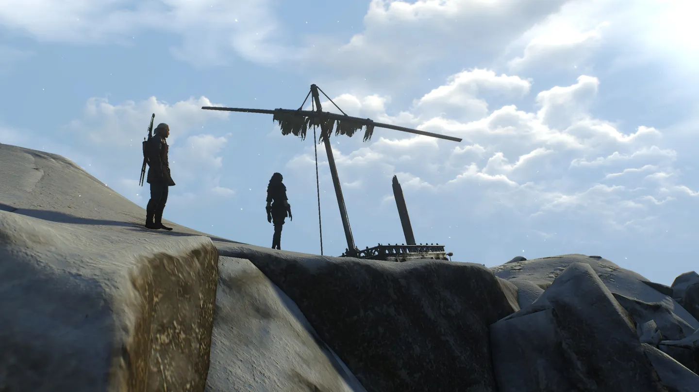
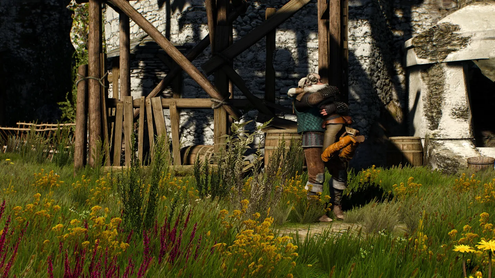
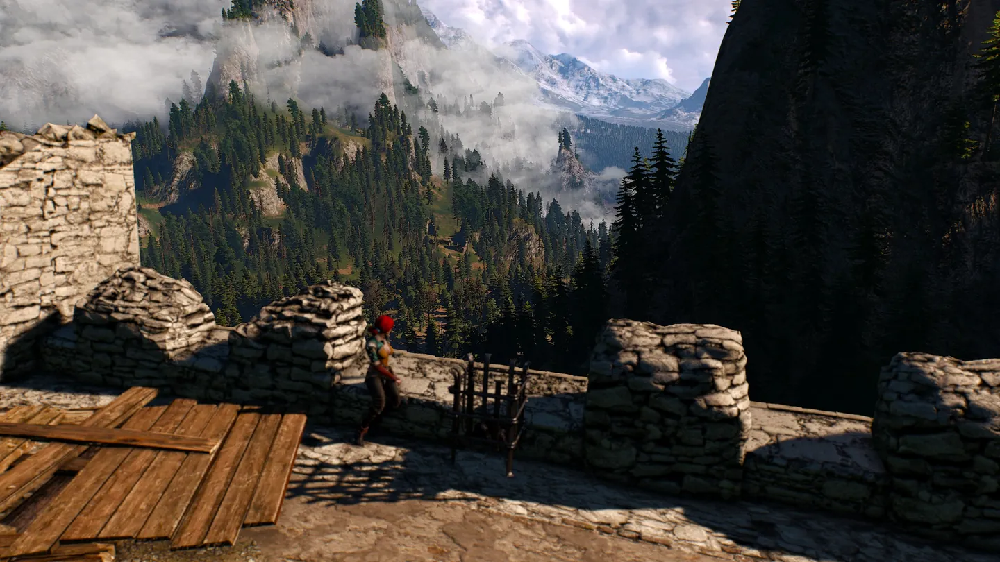
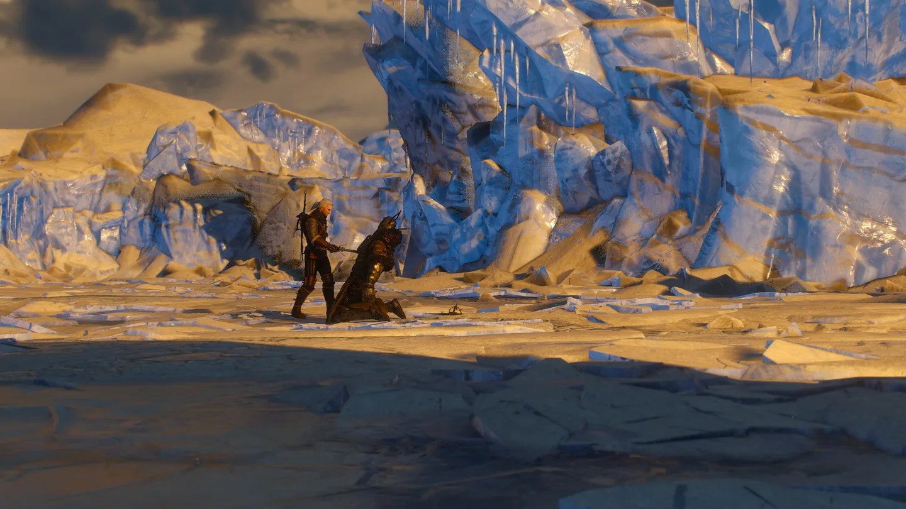

**개발** | CD 프로젝트 레드(CD PROJEKT RED)  
**유통** | 반다이 남코(Bandai Namco)  
**출시** | 2015년 5월 18일 / 2019년 10월 15일  
**플랫폼** | PS4, XONE, PC / NS  
**심의 등급** | 청소년 이용불가

 20세기 반지의 제왕의 등장 이래 수많은 판타지 소설이 등장했고, 수많은 게임들이 등장했다. 이 수많은 세계들은 대개 톨킨의 세계관을 바탕으로 했고[^1], 거기서 수많은 변형이 있었지만 결국 그 본류는 톨킨이 집대성한 그리스 로마 신화, 북유럽 신화, 켈트 신화와 영국의 민담, 그리고 기독교 문화와 성경에 있다.

 하지만 점차 판타지의 영역이 넓어지면서 톨킨에게서 받은 영향과 별개로 다른 신화소들이 판타지 속에 등장하기 시작했다. 판타지 작가들이 세계 곳곳에서 등장하면서 각국의 문화, 신화적 요소를 받아들이기 시작한 것이다. <em>안제이 사프콥스키(Andrzej Sapkowski)</em>의 **위쳐** 시리즈 역시 그 중 하나이다. 1990년 폴란드에서 처음 출판된 위쳐 시리즈는 동유럽 슬라브어권의 민담과 신화소를 흡수하여 독창적인 세계관으로 인기를 끌었다.[^2] 그리고 동유럽권에서 인기를 끌던 위쳐 시리즈는, 2007년 폴란드의 소규모 개발사 <strong><em>CD 프로젝트 레드(CD Projekt RED)</em></strong>에 의해 게임화되기에 이른다.

 철의 장막이 걷혀진 1990년대의 폴란드에서 게임 CD를 배급하던 이 작은 회사는 2007년 발매된 <strong><em>더 위쳐(The Witcher)</em></strong>를 성공시키며 RPG의 신흥 강자로 떠올랐고, 이어 2011년 <strong><em>더 위쳐 2: 왕들의 암살자(The Witcher 2: Assassins of Kings)</em></strong>마저 성공시키며 차기작에 대한 기대를 높였다. 그리고 연이은 성공에 힘입어 마침내 AAA급 게임에 도전하게 되는데, 그렇게 나온 작품이 2015년 혜성과 같이 등장해 그 해 <em>GOTY(Game Of The Year)</em>를 쓸어담은 3인칭 오픈월드 액션 RPG, <strong><em>더 위쳐 3: 와일드 헌트(The Witcher 3: Wild Hunt)</em></strong>이다.

## 스토리

 게임 더 위쳐 시리즈는 원작 소설의 시퀄에 가깝다. 가깝다고 표현한 이유는 원작자 안제이 사프콥스키가 게임 시리즈의 내용을 정사에 포함시키지 않았기 때문이며, 실제로도 자잘한 설정들이 달라지는 경우가 꽤 있다. 하지만 전체적으로 원작 소설의 설정과 서사를 토대로 각 등장인물의 캐릭터성을 확실히 살린 편이고, 게임 자체의 서사도 탄탄하다.

 소설을 읽어보지 않았거나, 1, 2편 게임을 해보지 않은 사람이라면 세계관에 적응하기 어려울 수도 있다. 독창적인 세계관을 가진 모든 작품이 그런 편이지만, 이 작품은 시리즈물이니만큼 어쩔 수 없는 부분이기도 하다. 특히 초반부 모르브란 부히스와의 대화를 통해 전편에 플레이어에게 주어졌던 선택지를 선택할 수 있는데, 무슨 인물이 어떤 행동을 왜 하는지도 모르는데 이를 선택해야 하는 입장에서는 조금 답답함이 느껴질 수 있다.  게임 내에서 주어지는 인물 사전이 있긴 하지만, 시리즈물이니만큼 전편 스토리를 요약한 영상을 찾아보는 것이 앞으로 주어질 서사를 이해하는데 도움이 될 것이다.

 더 위쳐 3: 와일드 헌트의 세계는 흔히 판타지 RPG가 그렇듯 중세 유럽을 떠올리게 한다. 왕과 귀족, 마법사와 괴물, 엘프와 뱀파이어, 등등... 하지만 일반적인 판타지 세상과 달리 실제 중세 유럽에 가까운 점은 주민들의 위생 상태가 형편없으며, 중앙 집권화되어있지 않아 중앙 권력이 구석구석 닿지 못한 무법 지대가 있고, 보다 암울하며 잔혹하다. 이 세계는 *천구의 결합*이라고 불리는 사건 이래 여러 종족들이 뒤섞이게 되었고, 그와 함께 여러 괴물들 역시 나타나기 시작했다. 주인공 리비아의 게롤트는 이러한 괴물들을 상대하기 위한 강화 인간 위쳐로서, 보수를 받고 괴물들을 처치해주는 일을 한다.

 게롤트와 운명으로 엮인 양딸 시리를 찾아 이 세계에 닥친 위협을 해결하는 것이 이 게임의 주된 스토리이다. 그리고 전작에서도 그러했듯 플레이어의 선택에 따라 게롤트와 주변 인물들, 그리고 세계의 결말이 달라질 수도 있다.

 메인 스토리 뿐 아니라 세계 곳곳에 흩어진 보조 퀘스트 역시 다양한 분기가 제공되며, 이 각각의 스토리 라인 또한 매우 매력적이다. 위쳐 시리즈 전체적으로 깔린 비극적 테이스트와 잔혹함은 때로 공포감마저 느끼게 만드는데, 이에 걸맞게 마녀 사냥, 질병과 저주, 인간의 이중성 등 다양한 주제의 보조 퀘스트는 그 자체만으로도 훌륭한 하나의 서사를 이루며, 플레이어가 좋은 의도로 행동한 것이 의도치 않은 결과를 낳거나, 그 어느 선택지를 골라도 무언가는 포기할 수밖에 없는 입체적인 스토리 라인을 보여준다.

 특히 좋은 평가를 받는 보조 퀘스트는 초중반부에 나오는 피의 남작 스토리인데, 처음에는 퉁명스럽고 폭력적인 피의 남작에게 호감을 가질 수 없지만, 스토리가 진행됨에 따라 그의 리더십, 대담함, 포용력을 보여주면서 벨렌 지역의 가혹한 환경과 전쟁의 참혹함이 그를 변하게 했다는 것을 보여주며 그의 다양한 면모를 조명한다.

 이렇듯 위쳐 세계관의 스토리는 완벽한 선과 악도 없는 세상을 적나라하게 드러내고, 그리고 그 와중에도 어떠한 선을 지키기 위해 투쟁하는 인물들에 대해 깊이 있게 탐구한다.

*리비아의 게롤트(좌), 시리(우)*

*트리스 메리골드(좌), 벤거버그의 예니퍼(우)*

 원작 소설에서의 매력 있는 캐릭터들을 이 게임에서는 훌륭하게 구현해 내었다. 냉소적인 위쳐인듯 하면서도 주변 사람들에게 은근 휘둘리기도 하는 주인공 리비아의 게롤트, 기가 세고 제멋대로지만 게롤트와 시리에게는 진심인 벤거버그의 예니퍼, 따뜻하면서도 강단 있는 트리스 메리골드, 시리즈 전체를 관통하는 혈통의 소유자면서도 이들에게는 그저 귀여운 딸일 시리까지.

 원작에서는 게롤트와 예니퍼가 완벽한 커플이고, 트리스는 잠시 게롤트와 연애했던 예니퍼의 친구이자 연적이며, 시리는 이들 모두의 딸과 같은 존재인데 게임에서는 조금 다른 결말을 맞을 수도 있다. 플레이어의 선택에 따라 게롤트는 원작대로 예니퍼와 살 수도, 트리스와 살 수도, 혹은 이들 모두와 연을 맺지 못한 채로 게임을 끝마칠 수도 있다. 물론 연애 노선과 별개로 청소년 이용불가 게임답게 성행위 장면이 다수 등장하기도 한다.

 일반적으로 게임의 확장팩은 본편 게임보다 좋은 평가를 받기 어렵다. 하지만 더 위쳐 3: 와일드 헌트의 확장팩은 둘 다 모두 좋은 평가를 받았으며, 메인 서사에 큰 영향을 주지 않으면서도 훌륭한 보조 스토리 라인을 만들어내었다. 첫번째 확장팩 <strong><em>하츠 오브 스톤(Hearts Of Stone)</em></strong>은 악마와의 내기라는 전통적인 전승 설화를 공포스러운 분위기 아래 훌륭하게 그려내었고,  두번째 확장팩 <strong><em>블러드 앤 와인(Blood And Wine)</em></strong>은 본편에서의 음울하고 공포스러운 중세와 달리 동화 속처럼 아름다운 배경을 한 투생과 동화를 모티브로 한 책 속 세계에서 몽환적이면서도 비극적인 스토리를 만들어내었다. 특히 블러드 앤 와인에서 모든 퀘스트를 끝내면 카메라가 게롤트의 표정을 비추는데, 마치 게롤트가 플레이어를 보며 미소짓는 듯한 느낌을 주도록 한다. 그리고 그 엔딩 이후 플레이어가 선택한 인물 혹은 시리와 함께 여생을 보내는 게롤트의 모습을 비춰주는데, 이 엔딩은 그 동안 게롤트와의 긴 여정을 함께 한 플레이어에게 깊은 여운을 남긴다.

*트리스와 투생에서 여생을 보내는 게롤트. 플레이어의 선택에 따라 예니퍼나 시리와 살 수도 있다.*

## 시스템

### 전투

 더 위쳐 3: 와일드 헌트에서 위쳐는 5개의 표식을 사용할 수 있다. 이 각각의 표식은 일종의 작은 마법인데, 이러한 표식을 전투 외에도 탐험이나 대화 도중 활용할 수 있다. 적에 따라 화염 속성이 약점인 적에게 *이그니(Igni)* 표식을 쓸 수도 있고, 대화 중 상대를 설득하는 대신 *액시(Axii)* 표식을 사용하여 조종할 수도 있다.

 위쳐는 두 가지 검을 가지고 다니며, 은검은 괴물을 대상으로, 강철 검은 인간 적을 대상으로 사용한다. 공격 방식은 속공과 강공으로 나뉘며, 각각 업그레이드할 수 있는 항목이 별개로 존재한다. 또한 원거리 보조무기로 석궁이 등장한다.

 이러한 능력들은 레벨이 오르면서 주는 포인트를 투자해 강화하거나 새로 얻을 수 있으며, 그 외에도 연금술을 통해 포션이나 탕약 등을 제조해 탐험이나 전투에서 사용할 수 있다.

 더 위쳐 3: 와일드 헌트에서의 전투는 대체로 화려하며, 특히 게롤트의 검술은 현실에 존재할 수는 없지만 유려하고 특징적이라 위쳐만의 스타일로 받아들이기 쉽다. 소프트 타겟팅 방식의 자동 조준이 다소 매끄럽지 않고, 게임 내부적으로 약간의 관성이 존재해 탐험할 때 불편하기도 하며, 전투 시에도 타겟팅이 제대로 동작하지 않아 다수의 적을 상대할 때 어려움을 겪을 수 있는 등 조작감에 있어서 다소 불편함을 느낄 수 있지만, 게임을 못할 정도로 불편한 것은 아니며 각종 포션과 탕약, 표식과 장비의 조합으로 제법 재밌는 전투를 즐길 수 있다.

### 세미 오픈 월드

 더 위쳐 3: 와일드 헌트의 세계는 심리스 오픈월드는 아니지만, 몇 개의 넓은 맵을 이어 놓은 세미 오픈월드라 할 수 있다. 하지만 각각의 맵이 상당히 넓고, 각자 특색있는 지형과 인물들, 스토리라인을 가지고 있기 때문에 특별히 단점으로 여겨지지는 않는다. 총 8개의 지방이 등장하지만, 벨렌-옥센푸르트-노비그라드는 하나로 이어져 실제 모든 맵을 돌아볼 수 있기 때문에 로딩이 필요한 별개의 맵은 총 6개이다.

 각 지역이 설정 상 대륙의 각지에 흩어져 있기 때문에 하나의 퀘스트를 진행하는 동안 로딩이 필요한 다른 지역으로 가야 할 일이 없기 때문에 실질적으로 오픈월드가 아니라고 느낄 새가 별로 없는데다, 늪지대, 마을, 대도시, 성과 섬 등 다양한 지역의 풍경이 다채롭고 날씨에 따라 보여주는 풍광과 그와 어우러진 스토리가 플레이어를 몰입시킨다.

 여러 지역을 쪼개놓은만큼 건물로 진입할 때는 로딩이 없다.

### 미니 게임

 요즈음의 AAA급 게임이 그렇듯 이 게임에도 미니게임이 다수 등장한다. 하지만 이러한 게임에서 등장하는 미니게임이 아무리 재밌다 한들 스탠드얼 게임화되어 서비스되는 작품은 흔치 않다. 그리고 그 흔치 않은 결과물중 하나가 이 게임에서 등장하는 <strong><em>궨트(Guent)</em></strong>이다.

 궨트는 카드 게임으로, 게임 내 등장하는 유닛과 세력, 인물을 바탕으로 하는 카드로 승부를 겨룬다. 120여 종의 카드가 있으며, 상인과 퀘스트 등에서 얻을 수 있다. 유닛카드 22장과 날씨, 마법 카드 10장으로 구성된 덱을 가지며, 이 덱에서 10장을 뽑아 2장을 교체할 수 있고, 이 손패로 게임을 진행한다. 3라운드 중 2선승을 하면 게임을 이길 수 있으며, 각각의 라운드에 플레이어 각자의 전장이 세 층위로 존재하는데, 이 전장 좌측에 표기된 숫자가 높으면 해당 전장에서 승리를 거둔 것으로 간주, 세 전장 중 두 개 이상의 전장을 이기면 라운드에서 승리를 거둘 수 있다.

 게임 내에서 대부분의 NPC들과 궨트 내기를 할 수 있으며, 이 궨트를 하기 위해 위쳐 3를 하는 사람이 있다고 말할 정도로 완성도와 인기 모두 높은 미니 게임이다.

## 비주얼

 앞서 설명했듯 다양한 지역이 등장하며, 다채로운 자연 환경을 훌륭하게 구현했다. 벨렌의 늪지대는 음산한 분위기를 물씬 풍기며, 까마귀 횃대는 중세의 지방 마을을, 노비그라드와 옥센푸르트는 르네상스 시기 도시의 모습을 잘 나타냈다. 한편 확장팩 블러드 앤 와인에서 등장하는 투생은 중세~르네상스 시기 프랑스 남부의 대저택을 연상케 하는데, 본편의 지역들이 대개 거친 환경이었다면 따뜻하고 푸근한 햇빛이 비치는 지역의 특성을 보여줘 여정을 마무리하는 게롤트의 삶에 편안함을 느끼게 한다.

*투생의 풍경*

 인물의 경우 당대 기준으로 뛰어난 그래픽을 보여주며, 게임을 플레이하며 머리카락이 휘날리는 등의 효과를 잘 나타내었다.

 탐험이나 전투에서 크게 느껴지지는 않지만 *위쳐 센스*를 사용할 때 나타나는 어안 렌즈 효과는 시야각을 줄일 뿐 아니라 멀미를 유발하기도 하는데, 다른 효과를 사용했더라면 더 좋았을 것 같다.

## 정리

  더 위쳐 3: 와일드 헌트가 어떤 점이 특별한가라고 묻는다면, 사실 좀 어려운 질문이다. 전투가 독창적이라던지, 게임의 스토리를 풀어나가는 방식이 전에 없던 새로운 방식이라던지, 그래픽이 타의 추종을 불허하는 정도라던지 하는 이 게임만의 특별함이 없기 때문이다. 하지만 그럼에도 불구하고 이 게임은 특별한 게임이다. 이만큼 모든 영역에서 훌륭한 성취를 보여주는 게임이 드물기 때문이다. 그리고 그 중심에는 흡입력 있는 서사와 플레이어의 선택에 설득력 있게 반응하는 세계가 있음을 부정할 수 없다.

 완성도 높은 스토리, 그와 어울리는 몰입감 넘치는 세계, 매력적인 캐릭터, 화려한 그래픽, 불분명한 선악의 세계를 여행하는 플레이어에게 주어지는 무거운 선택지. 더 위쳐 3: 와일드 헌트는 불편한 조작감,  아쉬운 난이도 밸런싱을 단순 옥에 티로 느끼게 할만큼 훌륭한 게임이다. 더 위쳐 3: 와일드 헌트는 혁신적인 시도 없이도 기본에 충실한, 그야말로 2010년대 액션 RPG의 정석이라 하겠다.

> **그래픽** | ★★★★☆(9점) 아름답고 공포스러운 중세  
> **스토리** | ★★★★★(10점) 분기 하나하나에 정성이 들어간  
> **전투** | ★★★★(8점) 다양한 선택지, 아쉬운 밸런스  
> **연애** | ★★★★☆(9점) 이 정도면 미연시  
> **조작감** | ★★★☆(7점) 약간은 불편한  
> **세계관** | ★★★★★(10점) 서사에 완벽히 녹아든 세계  
> **확장팩** | ★★★★★(10점) 이런 확장팩이라면 언제든 환영이야  
> **오픈월드** | ★★★★☆(9점) 세미 오픈 월드라곤 하지만, 살아 숨쉬는 세계  
> **미니 게임** | ★★★★☆(9점) 궨트 한 판 할까?  
> **서브 퀘스트** | ★★★★★(10점) 백미
>
> **총점** | ★★★★☆ (91/100)  
> *2010년대 RPG의 교과서*

[^1]: R.E.하워드, H.P.러브크래프트, C.S.루이스를 비롯해 톨킨의 그림자 아래 있지 않은 환상문학 작가들도 많다. 하지만 적어도 톨킨 이후의 중세풍 판타지는 거의 톨킨의 영향 아래 있다고 봐야 할 것이다.
[^2]: 그 외에 기독교 신비주의나 크툴루 신화, 그리고 그 외의 신화소도 많이 드러난다.
