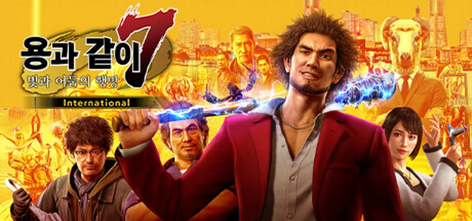
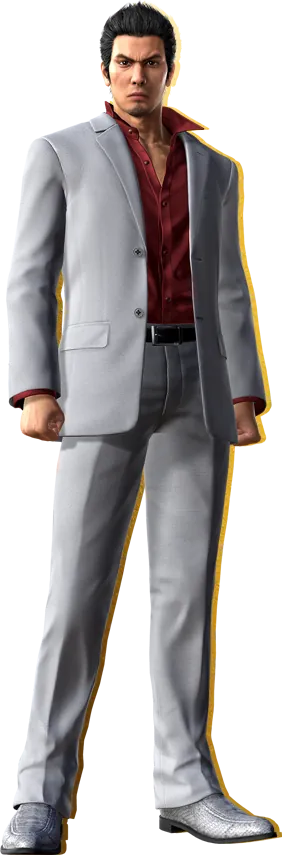
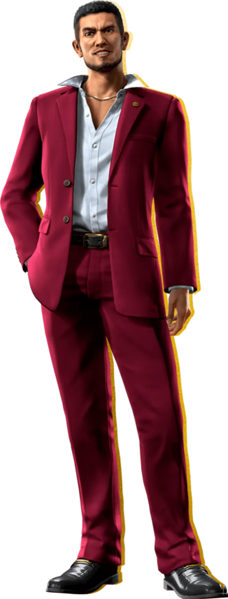
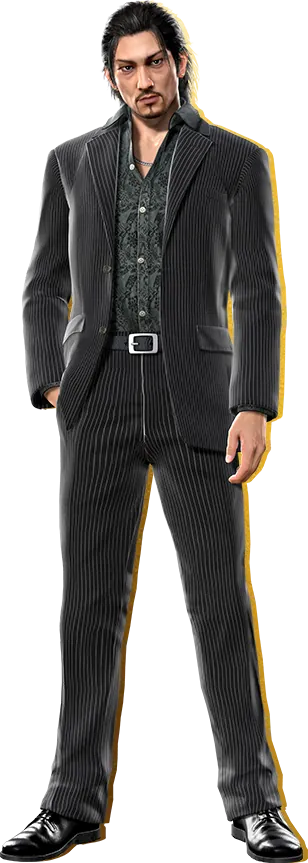
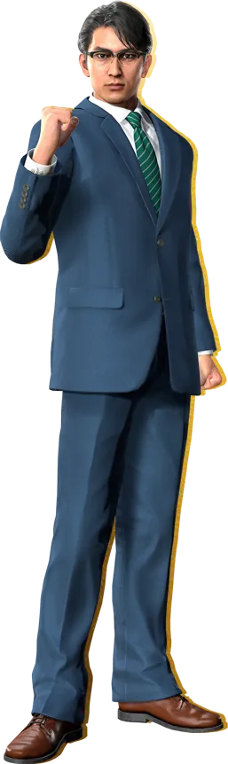

**개발** | 용과 같이 스튜디오(Ryu Ga Gotoku Studio)  
**유통** | 세가(SEGA)  
**출시** | 2020년 1월 16일 / 2020년 11월 10일 / 2021년 2월 25일  
**플랫폼** | PS4 / PC, XBO, XSX|S /PS5  
**심의 등급** | 청소년 이용불가

 2005년 처음 <strong><em>용과 같이(Yakuza)</em></strong>가 나왔을 때만 하더라도 이 시리즈가 전세계적으로 인기를 끌 것이라 예상한 사람은 많지 않았을 것이다. 고작 한 동네를 배경으로 해서 벌어지는 야쿠자의 이야기라니, 이미 수많은 게이머들은 <strong><em>엘더스크롤 2: 대거폴(Elder Scrolls': Daggerfall)</em></strong>이나 ***GTA 3***와 같은  넓은 세상에 적응해 있었고, 도쿄의 가부키쵸는 전세계인의 이목을 끌기는 그다지 매력적인 장소는 아니었다. 하지만 마틴 스코세이지가 그랬던가, '가장 개인적인 것이 가장 창의적인 것이다'라고. 가장 지역적인 이 장소에서 벌어지는 시대착오적 이야기는 일본 내에서는 물론 일본 바깥에서도 큰 호응을 얻으며 시리즈를 계속 이어나가게 되었다.

 용과 같이 시리즈를 이끌어왔던 원동력은 물론 현실의 장소와 비슷한데다 수많은 미니게임들이 가득한 거리, 다양한 B급 테이스트의 서브 퀘스트와 NPC, 박진감 넘치는 액션과 연출도 있겠지만 무엇보다도 주인공 **키류 카즈마**의 강렬한 캐릭터성일 것이다. 그야말로 홍콩 느와르 영화의 의(義)와 협(俠)을 형상화한듯한 하드보일드한 야쿠자가, 자신의 첫사랑의 딸 **사와무라 하루카**를 지키기 위해 폭력의 세계에서 탈출하려 하나 야쿠자라는 업보로 인해 자꾸만 그 세계와 다시 얽혀 소중한 것을 한꺼풀씩 잃어가는 전개도 매력적일 뿐더러, 서브 퀘스트 등지에서 보여주는 B급 감성의 전개가 보여주는 허당미, 그리고 무엇보다 그 어떤 적도 대적할 수 없는 위용으로 <em>'용'</em>이라는 호칭까지 붙은 남자. 키류 카즈마의 캐릭터성은 용과 같이 시리즈를 이끌었던 가장 큰 동력이었다고 감히 말할 수 있다.

 그렇기 때문에 <strong><em>용과 같이 6: 생명의 시(Yakuza 6: The Song of Life)</em></strong>에서 키류 카즈마가 죽음을 가장함으로서 퇴장하면서 차기 시리즈의 전개에 대한 의구심의 목소리가 나오기 시작하고, 차기작에서는 새로운 주인공이 등장한다는 소식이 확정적으로 들려오면서 기존 용과 같이 시리즈의 팬들이 불안해 했던 것은 어쩌면 당연했던 일인지도 모른다. 거기에 더욱 충격적인 소식마저 들려왔다. 지금까지 줄곧 액션 어드벤처로 개발되어 왔던 시리즈가 턴제 RPG로 나온다는 것이었다. 만우절 영상에서나 나올 법한 이야기가 진실로 밝혀지자 많은 사람들이 당혹감을 감추지 못했다.

 그렇게, <strong><em>용과 같이 7: 빛과 어둠의 행방(Yakuza: Like a Dragon)</em></strong>은 큰 변화를 바라보는 팬들의 걱정 섞인 시선과 함께, 세상에 나오게 되었다.

## 스토리

> 도쿄의 군소 야쿠자 조직의 말단 조원인 카스가 이치반은 자신이 저지르지도 않은 범죄를 뒤집어쓰고 18년형을 대신 살게 되었습니다. 충성심을 절대 버리지 않은 그는 형을 다 마치고 사회로 돌아왔지만 자신을 기다리는 사람은 아무도 없었고, 조직 역시 자신이 가장 존경했던 사람의 손에 의해 와해되었습니다.
>  
> 이치반은 패밀리가 자신을 배신한 배경을 파헤치고 인생을 되찾기 위한 여정에 나섭니다. 그런 이치반의 편에는 사회 낙오자들이 오합지졸처럼 모여 있습니다. 해고당한 경찰 아다치, 노숙자 신세가 된 전직 간호사 난바, 그리고 사명감 넘치는 화류계 여성 사에코가 그들입니다. 이들은 함께 요코하마 지하 세계에서 불거지는 무력 충돌의 소용돌이에 휩싸여 전혀 생각해 본 적 없었던 영웅적인 행보에 나서야 합니다.[^1]

 게임은 새로운 주인공 **카스가 이치반**의 일생을 소개하는 데서 시작한다. 2000년 12월 31일, 동성회 하부 조직 아라카와조의 말단 조직원인 카스가 이치반은 천성이 착하고 마음이 약한 나머지 빚쟁이들에게 빌려준 돈을 수금하는 일도 제대로 하지 못해 와카가시라[^2]인 사와시로 죠에게 손가락도 잘릴 뻔하지만, 아라카와조 조장 아라카와 마스미의 중재 덕분에 겨우 이를 벗어난다.

 아라카와 마스미는 그에게 유사 아버지의 역할을 한 인물로, 부모 없이 소프랜드의 점장과 소프 걸들의 손에서 자란 카스가 이치반이 역시 유사 아버지였던 점장의 죽음 이후 방황하면서 절도와 폭행 등 범죄에 손을 담그면서 야쿠자들과 마주치게 되는데, 야쿠자들에 의해 죽을 위기에 처하자 유명한 야쿠자였던 아라카와의 이름을 팔아 살고자 했다. 그러나 그를 고문하던 야쿠자들은 아라카와의 적이었고, 그들은 이치반을 미끼로 아라카와를 끌어내려 했다. 아무 상관도 없는 자신을 위해 야쿠자 두목이 나설리는 만무하니, 삶을 포기했던 이치반 앞에 나타난 아라카와 마스미는 그의 손가락 하나를 내주면서 처음 보는 꼬마를 구해낸다.

 위태롭던 소년의 삶에 손을 내민 두 번째 어른이었던 아라카와 마스미에게, 카스가 이치반은 그의 조직원이 되게 해달라 매달린다. 아라카와는 이를 몇 번이고 거절하지만, 결국 갈 곳 없던 그를 거두었다. 이치반은 그를 은인이자 또 다른 아버지로 여기며 충성을 다 하고, 몸이 불편한 그의 아들 아라카와 마사토의 수발도 기꺼이 든다.

 2001년 1월 1일, 카스가 이치반의 23번째 생일에 아라카와 마스미는 그를 비밀스레 호출한다. 사와시로 죠가 동성회 계열의 경쟁 조직 사카키조의 조직원을 우발적으로 살해했는데, 이 사실이 알려진다면 아라카와조가 경찰과 동성회 상위 조직의 타겟이 되어 존폐의 기로에 설 수도 있다 것. 그리고 이 사실을 덮기 위해 그가 대신 감옥에 갔다온다면 조직에 무사히 복귀시켜주겠다는 부탁이었다. 자신을 거두어준 은인의 부탁에, 카스가 이치반은 조금의 망설임도 없이 이를 받아들여, 15년형을 선고받고 감옥에서 아라카와 마스미를 욕하는 죄수들을 두들겨 패 총 18년을 감옥에서 보낸다.

 그리고 2019년, 모든 형기를 마친 카스가 이치반은 사회로 복귀하지만 충격적인 소식들을 접한다. 아라카와 마사토는 죽었고, 새로운 도쿄 도지사가 시행한 **카무로쵸 3K** 작전에 아라카와 마스미가 적극 가담하여 동성회 내부 정보를 빼돌림으로써 동성회가 무너지고, 그 빈자리는 오미 연합을 끌어들인 아라카와가 오미 연합의 와카가시라 대행에 올랐다는 것. 이 소식을 들은 이치반은 아라카와를 만나기 위해 무작정 오미 연합의 간부 회의가 열린다는 평안루에 난입해 그와 대면하지만, 아라카와는 그에게 총을 쏘았고, 이윽고 요코하마 이세자키 이진쵸의 빈민가에 버려진 상태로 깨어난다.

### 캐릭터

 카스가 이치반은 여러모로 이전 시리즈들의 주인공인 키류 카즈마를 떠올리게 한다. 때로는 극명한 대비를 이루고, 때로는 비슷한 모습을 보인다. 이러한 대비는 강렬했던 키류 카즈마의 캐릭터성을 답습해 그의 열화판으로 만드는 실수[^3]를 피할 수 있게 해주었다. 두 주인공의 공통점과 차이점을 다음과 같이 정리해보았다.

<!-- 원본의 colspan/rowspan을 마크다운 표로 표현할 수 없어 HTML로 작성.
     전신샷은 각 인물 열의 머리에 배치. -->
<table class="yakuza-compare">
  <tbody>
    <tr>
      <th colspan="2">구분</th>
      <th> 키류 카즈마</th>
      <th> 카스가 이치반</th>
    </tr>
    <tr>
      <th rowspan="2">공통점</th>
      <td>작품의 시작</td>
      <td colspan="2">하지 않은 일을 뒤집어 쓰고 투옥, 형기를 마친 후 배신당함</td>
    </tr>
    <tr>
      <td>아버지와 같이 여기는 인물이자 야쿠자가 되고자 했던 이유</td>
      <td>카자마 신타로</td>
      <td>아라카와 마스미</td>
    </tr>
    <tr>
      <th rowspan="6">차이점</th>
      <td>문신</td>
      <td>응룡</td>
      <td>용어</td>
    </tr>
    <tr><td>복장</td><td>붉은 셔츠에 회색 정장</td><td>흰 셔츠에 붉은 정장</td></tr>
    <tr><td>헤어 스타일</td><td>단정한 짧은 머리</td><td>풍성한 파마머리</td></tr>
    <tr><td>무기</td><td>맨손</td><td>야구 배트</td></tr>
    <tr><td>투옥 전 커리어</td><td>조장 승격이 유력한 야쿠자</td><td>말단 조직의 말단 조직원</td></tr>
    <tr><td>성격</td><td>진중함</td><td>밝고 순수함</td></tr>
  </tbody>
</table>

 키류 카즈마가 용과 같이 1에서 그랬듯, 카스가 이치반 역시 자신이 하지 않은 일을 스스로 뒤집어 쓰고 투옥되었다. 긴 형기를 마치고 나왔을 때 각각 형제/아버지로 여겼던 사람에게 배신을 당했다. 두 사람의 출발점은 언뜻 보면 비슷해 보인다.

 하지만 키류 카즈마는 이미 조장 승격이 유력한 야쿠자로, 직계 조직에서 분가해 자신만의 조직을 꾸릴 정도의 명성을 가진 상태였고, 카스가 이치반은 빚 수금조차 똑바로 못하는 3차 조직의 말단 조직원이었다. 이는 두 인물의 능력과 성격의 차이에서 기인한다. 키류 카즈마는 전형적인 느와르물의 주인공으로, 무력이 뛰어날 뿐 아니라 야쿠자로서의 능력 역시 비범했다. 성격 역시 진중하며, 스스로의 내면을 잘 드러내지 않기 때문에 홀로 모든 것을 감당한다. 하지만 카스가 이치반은 무력은 키류 카즈마에 비교하는 것조차 민망하며, 야쿠자로서는 성격이 지나치게 가볍고, 스스로의 내면을 숨김없이 내보이며 동료들의 도움을 받아 난관을 헤쳐나간다. 그리고 이렇게 대비되는 면모는 후술할 게임 장르와 플레이 방식을 통해 더 적나라하게 드러난다.

 용과 같이 시리즈는 늘 '야쿠자는 행복할 수 없다'라는 불문율 아래 서사를 진행시켜 왔다. 아무리 키류 카즈마와 카스가 이치반 본인의 본래 모습이 선량한 인물일지라도, 그들이 폭력 조직의 일원으로서 해왔던 일들이 없어지는 것이 아니며, 이러한 업(業)은 결국 그들이 소중하게 여기는 것들을 하나씩 앗아간다. 키류 카즈마는 그 첫 여정에서 의형제, 첫사랑, 아버지를 잃었으며, 야쿠자의 삶을 버리고자 하여도 다시 끌려들어가 동료, 몸 담았던 조직, 마침내는 그 자신의 생존마저도 버려야 했다. 카스가 이치반 역시 그의 첫 여정에서 의형제, 아버지를 잃었다.

 하지만 이렇게 대비되는 캐릭터성에 더불어 카스가 이치반에게 남은 동료들의 존재는, 그의 남은 여정이 어쩌면 키류 카즈마와는 다를지도 모른다는 추측을 하게 만든다. 무엇보다 그의 업의 크기는 키류와는 다르지 않은가.

### 주제 의식

 용과 같이 7의 부제는 빛과 어둠의 행방이다. 여기서 빛과 어둠은 카스가 이치반과 아오키 료 쌍방을 뜻한다. 아오키 료는 도쿄도지사로, 동성회를 카무로쵸에서 완전히 쫓아낸 카무로쵸 3K 작전의 입안자이다.

 이 작품에서는 꾸준히 색에 대한 비유가 등장한다. '그레이 존', '블리치 재팬' 등, '빛'은 일반적으로 뜻하는 떳떳한 사회의 모습을 뜻하며, '어둠'은 폭력과 성(性) 등 법 바깥의 구역을 지칭한다. 그리고 그 사이, 법으로 규정되지 않거나 보호되지 않는 구역을 '그레이 존'이라 칭하며, 작중 등장하는 청년 단체 '블리치 재팬'은 이러한 그레이 존을 표백해버리겠다는 의지를 표명한다. 그리고 이 블리치 재팬의 설립자 아오키 료는 도지사가 되어 이러한 정책을 도쿄도 전체에 전파하려 한다.

 그러나 이러한 '그레이 존'에는, 전술했듯 법의 보호를 받지 못하는 약자들 역시 존재한다. 이는 우리 일상에서도 흔히 찾아볼 수 있다. 이따금 뉴스 기사에서 법으로 보호받지 못하는 약자가 법 바깥에 있는 나름의 질서에 의지해 살아가는 이들을 본 적이 있을 것이다. 이들을 둘러싸고 안타깝지만 법을 어겼으므로 그들을 처벌해야 한다는 의견부터, 임시방편으로 법을 개정하여 그들을 법의 테두리 안으로 넣자는 의견, 혹은 이러한 정당행위를 보다 폭넓게 해석하여 무죄로 해야 한다는 의견까지 수많은 의견들이 그러한 기사 댓글 창에서 논쟁을 빚는다.

 카스가 이치반은 법의 테두리에 있는 소프랜드에서 길러졌다. 일본에서도 성매매는 불법이지만 실제 행위가 이뤄지지 않는 소프랜드는 법의 테두리에 있다고 할 수 있을 것이다. 이러한 법의 테두리에는 자연스레 약자들이 모인다. 고아, 가난한 사람, 장애인 등. 법의 해석 범위와 적용 범위에 대한 논쟁은 글을 따로 할애해도 끝나지 않을 것이기에, 카스가 이치반과 그의 동료들은 그들을 둘러싼 환경에 의해 그레이 존으로 몰린 인물들이며, 그 때문에 아오키 료의 블리치 재팬과 맞서게 된다는 정도로 마무리하겠다.

 이 챕터의 첫머리에서 야쿠자인 카스가 이치반을 어둠, 도지사인 아오키 료를 간단히 각각 어둠과 빛으로 비정할 수도 있었을 것이다. 하지만 각각이 아니라 쌍방이라 표현한 이유는 스포일러가 될 수 있으므로 아래 더보기 란에 더 설명하도록 하겠다.

{}

  사실 아오키 료는 아라카와 마사토였다. 작품 초반 여자친구인 호스티스 유메노가 경시청 경무부장 호리노우치 쥬로에게 그를 야쿠자의 아들이라며 경멸하는 말을 들은 그는 어둠 속에 속한 존재인 자신과 아버지를 혐오하게 되어 어느 히키코모리의 호적을 사고 미국에서 치료를 받은 후 아오키 료로서 활동하게 된 것이었다.

 한편 자신을 드러내는 것에 대해서, 카스가 이치반은 그 스스로를 온전히 남에게 드러낸다. 그의 행동에 꾸밈과 가식은 없다. 하지만 아오키 료는 아라카와 마사토로서의 자신을 숨김과 동시에 그 자신에 대한 혐오와 냉혹함을 숨기고 친절과 예의, 그리고 단 하나의 진짜인, 어둠에 대한 깊은 경멸만을 드러낼 뿐이다.

 아오키 료는 그가 쥔 권력에 비하면 하잘 것 없는 카스가 이치반을 경계하고, 적의를 품는다. 이치반에게 마사토는 자신이 가지지 못한 아버지와 가족, 돈을 가진 사람이지만, 마사토에게 이치반은 자신을 온전히 드러내면서, 범죄자인 주제에 자신이 가지지 못한 건강과 사람을 끌어들이는 매력을 가진 사람이었다.

 작 후반부 드러나는 반전은 이 두 사람의 입장을 완전히 뒤집어 놓는다. 카스가 이치반이 소프랜드 점장에게 코인로커에서 발견되었던 1월 1일, 또 하나의 아이가 코인로커에 있었다. 그 아이는 사와시로 죠의 아이로, 그를 버릴 생각이었던 죠의 무관심으로 질병을 안게 되었다. 그리고 코인로커에 자신의 아이를 잠시 보호하려 했던 아라카와 마스미가 문을 부숴가며 발견했던 것은 추위와 굶주림으로 크게 울 수밖에 없었던 사와시로 죠의 아이였고, 남겨진 마스미의 진짜 아들은 소프랜드 점장이 발견해 기르게 된 것이었다.

 하지만 이 사실을 알지 못했던 그 둘은 끝까지 대립했다. 아라카와 마사토는 아버지의 세력을 등에 업고, 블리치 재팬이라는 단체의 뒤를 오미 연합이 보도록 하게 하였다. 하지만 마스미는 오미 연합의 병력이 빠진 틈을 타 기습적으로 해산 선언을 했고, 이에 아라카와 마사토는 분노해 아버지를 살인 교사하는 패륜을 저지른다.

 이러한 사실을 알게 된 카스가 이치반은 아라카와 마사토와 대립하여 마침내 그를 제압한다. 이치반은 끝까지 그에게 자수를 권하고, 마침내 거짓으로 지켜낸 권력에 미련을 버리고 자수하고자 했던 아오키 료는 그를 진심으로 믿고 따랐던 블리치 재팬의 요코하마 지부장 쿠메 소타가 찌른 칼에 의해 죽음을 맞이한다.

 카스가 이치반은 아버지와 돈을 가졌던 아라카와 마사토를 부러워했다. 소프랜드에서 자란데다 아버지로 여긴 점장마저 요절했던 이치반에게 마사토는 무엇이든 다 가졌던 사람이었다. 야쿠자로서의 삶을 시작하고 나서, 그는 살인 누명을 스스로 뒤집어 쓰고 전과자가 되지만 조직에 버림받는다. 그리고 그 사이 모든 것을 다 가졌던 사람은, 신분마저 세탁해 권력마저 가졌다. 카스가 이치반은 아라카와 마사토와 자신을 빛과 어둠이라 칭했다. 저 위에 있는 마사토는 빛, 자신은 어둠.

 하지만 실상은 달랐던 것이다. 버려져야 했던 이는 스스로를 거뒀던 사람을 버렸고, 이내 스스로마저 버려 깊은 어둠속에 스스로를 담궜다. 거둬져야 했던 이는 스스로를 거뒀던 사람을 끝까지 지켜냈고, 그 스스로를 드러내 많은 동료와 함께 나아갔다. 마침내 어둠이 스스로를 마주보았을 때, 그는 그 자신의 업에 의해 생을 마감했다.

 빛과 어둠의 행방은 그렇게 정해졌다.

{}

 본작은 바뀐 게임 시스템에 맞춰 게임의 플레이와 스토리가 유리되지 않도록 서사를 잘 구성했다. 전작의 주인공과의 강렬한 대비 역시 바뀐 시스템에 대한 강력한 설득이 되었기에, 수많은 팬들의 걱정을 열광으로 바꿀 수 있었다. 그리고 어떻게 보면 뻔하지만, 그렇기에 왕도적인 메시지와 반전 덕분에 용과 같이 시리즈의 팬들은 새 시리즈의 시작을 반길 수 있으며, 짧은 등장이었지만 그다운 임팩트를 보여준 키류 카즈마 덕분에 기존 시리즈에 대한 존중도 놓지 않았다 하겠다.

## 시스템

### RPG

 이전 시리즈들은 키류 카즈마가 혼자서 전투를 벌이는 3인칭 액션 어드벤처였다. 하지만 이번 작품부터는 턴제 RPG, 그것도 ***페르소나(Persona) 시리즈***와 비슷한 JRPG 계열의 턴제 전투로 게임의 장르가 바뀌었다. 전설적인 JRPG <strong><em>드래곤 퀘스트(Dragon Quest)</em></strong>에 대한 경의를 드러내기라도 하듯, 주인공 카스가 이치반은 드래곤 퀘스트의 팬으로, 전투 시 동료들이 각종 현대 사회에서 볼 수 있는 직업으로 변신해 해당 직군이 쓸법한 도구들을 이용해 상대를 공격하거나 상태 이상을 걸고, 동료들을 회복시킨다. 이러한 판타지성은 B급 테이스트가 짙게 묻어나는데, 용과 같이 시리즈의 정체성과도 같은 B급 감성이기에 오히려 더 잘 받아들일 수 있다.

 하지만 이러한 RPG 요소에 깊이가 있냐고 묻는다면 그다지 깊다고 하긴 어렵다. 형사, 노숙자, 보디가드, 호스트, 댄서, 아이돌, 딜러 등 수많은 직업이 각각 특색을 갖고 있고 비교적 이들이 가진 공격의 속성(불, 얼음, 바람 따위) 역시 제법 잘 녹여낸 편이지만 전투 자체의 전략성이 부재해 기술의 다양성보다는 소위 '레벨빨'로 해결하는 것이 간편하다. 오히려 이를 지원하기라도 하듯 중후반부 소텐보리에 해금되는 배틀 아레나에서 '레벨 노가다'를 통해 레벨을 올려놓는다면 콘텐츠를 즐기는데 어려움이 없다. 이러한 캐주얼함은 신규 유저를 노렸다고도 할 수 있겠지만, 난이도가 다소 낮아 전투 그 자체에서 특별한 재미를 느끼기는 어렵다.

 그렇다고 해서 전투가 마냥 지루한 것은 아니다. 직업이 가지고 있는 기술과 속성을 활용해 적을 공략하고, 이를 단련해 새로운 직업을 전직해가는 기본적인 JRPG의 문법 자체는 충실하게 따르고 있다. 거기에 각 캐릭터들의 위치에 따라 달라지는 액션이 약간의 전략성을 추가해줘 신선함을 더한다. 전술했듯 현대 직업을 드래곤 퀘스트와 같은 중세 판타지에 대입(노숙자 = 힐러, 기동대원 = 탱커 등)하는 참신함도 갖고 있다.

### 동료 시스템

 본작에서는 동료 시스템이 보다 발전했다. 동료들과 각종 유대 퀘스트를 진행하면서 인연을 쌓으면 인연 레벨이 올라 새로운 직업을 택할 수 있다던가, 더 깊은 이야기를 들을 수 있다던가 하는 요소가 추가되었으며, 여성 캐릭터를 대상으로는 연애도 가능하다. 하지만 연애 컨텐츠는 본격적인 러브라인이 만들어진다기보다는 고백 이벤트 컷신을 재생하는 것에 불과하기 때문에 조금 아쉬운 지점이다.

 특정 동료와 함께 특정 장소에 도착하면 동료들과 대화가 재생되는 파티 채팅 시스템이 존재하는데, 이는 주인공과 동료들의 유대감을 잘 표현해주는 서사로 플레이어에게도 동료들에 대한 이해를 높여준다.

### 미니 게임

 용과 같이 시리즈의 또 다른 아이덴티티는 미니 게임이다. 본작에서도 역시 다양한 미니 게임이 등장한다. 이전 시리즈에서 등장했던 배팅 센터, 골프, 다트, 마작, 장기, 화투를 비롯한 각종 도박과 세가 고전 게임을 즐길 수 있는 오락실, 노래방까지 다양한 컨텐츠가 등장하여 아무 목적 없이 미니 게임을 하기 위해 게임을 플레이해도 될 정도로 그 가짓수가 많고 잘 구현되어 있다.

 본작에서 새로 도입된 드래곤 카트, 서바이벌 캔 줍기 역시 꽤 할만한 서브컨텐츠이며, RPG 요소 강화를 위해 도입한 자격증 학교, 알바 퀘스트와 야쿠몬 도감 등도 있지만 어느새 시리즈의 전통처럼,경영 요소를 갖춘 컨텐츠인 회사 경영이 가장 이들 중 메인 컨텐츠라고 할 수 있겠다.

 용과 같이 0와 용과 같이 극 2 등에서 물장사 아일랜드, 부동산 경영 등 경영 요소를 도입한 컨텐츠를 이은 셈인데, 이치반 제과라 불리는 전병 가게를 이끄는 서브컨텐츠이다. 이치반 제과를 키워 이치반 홀딩스가 되어 직원을 고용하고, 주가를 올려 주주들의 지지를 받아 적대적인 기업들을 넘어 주가 순위를 올리는 컨텐츠인데, 해당 컨텐츠들이 모두 그랬듯 경영 시뮬레이션 요소를 캐주얼하게 도입해 계속 플레이하기만 한다면 쉽게 돈을 벌 수 있는 컨텐츠지만 볼륨이 꽤 크고 메인 퀘스트를 진행하는데도 큰 도움을 주기 때문에 반 필수적인 컨텐츠가 되었다.

## 비주얼

 용과 같이 시리즈의 그래픽은 동세대의 AAA급 게임들과 비교했을 때 아주 뛰어나다고 하기는 어려운 편이다. 건물이나 물건의 텍스쳐, 애니메이션과 액션, 이펙트, UI까지 B급 감성이 물씬 묻어나온다. 인게임에서의 인물 모델링 역시 훌륭하다고 말하기는 어렵다.

 하지만 컷신에서의 인물 묘사는 전혀 뒤쳐지지 않으며, 시리즈가 거듭될수록 맵이 확장되고 구석구석 채워지는 것을 볼 때, 이러한 것으로 점수를 깎기에는 제작비를 고려했을 때 타당치 않은 결정이다.

 전체적으로 일본 현대 도시의 모습을 충실하게 구현해서, 이번에도 모델이 된 도시의 거리를 가보면 거의 비슷한 수준이며, 다소 디테일이 아쉽지만 시리즈가 거듭해 갈수록 발전하는 모습을 보여준다.

## 정리

용과 같이 7: 빛과 어둠의 행방은 시리즈에 훌륭한 전환점을 마련했다. 키류 카즈마의 서사를 마무리하고 새로운 주인공을 내세울 최고의 무대를 마련했으며, 이 새로운 주인공은 새로운 시스템과 함께 여러 면에서 전 주인공을 떠올리게 함과 동시에 그와 반대되는 캐릭터성으로 존재감을 드러내었다. 여러 팬들의 걱정에도 불구하고 턴제 RPG로의 전환은 성공적이었다.

 으레 새로운 주인공이 등장했던 시리즈에서 이전 주인공을 불필요하게 깎아냈던 사례가 있음을 감안했을 때, 이 작품은 시리즈의 연착륙을 위한 더할 나위 없는 교두보를 확보했다. 기존 주인공과 등장인물들과 플레이어 간의 추억을 훼손하지 않고 이를 존중함과 동시에 새로운 이야기와 캐릭터로 스스로의 매력을 플레이어에게 각인시킬 수 있었다.

 이미 시리즈의 전통으로 자리잡은 각종 B급 감성의 서브 퀘스트와 캐주얼한 경영 컨텐츠와 함께 탄탄한 스토리와 연출로 앞으로 시리즈의 새로운 게임을 기대하게 하는 작품이라고 할 수 있겠다.

> **그래픽** | ★★★☆(7점) 늘 발전하는 모습을 보여주는  
> **스토리** | ★★★★(8점) 다소 편의주의적인 전개가 숨어있지만, 그럼에도 불구하고 훌륭한  
> **연출** | ★★★★★(10점) B급 감성의 AAA급 연출  
> **배경** | ★★★★(8점) 과장 조금 보태면 요코하마 가이드  
> **주인공** | ★★★★☆(9점) 키류의 빈자리를 메우긴 부족하지만... 매력있다  
> **난이도** | ★★★(6점) 장르로서의 깊이와 더불어... 새로운 팬들을 위한 안배인가?  
> **미니 게임** | ★★★★(8점) 용과 같이의 아이덴티티  
> **장르 변경** | ★★★★(8점) JRPG가 싫지 않다면... 하지만 깊이는 없다  
> **캐릭터 활용** | ★★★★☆(9점) 우리가 시리즈물에 기대하는 바  
> **직업 시스템** | ★★★☆(7점) 참신하긴 한데...
>
> **총점** | ★★★☆(80 / 100)*시리즈를 다시금 출발선에 서게 하려면*

[^1]: https://www.playstation.com/ko-kr/games/yakuza-like-a-dragon/
[^2]: 부두목
[^3]: 이에 대해서 추후에 다룰 수 있을 것이다.
